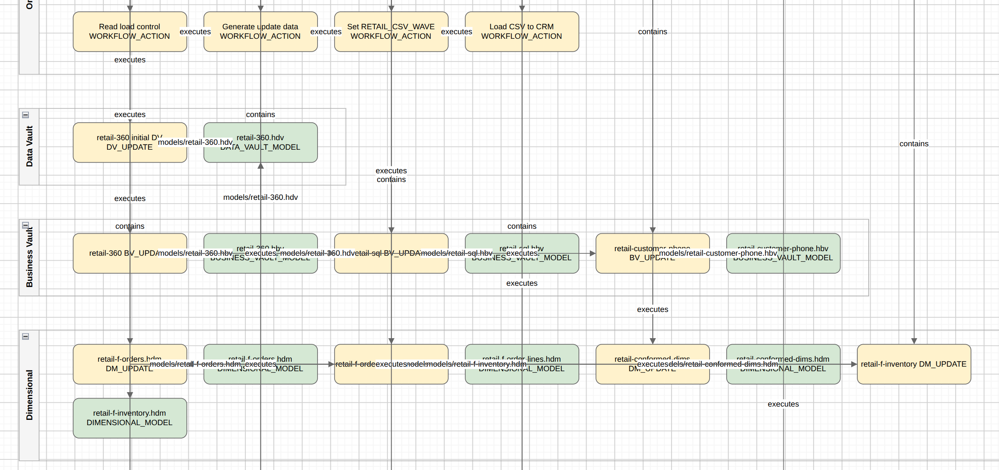
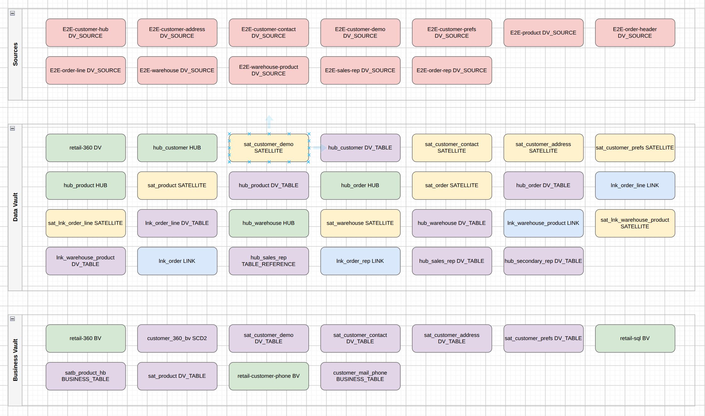
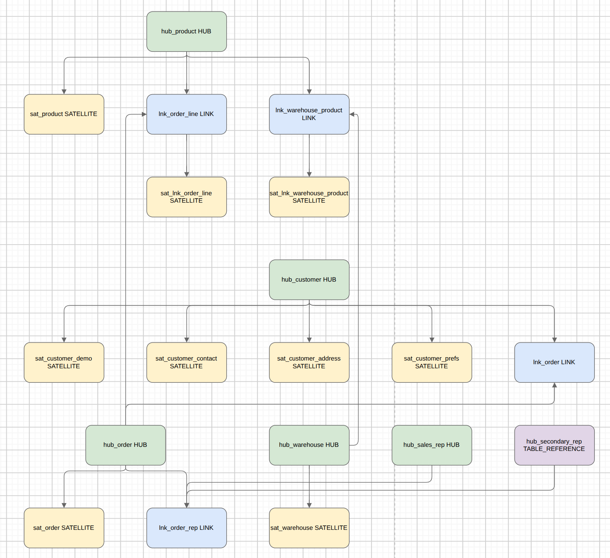
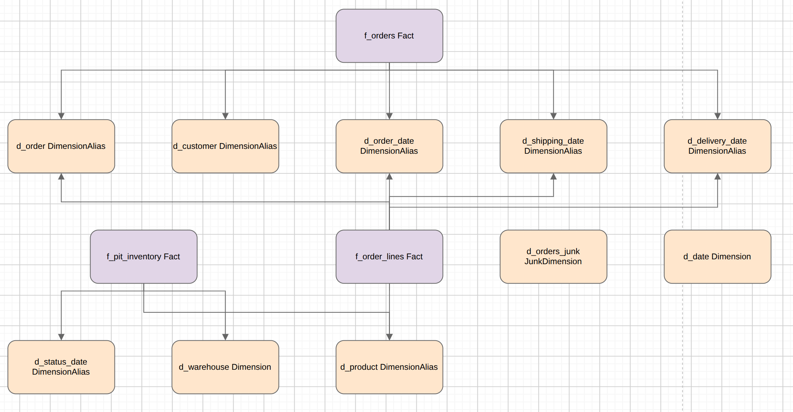

= Architecture and model export (Draw.io)
:toc: macro
:toclevels: 3

toc::[]

Export **derived** diagrams for architects and analysts. Models and workflows remain the source of truth; exports are projections for Draw.io / ArchiMate-style communication (issue #104).

== Three products

[cols="1,2,2", options="header"]
|===
|Product |Purpose |Layout

|**SOLUTION architecture**
|What the project *implements and runs* at **process** level: workflows, controls/capabilities, and **model file** references (e.g. `models/retail-360.hdv`). No table/dataset grain (that would clutter Draw.io beyond a useful overview).
|Layered **swimlanes** with multi-row wrapping (architecture layout — not ELK / Draw.io auto-layout).

|**DATA inventory**
|Which tables and sources are involved across models (lineage). **No relationship arrows**. Default file name: `data-inventory.drawio`. Catalog feeds (including composite sources published from `.hsm` queries) appear as source inventory when referenced by vault models.
|Swimlanes by layer; multi-row packing.

|**MODEL diagrams (aggregated by layer)**
|**Enterprise multi-file** data-model projection: all `.hdv` files → one DV diagram; all `.hbv` → one BV diagram; all `.hdm` → one dimensional diagram. Shared hubs/dims are **deduped by name**. Structural relationships included. Source models (`.hsm`) remain the ER canvas for physical sources; they are not yet a separate aggregated Draw.io layer (use the `.hsm` file and DATA inventory for source-side views).
|**ELK** layout (same stack as the Hop GUI canvas).
|===

The point of MODEL export is the **aggregate across model files** (subject areas, shared core, multiple dimensional stars) — not a one-file-at-a-time dump of each `.hdv`.

== Screenshots (retail example)

Solution architecture — workflows, controls/capabilities, and model file references (no table dump):



Data inventory — tables and sources involved, no relationship edges (default file `data-inventory.drawio`):



Aggregated Data Vault model — all `.hdv` tables unioned with ELK layout:



Aggregated dimensional model — all `.hdm` tables unioned with ELK layout:



== Example artifact set (retail)

```text
work/architecture/retail-solution.drawio       # process architecture only
work/architecture/data-inventory.drawio        # short default inventory name
work/architecture/models/data-vault.drawio     # all .hdv tables unioned + ELK
work/architecture/models/business-vault.drawio
work/architecture/models/dimensional.drawio
```

== Formats (current)

* **Draw.io** (`.drawio` / mxfile XML) — open in https://app.diagrams.net/[diagrams.net] or the Draw.io desktop app.

ArchiMate Open Exchange XML is planned next (same intermediate graphs).

== Workflow action

**Export architecture** (`EXPORT_ARCHITECTURE`):

* **Root** — workflow path, `.hem`, or for DATA/MODEL a comma-separated list of `.hdv`/`.hbv`/`.hdm` paths
* **View type** — `SOLUTION`, `DATA` (inventory), `MODEL` (layer aggregates), or `END_TO_END`
* **Output Draw.io file** — primary SOLUTION destination
* **Also export DATA inventory** — second file from models discovered on the crawl
* **Also export aggregated model diagrams (ELK)** — writes `data-vault.drawio` / `business-vault.drawio` / `dimensional.drawio` under the models folder

== CLI

With the hop-datavault plugin installed. Enable a Hop **project** or **lifecycle environment** the same way as `hop-run` (projects plugin mixins). Use **one** of `-j` / `--project` **or** `-e` / `--environment` (not both).

Relative paths resolve under `${PROJECT_HOME}`. Paths inside diagrams are project-relative (e.g. `models/retail-360.hdv`).

[source,bash]
----
# Solution + inventory + aggregated layer model diagrams:
hop architecture-export \
  -e retail-example-docker-pg \
  -f workflows/run-retail-update.hwf \
  -o work/architecture/retail-solution.drawio \
  --view SOLUTION \
  --also-data \
  --data-output work/architecture/data-inventory.drawio \
  --also-models \
  --models-output work/architecture/models

# MODEL only — pass every model file; get three layer aggregates:
hop architecture-export \
  -e retail-example-docker-pg \
  -f models/retail-360.hdv,models/retail-360.hbv,models/retail-f-orders.hdm,models/retail-conformed-dims.hdm \
  --view MODEL \
  --models-output work/architecture/models
----

DATA inventory only:

[source,bash]
----
hop architecture-export \
  -e retail-example-docker-pg \
  -f models/retail-360.hdv,models/retail-360.hbv \
  -o work/architecture/retail-data-inventory.drawio \
  --view DATA
----

== How it is built

```
workflow / .hem     →  Execution map crawl  →  ArchitectureGraph (SOLUTION)
model lineage       →  ArchitectureGraph (DATA inventory, no ER edges)
all .hdv / .hbv / .hdm
  →  ElkGraphLayout.from*Models (union + dedupe)
  →  layoutToBoxes (ELK, no model file mutation)
  →  ArchitectureGraph (MODEL freeform)  →  data-vault | business-vault | dimensional .drawio
```

* ELK coordinates are computed in memory and **do not** rewrite table positions in model files on disk.
* Does **not** replace OpenLineage/Marquez or `hop svg` (canvas fidelity per file).
* Multi-team model organization: link:enterprise-modeling-and-team-collaboration.adoc[Organizing large Data Vault programs].

== Related

* link:execution-maps.adoc[Execution maps]
* link:source-to-target-lineage.adoc[Source-to-target lineage]
* link:openlineage-export.adoc[OpenLineage export]
* link:feature-overview.md[Feature overview]
