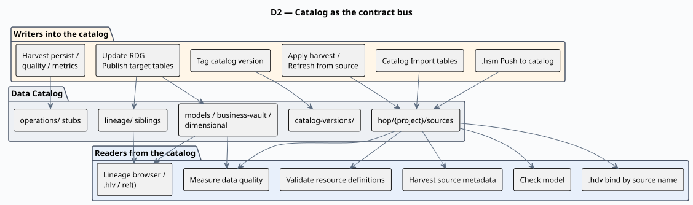
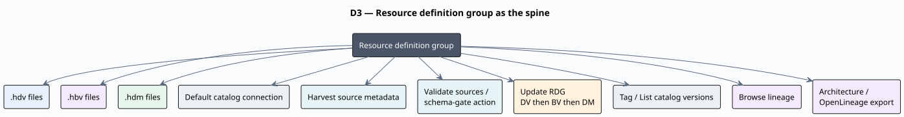
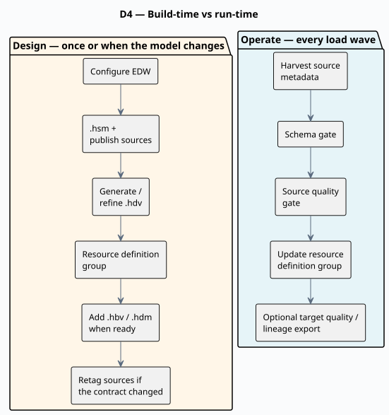
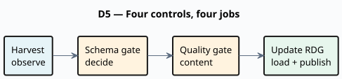
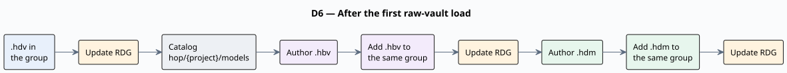
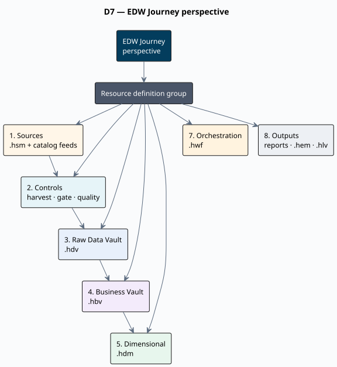

= Architecture — model-driven EDW on Apache Hop
:toc: macro
:toclevels: 3
:openvar: ${
:closevar: }

toc::[]

This page is the **plugin architecture** picture: what the Data Catalog is for, how the model files relate, and which workflow actions sit on that spine.

It is *not* a Draw.io export of one project. For those derived diagrams see link:architecture-export.adoc[Architecture export].

* **Build an EDW from scratch:** link:getting-started-edw.adoc[Getting started — building an EDW]
* **Tour a finished sample:** link:getting-started-retail.adoc[Getting started — retail example]
* **Resource definition group (the spine):** link:resource-definition-group.adoc[Resource definition group]

== Why the catalog sits in the middle

Hubs, links, satellites, Business Vault tables, and dimensional tables bind to **catalog names**, not raw connection strings. The catalog is the shared vocabulary:

* **In:** source contracts (`DV_SOURCE` feeds) published from a source model or imported in the Data Catalog perspective.
* **Out:** published DV / BV / DM table layouts, lineage siblings, the model registry, and operations stubs — written when an update action publishes after a load.

Harvest **observes** live schemas and does **not** rewrite working-tree contracts. Apply-harvest, catalog Refresh from source, and schema-gate remediation are separate, deliberate writes.

[[d1-logical-layers]]
== D1 — Logical layers

Landing systems stay outside the plugin. You model them, publish contracts, then generate and load each warehouse layer.

image::images/diagrams/d1-logical-layers.svg[D1 — Logical layers: landing to source model to catalog to DV, BV, and dimensional,align="center"]

PlantUML source: link:diagrams/d1-logical-layers.puml[d1-logical-layers.puml].

[cols="1,2,3", options="header"]
|===
|Layer |File |Role

|Source system
|`.hsm`
|Tables, PK/FK, queries, JSON extractions, pipeline contracts. Publish feeds; optionally **Generate Data Vault…**

|Source contracts
|Data Catalog
|`DV_SOURCE` / `COMPOSITE` / `JSON` / `PIPELINE` under `hop/{project}/sources`

|Raw Data Vault
|`.hdv`
|Hubs, links, satellites, reference tables. Insert-only loads.

|Business Vault
|`.hbv`
|SCD2, PIT, SQL business tables on top of raw vault history.

|Dimensional
|`.hdm`
|Kimball dims, facts, bridges. Often reads BV and/or raw vault.

|Execution / lineage views
|`.hem` / `.hlv`
|Optional ops graphs and Hop Lineage Views — not required to build the warehouse.
|===

Typical databases in a Hop project:

* **Source** (retail: `CRM`) — landing tables the `.hsm` and catalog sources point at.
* **Vault** — raw DV, BV, and dimensional tables (one or more Hop connections).
* **OPS** — optional harvest history, quality history, and load-run metrics.

[[d2-catalog-bus]]
== D2 — Catalog as the contract bus

One FILE catalog, two directions.

PlantUML source: link:diagrams/d2-catalog-bus.puml[d2-catalog-bus.puml].

Rules that surprise first-time users:

* **Harvest never rewrites contracts.** It writes OPS history (`schema_harvest_*`) and can later *apply* FKs or field layouts if you choose **Apply harvest to catalog…**.
* **Length remediation expands models and target DDL from the catalog length.** It does not change the catalog. If the live source is the new truth, update the catalog yourself, then re-validate.
* **Version tags freeze source contracts** used by the group's models — not the `.hdv` / `.hbv` / `.hdm` files (those live in git) and not published target layouts.

Namespaces after a published load (retail example under `work/edw-catalog/`):

[cols="2,3", options="header"]
|===
|Namespace |Contents

|`hop/{project}/sources`
|Source feeds (input contracts)

|`hop/{project}/models/{model}/`
|Published DV table layouts

|`hop/{project}/business-vault/{model}/`
|Published BV targets

|`hop/{project}/dimensional/{model}/`
|Published dimensional tables

|`hop/{project}/lineage/{dv\|bv\|dm}/{model}/`
|Derived lineage siblings (not an edit surface)

|`hop/{project}/operations/`
|Load metrics, harvest, quality ops stubs

|`catalog-versions/`
|Immutable source-contract snapshots
|===

Details: link:data-catalog.adoc[Data Catalog], link:datavault-source.adoc[Data Vault sources], link:source-to-target-lineage.adoc[Source-to-target lineage].

[[d3-rdg-spine]]
== D3 — Resource definition group as the spine

A **resource definition group** is not a pile of catalog records. It is the project's list of warehouse models plus the default catalog connection. Almost every cross-model action takes a group:

PlantUML source: link:diagrams/d3-rdg-spine.puml[d3-rdg-spine.puml].

Create the group as soon as the first `.hdv` exists. Add `.hbv` and `.hdm` paths to the **same** group later. Split into multiple groups only when teams need separate load waves — see link:enterprise-modeling-and-team-collaboration.adoc[Organizing large Data Vault programs].

Full field and button-bar reference: link:resource-definition-group.adoc[Resource definition group].

[[d4-build-vs-run]]
== D4 — Build-time vs run-time

Design changes the models and contracts. Operate loads the warehouse. Do not mix the two in your head.

PlantUML source: link:diagrams/d4-build-vs-run.puml[d4-build-vs-run.puml].

Greenfield first load can skip harvest, the schema gate, and quality: one **Update resource definition group** with **Update target database structure** and **Publish target tables to catalog** is enough to create tables and write layouts back. Add the full operate chain as soon as that first load works.

[[d5-four-controls]]
== D5 — Four controls, four jobs

These are not one slider.

[cols="1,3,2", options="header"]
|===
|Control |Question it answers |Fails the load?

|**Check model** (toolbar / update action)
|Is this `.hdv` / `.hbv` / `.hdm` structurally sound?
|Optional abort on errors

|**Harvest source metadata**
|What do live sources look like *now*?
|No (default). Observation only.

|**Validate resource definitions** (schema gate)
|May we load given the catalog contract, a version tag, a harvest run, and/or target DDL?
|Yes, by policy (`FAIL_ON_BLOCKING`, …)

|**Measure data quality** + **Evaluate quality gate**
|Are the *rows* acceptable (nulls, domains, counts, …)?
|Pre-load: yes by policy. Post-load: usually `ALERT_ONLY`.
|===

PlantUML source: link:diagrams/d5-four-controls.puml[d5-four-controls.puml].

Reference: link:metadata-harvesting.adoc[Metadata harvesting], link:resource-definition-validation.adoc[Resource definition validation], link:data-quality.adoc[Data quality], link:datavault-update-action.adoc[Check model / Data Vault Update].

[[d6-grow-the-warehouse]]
== D6 — After the first raw-vault load

Grow **one** resource definition group. Do not create a second group for BV or DM unless you have a multi-team split.

PlantUML source: link:diagrams/d6-grow-the-warehouse.puml[d6-grow-the-warehouse.puml].

Then day-2: harvest history and apply FKs, catalog version tags + CI gate, quality bindings on published targets, execution maps, Hop Lineage View / Marquez. That is operations and discovery, not a new modeling layer.

Walkthrough: link:getting-started-edw.adoc#after-first-load[Getting started — after the first load].

[[d7-edw-journey]]
== D7 — EDW Journey perspective

The Hop GUI map of D1 + D3 + D5 is the **EDW Journey** perspective: a tree of one resource definition group in operate order (sources → controls → DV → BV → DM → orchestration → outputs). Selecting a node opens the existing catalog, modeler, metadata, workflow, or report — it does not replace those editors.

PlantUML source: link:diagrams/d7-edw-journey.puml[d7-edw-journey.puml].

User guide: link:edw-journey.adoc[EDW Journey perspective].

== Related documents

[cols="1,2", options="header"]
|===
|Need |Document

|Build order, GUI steps
|link:getting-started-edw.adoc[Getting started — building an EDW]

|Resource definition group fields and buttons
|link:resource-definition-group.adoc[Resource definition group]

|Catalog namespaces and version tags
|link:data-catalog.adoc[Data Catalog]

|Preferred load action
|link:update-resource-definition-group-action.adoc[Update resource definition group]

|GUI map of the warehouse
|link:edw-journey.adoc[EDW Journey perspective]

|Day-2 runners
|link:operations.adoc[Operations]

|Multi-team split
|link:enterprise-modeling-and-team-collaboration.adoc[Organizing large Data Vault programs]

|Project Draw.io exports
|link:architecture-export.adoc[Architecture export]
|===
