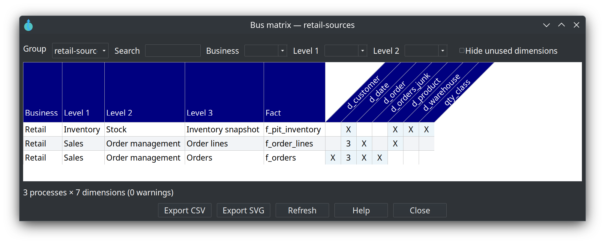

= Kimball bus matrix
:toc: macro
:toclevels: 3

toc::[]

The **bus matrix** is a Kimball crosstab of **business processes** (fact-like tables) against **conformed dimensions**. Data Hopper EDW builds it from every `.hdm` file listed on a link:resource-definition-group.adoc[resource definition group].

Issue https://github.com/ProjectDataHopper/hopper-edw/issues/177[#177].

== Why

* See which processes share Date, Customer, Product, and other conformed dimensions.
* Spot coverage gaps (empty columns).
* Communicate incremental delivery: one process (row) at a time.

== Tag facts

. Create EDW metadata **Business process catalog** (domains plus process levels 1–3, with descriptions and parents).
. On each fact (General tab), set **Business**, **Process level 1 / 2 / 3**. Combos come from the catalog; you can still type a value while sketching. **Business process catalog** opens that metadata type in the Metadata perspective.
. Optionally point the resource definition group at that catalog (**Business process catalog**). Empty means “union every catalog in the project”.

The link:help/business-process-catalog-dialog.adoc[catalog editor] has a tab per level. Retail `retail-bus`:

image::images/business-process-catalog-editor-domain-tab.png[Business process catalog retail-bus — Domains tab with Retail,align="center"]

image::images/business-process-catalog-editor-level1-tab.png[Business process catalog retail-bus — Level 1 tab with Sales and Inventory under Retail,align="center"]

image::images/business-process-catalog-editor-level2-tab.png[Business process catalog retail-bus — Level 2 tab with Order management and Stock,align="center"]

image::images/business-process-catalog-editor-level3-tab.png[Business process catalog retail-bus — Level 3 tab with Orders, Order lines, and Inventory snapshot,align="center"]

Role-playing date aliases (`d_order_date`, `d_shipping_date`) collapse to the physical date dimension. The cell shows `X` or a role count.

== Open the viewer

* Resource definition group editor → **Bus matrix**
* EDW Journey → the group, the Dimensional stage, or the **Bus matrix** node
* Dimensional model canvas toolbar
* **Tools → View bus matrix…**

Filter by business or process level, switch **Group** in the viewer, search fact/dimension names, hide unused dimensions, double-click to open a fact or dimension, export **CSV** or **SVG**. Dimension names tilt 45° counter-clockwise, each in a trapezium that follows the text. The header row is tall so long names fit.

== CLI and documentation

[source,bash]
----
hop bus-matrix -g retail-sources -f csv -o ${PROJECT_HOME}/work/bus-matrix.csv
hop bus-matrix -g retail-sources -f svg -o ${PROJECT_HOME}/work/bus-matrix.svg
----

**Generate project documentation** writes a **Bus matrices** page per group (sticky HTML table, SVG, CSV download).

== Retail sample

Catalog `retail-bus` tags `f_orders`, `f_order_lines`, and `f_pit_inventory` on group `retail-sources`. Date role-playing aliases collapse to `d_date` (the cell shows `3` on orders and order lines).
