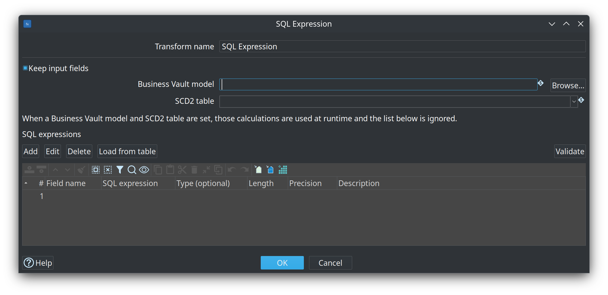
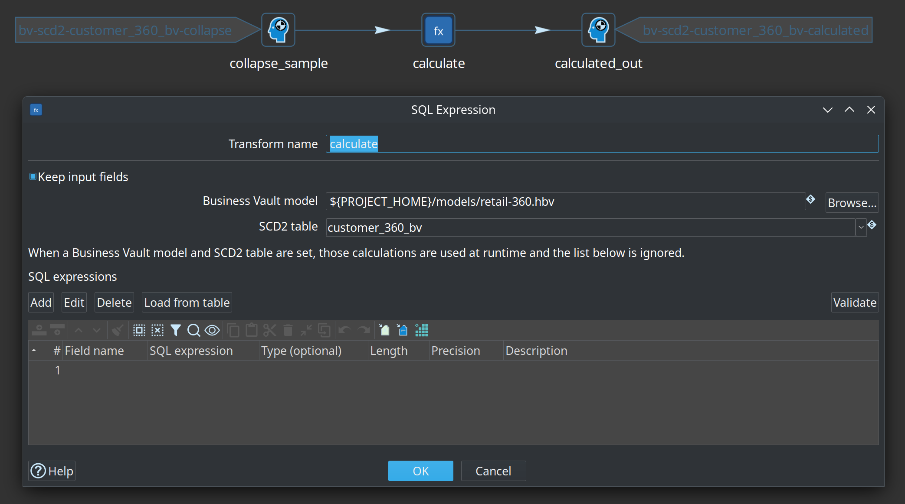

= Business Vault SCD2
:toc: macro
:toclevels: 3

toc::[]

SCD2 tables are the primary Business Vault output today. They materialize **functional timelines** from raw Data Vault satellite history.

== Type 1 vs Type 2 and hybrid attributes

Business Vault SCD2 tables are **pure SCD Type 2**: each functional change produces a version row with `valid_from` / `valid_to` (or your configured validity columns). The plugin does **not** support a per-column Type 1 mode that rewrites every historical version when a “current” value changes.

That is intentional. BV SCD2 is **organizational memory made consumable** (harmonized names, multi-satellite merge, business-effective intervals). Hybrid Type 1 + Type 2 presentation rules usually belong further downstream.

[cols="1,3", options="header"]
|===
|Need |Recommended approach

|Historized attributes (as-of correct)
|Map them on the SCD2 table (Type 2).

|Always-current attributes (e.g. current sales rep on old facts)
|Keep Type 2 history clean; resolve “current” at **mart or query** time by joining the open SCD2 row, a latest satellite, or a separate BV current table/view (see link:business-vault-sql-view.adoc[Business Vault SQL views and tables]). Prefer **hybrid SCD in the dimensional model** when product owners want Type 1 and Type 2 columns on one dimension.

|Mix Type 1 and Type 2 **in the same BV SCD2 table**
|Not a field-mapping feature. Mixing would make some columns look historical while they are not, weaken audit-friendly intermediate history, and is expensive under incremental watermarks.

|Type 1 / Type 2 modes **on a PIT table**
|Wrong layer. PIT tables store hub grain × snapshot dates with satellite load-timestamp **pointers** only. Compose attributes (including always-current ones) when joining raw or BV tables. See link:business-vault-pit.adoc[Business Vault PIT].
|===

In short:

1. Prefer **pure Type 2** BV SCD2 for mapped attributes.
2. Prefer a **separate current-state object** (or open-row filter) for always-current values.
3. Prefer **hybrid Type 1 + Type 2 in the dimensional / information mart layer** for reporting rules.
4. Treat hybrid Type 1 *inside* a historized BV SCD2 table as a last resort outside this builder, not core plugin behaviour.

Dialog help (Hop GUI **Help** on the SCD2 table dialog): link:help/bv-scd2-table-dialog.adoc[SCD2 table dialog].

== What gets generated

For each SCD2 table the plugin builds a Hop pipeline that:

1. Reads satellite history via `TableInput` SQL (grain + functional timestamp + attributes), `ORDER BY` hash key in **Java `String.compareTo` order** (Postgres `COLLATE "C"`, SQL Server `BIN2`, MySQL `BINARY`) so `SortedSchemaMerge` sees a stream that is already sorted the way Hop compares strings. Locale collations such as Postgres `en_US.utf8` sort `10-` before `1-` and would split the same key across satellite legs. The vault record-source / source-indicator column is **not** selected when a satellite has **Store record source indicator** off (VaultSpeed-style mono-source sats). Multi-satellite pipelines never read that physical column; merge identity is the synthetic `_bv_source` value.
2. Adds source indicators when multiple satellites feed one BV table. When a satellite omits the physical column, a Constant supplies the BV record-source value from the satellite config (or the satellite name).
3. Merges streams (multi-satellite) with `SortedSchemaMerge`
4. Repeats sparse attribute columns across merged rows
5. Computes validity bounds with `Analytic Query` (LAG/LEAD)
6. Applies open-interval sentinels with `If Null`
7. Collapses duplicate timestamps with `Group By`
8. Loads the Business Vault target table with `TableOutput` (full rebuild) or runs the incremental write path below

Use **Debug** or **Show build pipeline** on an SCD2 table in the `.hbv` editor to inspect the generated pipeline before running a workflow.

=== Hash-key partitions (large full rebuilds)

When a satellite is too large to `ORDER BY` hash key and load date in one pass, set **Hash-key partitions** to 4, 8, or 16 on the SCD2 table. Full rebuild then:

1. Truncates the BV target **once** with a workflow SQL action (`TRUNCATE TABLE` via the Hop database dialect).
2. Generates partition numbers `0 .. N-1` and runs the SCD2 pipeline once per part, passing `'${PARTITION_COUNT}'` and `'${PARTITION_NUMBER}'`.
3. Filters each satellite `TableInput` with a first-byte modulus of the parent hash key (BINARY: first octet; HEX: first two hex characters; STRING: first dash-separated token). Every version of a hub/link key stays in one partition. STRING/HEX hash keys still `ORDER BY` with a Java-matching binary collation inside each slice.
4. Writes with `TableOutput` **truncate off**, so later partitions append.

**Show build pipeline** opens the parameterized SCD2 pipeline, the partition driver, and the wrapper workflow. Running the inner pipeline alone with defaults loads partition 0 of N.

Constraints:

* Full rebuild only (Incremental already filters by watermark).
* Target load mode is honored: **Table Output** and **Native bulk** append after the SQL truncate; **Staging file** writes one CSV set per partition (`…-${PARTITION_NUMBER}-${Internal.Transform.CopyNr}.csv`) then bulk-loads those files in the wrapper workflow.
* Sequential partition execution (lower peak memory, not parallel wall-clock).

Integration test: `integration-tests/tests/multi-satellite-bv/update-customer-360-partitioned.hwf` uses `customer-360-partitioned.hbv` (4 parts) and the same golden current-state dataset as the unpartitioned full rebuild.

=== Incremental build mode

Set **Build mode** to *Incremental* on the SCD2 table when you want to append new functional versions instead of truncating and reloading the BV table on every run.

Incremental pipelines extend the shared analytic tail with:

1. **Watermark resolve** — at pipeline generation time the plugin queries the **Business Vault** target with `SELECT MAX(watermark) …` (BV connection only; null → open-start sentinel in Java)
2. **Parameter Generate Rows** — `param_incremental_watermark` (Generate Rows, limit 1) holds the Timestamp value; `param_open_row_filter` holds the open-end sentinel (and watermark when DV/BV share a connection). Generate Rows is used instead of Constant because Constant only enriches incoming rows and would emit nothing as a pipeline start.
3. **Satellite filter** — each DV-connected `TableInput` uses JDBC positional parameters (`source_ts > ?`) with the watermark transform as its **Insert data from** stream. SQL stays dialect-neutral and never references BV tables
4. **Open target baseline** — BV-connected `TableInput` with `valid_to = ?` (open-end bound from the param transform). When DV and BV share the same Hop connection name, hash keys are further restricted with `IN (SELECT … FROM sat WHERE ts > ? UNION …)` — one watermark `?` **per satellite leg** (JDBC does not reuse bind values; the param transform repeats the same watermark once per leg). When connections differ, all open BV rows are read
5. **Watermark attach** — a stream `Constant` (after the analytic chain) adds `_incremental_watermark` to every computed row
6. **Incremental row filter** — `FilterRows` keeps computed rows where `functional_timestamp > _incremental_watermark`
7. **Append** — `TableOutput` with `truncate=false`
8. **Close open version** — `Update` sets `valid_to = valid_from` on the prior open row (match hash key + open `valid_to`) before new open versions are inserted

**Watermark field** resolution:

1. Per-table **Incremental watermark field** override (optional)
2. Per-table **Functional timestamp** field
3. Model-level functional timestamp default
4. Load-date fallback from Data Vault configuration

The watermark is always read from the **Business Vault target table** (`MAX(watermark_field)`), matching the PIT incremental pattern. DV satellite history may live on a **different** database connection than the BV target.

On the first incremental run against an empty BV table the sentinel (`1900-01-01 00:00:00`) applies, so behaviour matches a full rebuild. Later runs process only satellite deltas and close prior open rows in place.

Integration test: `integration-tests/tests/multi-satellite-bv/update-customer-360-incremental.hwf` loads four DV satellite waves, runs **Business Vault Update** once on `customer-360-incremental.hbv`, then validates current open rows against the same golden dataset as the full-rebuild fixture. Multi-run close-and-append behaviour is covered by unit tests in `BvScd2PipelineSupportTest`. Hash-key partitioned full rebuild: `update-customer-360-partitioned.hwf` / `customer-360-partitioned.hbv` (4 parts, same golden).

== Calculations (SQL expressions)

After collapse, each SCD2 table can compute extra target columns with deterministic SQL scalars. This is the replacement for per-entity `CASE` / `COALESCE` / `CAST` in dbt-core SCD2 models.

* Expressions run **after** Group By collapse and **before** Table Output / incremental write.
* They do **not** create new versions. Mapped satellite attributes remain the grouping keys.
* Target names must be **new columns** (they cannot overwrite mapped attributes, hash keys, hub business keys, or validity fields). Raw mapped columns stay on the table so incremental runs can recompute expressions, unless **Load** is **No** on the mapping (calculation-only; full rebuild only).
* Optional **Include hub business keys** (General tab) left-outer Merge Joins parent-hub BK columns onto the collapsed stream **immediately before** SQL calculations. They are identity fields: available for calculations, but they do not open new versions. **Load hub business keys** (default on) writes them to the BV table; uncheck to keep them on the stream only. The SCD2 merge / repeat / incremental chain is unchanged. The Lineage tab lists every loaded column, including hub business keys when those are loaded.
* Syntax is SQL: `CASE WHEN …`, `COALESCE`, `CAST(x AS VARCHAR(n))`. `x :> VARCHAR(n)` and `x::TYPE` are accepted. MySQL / SingleStore-style `CONCAT`, `HEX`, `UNHEX`, `MD5`, `DATE_FORMAT`, and `TO_DATE` are available for migration.
* Not allowed: `NOW()`, `CURRENT_TIMESTAMP`, `RANDOM`, subqueries, aggregates, Jinja.

Configure them on the SCD2 table **Calculations** tab. **Add** / **Edit** opens the SQL expression editor (fields + `CASE` / `COALESCE` / `CAST` patterns, large SQL widget, type and description). Generated **production** pipelines insert an **SQL Expression** transform (`calculate_<table>`) after `collapse_*` with a copy of the expressions.

The SQL Expression transform can also **link a Business Vault model file and SCD2 table**. When both are set, it loads calculations from that table at runtime (inline expressions are ignored). Production generate still copies expressions so load pipelines do not depend on opening the `.hbv` at run time. Help for the transform: link:help/sql-expression-dialog.adoc[SQL Expression].

Integration fixture: `integration-tests/tests/scd2-calculations/update-scd2-calculations.hwf` — deleted-flag `CASE` plus `CAST('Default value' AS VARCHAR(720))` on a single-satellite SCD2 table, golden current-state after initial and update loads. The same workflow also builds `sat_customer_calc_hub_bv` (issue #153): hub `customer_id` on the stream/table, `deleted_flag` mapped with **Load=No**.

=== Tests

When the table is ready, use **Generate calculation unit test** on the SCD2 table (canvas context menu or the **Tests** tab). That creates:

image::images/generate-calculations-unit-test-scd2-context-action.png[SCD2 table context menu — Generate calculation unit test on customer_360_bv,align="center"]

* A slim pipeline `Dummy collapse_sample` → **SQL Expression** (linked to this table) → `Dummy calculated_out`
* Input data set `bv-scd2-<table>-collapse` and golden data set `bv-scd2-<table>-calculated`
* A Hop **pipeline unit test** that injects at `collapse_sample` and compares golden output at `calculated_out`
* A **capture** pipeline: the SCD2 build up to Group By, then Reservoir Sampling (100 rows), then the linked SQL Expression. Optional: run it once against the warehouse to fill the data sets

image::images/generate-calculations-unit-test-scd2-confirmation-dialog.png[Sample warehouse rows confirmation — 100 reservoir-sampled collapsed rows,align="center"]

Production SCD2 loads are **not** reservoir-sampled. After capture, re-run the unit test from the pipeline Testing toolbar (no database).

image::images/generate-calculations-unit-test-scd2-completion-report.png[Calculation unit test completion report with pipeline, input data set, and golden data set names,align="center"]

Check model still compiles expressions. Legacy column-level / CSV tests stored on older `.hbv` files still run if present.

=== Migrating from dbt SCD2 SQL

Keep using link:dbt-import.adoc[Import dbt models] for arbitrary SQL business tables. For SCD2-like models:

. Model the raw satellites on `.hdv` (Hop-managed or External read-only).
. Create a BV SCD2 table with field mappings, including CASE inputs such as deleted flags.
. Copy SELECT-list expressions onto **Calculations**.
. Generate a Hop pipeline unit test and sample collapsed rows once.
. Optional: a BV SQL view that projects the calculated columns without the raw flags.

== Single-satellite SCD2

The simplest case: one DV satellite derivative → one BV table.

* Set the satellite as a **derivative** on the SCD2 table
* Configure **functional timestamp** (per table, or model default, or load-date fallback)
* Attribute columns pass through with DV names unless you add field mappings

Example: `integration-tests/tests/basic/vault1.hbv` builds `sat_customer_hb` from `sat_customer`.

== Multi-satellite SCD2

When an SCD2 table references **two or more** satellites (e.g. Customer 360 from demo, contact, address, and preference satellites), you must provide:

* **Field mappings** — map each `(satellite, source field)` to a BV target column name
* **Satellite configs** — optional per-satellite functional timestamp override and source indicator value

Validation enforces:

* All referenced satellites share the same hub (or link) parent
* Every mapped source field exists on the satellite
* No duplicate BV target column from different sources
* Explicit mappings when multiple satellites are present

Example: `integration-tests/tests/multi-satellite-bv/customer-360.hbv` → table `customer_360_bv` with 11 field mappings across 4 satellites.

image::images/business-vault-model-customer-360.png[Customer 360 Business Vault model on the canvas,align="center"]

=== Functional timestamp resolution

Priority order:

1. Per-satellite override in **Satellite configs**
2. Per-table **functional timestamp** field on the SCD2 table
3. Model-level **functional timestamp** in Business Vault configuration
4. **Load date fallback** (typically `x_load_ts` from Data Vault configuration)

The functional timestamp drives SCD2 interval boundaries — not the technical load date unless you choose it explicitly.

=== Valid from / valid to

Defaults come from Business Vault configuration (`x_from_ts`, `x_to_ts` in the sample project). Override per table if needed.

Open intervals use sentinels from configuration (default `1900-01-01 00:00:00` and `9999-12-31 23:59:59`).

== SCD2 table dialog (key fields)

[cols="1,3", options="header"]
|===
|Field |Description

|Name
|Logical name of the SCD2 table in the `.hbv` model.

|Physical table name
|Target table in the Business Vault database.

|Derivatives
|One or more DV satellite references. At least one satellite is required.

|Include hash key
|When enabled, the parent hash key column is included in the BV table.

|Include hub business keys
|When enabled, parent-hub business key columns are Merge Joined after collapse, before calculations. Identity only (not version drivers). Requires Include hash key and hub-parent satellites. Not supported for link satellites.

|Load hub business keys
|Enabled with Include hub business keys. Checked (default) writes hub BK columns to the BV table. Unchecked keeps them on the stream for calculations only.

|Suggest mappings
|Reloads the linked `.hdv` and fills unmapped satellite attributes. Reports a clear reason when satellites are listed but no fields appear (stale or missing Data Vault model, unresolved satellite, empty Attributes tab).

|Functional timestamp
|Column on the satellite stream used as the timeline (see resolution order above).

|Build mode
|`FULL_REBUILD` (default) truncates and reloads the BV table; `INCREMENTAL` filters satellite history and appends/closes versions.

|Hash-key partitions
|`None` (default), or `4` / `8` / `16` parts for a large full rebuild. See <<Hash-key partitions (large full rebuilds)>>.

|Incremental watermark field
|Optional BV column used for `MAX(...)` watermark reads and incremental write filtering. Defaults to the resolved functional timestamp field.

|Valid from / Valid to
|Output column names for SCD2 interval bounds.

|Field mappings
|Required for multi-satellite tables. Maps satellite attribute → BV column.

|Satellite configs
|Per-satellite functional timestamp and source indicator for multi-satellite merges. The source indicator is the merge tag (`_bv_source`) and the BV record-source value when the satellite does not store a physical source-indicator column. Honor **Store record source indicator** on each DV satellite — SCD2 Table Input SQL never requests a column the satellite table does not have.
|===

The Customer 360 sample uses all three SCD2 dialog areas:

image::images/business-vault-scd2-table-dialog.png[SCD2 table dialog — General tab,align="center"]

image::images/business-vault-scd2-table-dialog-field-mappings.png[SCD2 table dialog — Field mappings,align="center"]

image::images/business-vault-scd2-table-dialog-satellite-settings.png[SCD2 table dialog — Satellite settings,align="center"]

== Target databases

SCD2 pipeline generation requires:

* **Data Vault target database** — on the linked `.hdv` configuration (read satellite history)
* **Business Vault target database** — on the `.hbv` configuration (write BV table)

Both connection names must resolve in Hop project metadata. **Check model** on the `.hbv` file validates this before pipeline generation.

If you change the linked `.hdv` file on disk, use **Reload DV model** on the Business Vault toolbar before generating pipelines.

== External satellites

Satellites marked **External read-only** in the `.hdv` model are skipped by Data Vault Update but remain fully visible to Business Vault generation. Ensure:

* Physical table names match the warehouse
* Attribute lists describe actual columns
* The vault database connection can read those tables

See `integration-tests/tests/multi-satellite-bv/customer-360-external.hdv` and `.hbv` for a working example.

image::images/data-vault-model-customer-360-external.png[External read-only satellites on the Customer 360 Data Vault canvas,align="center"]

== Running loads

* **Debug** — generate and open build pipeline(s) in Hop GUI (no data write unless you run the pipeline)
* **Business Vault Update** action — model check, optional DDL, generate, stage, and execute build pipelines

See link:business-vault-update-action.adoc[Business Vault Update Action].