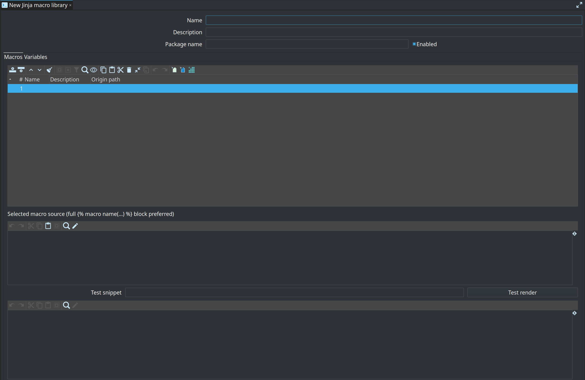

= Business Vault SQL views and tables
:toc: macro
:toclevels: 3

toc::[]

SQL business tables let you author consumption SQL on the Business Vault canvas with explicit dependencies, instead of maintaining opaque dbt models outside the vault graph.

== Why

Raw Data Vault and generated SCD2/PIT tables cover the mechanical patterns. Real projects still need arbitrary SQL for business rules, enrichments, and lookups. dbt handles this with `ref()` / `source()` and dependency ordering. Hop Data Vault brings the same idea onto the `.hbv` model:

* Author SQL with templates
* Declare sources used by the query
* Resolve references to other BV or DV objects
* Materialise as a **view** or **table**
* Order Business Vault Update pipelines by dependency

== Table type

Add **SQL view / table** from the Business Vault canvas (type `BUSINESS_TABLE` in the `.hbv` file).

|Property |Description

|Name / physical name
|Logical canvas name and target object name in the BV database

|Materialization
|`VIEW` or `TABLE` (see dialect-specific SQL below)

|Reference style
|`dbt` only in the current release

|SQL query
|Authoring SQL with optional macros and Jinja

|Schema
|Optional target schema for `CREATE` and `{{ this }}`

|Sources
|Explicit list for `{{ source('name', 'table') }}`

|References
|Parsed from SQL; used for canvas edges and update order

== Template language (dbt + Jinja)

Simple SQL that only uses single-quoted `ref()` / `source()` still uses the original regex fast path. Anything else (``, `{# #}`, other `{{ }}` expressions, user macros) is rendered with **sandboxed Jinjava**.

Macros live in project metadata: **Jinja macro library**. Enable the library, then call `{{ my_macro(...) }}` from SQL. `{{ var('name') }}` reads a Hop variable of that name first, then a library default.

Built-ins: `ref`, `source`, `config()` (empty at render), `var`, `this`, `is_incremental()` (always false), `adapter.quote`. Unsupported dbt calls such as `run_query` and `adapter.dispatch` fail at Check model / materialization with a clear error.

To load a dbt-core `macros/` folder (and the models that call them), use **Import dbt models** on the Business Vault canvas. See link:dbt-import.adoc[Import dbt-core models].

== Template language (dbt style) — `ref` / `source`

[cols="2,3", options="header"]
|===
|Macro |Resolution

|`{{ ref('object') }}`
|Object in this `.hbv` (BV table), or a DV table named by a canvas Hub/Link/Satellite reference (any referenced `.hdv`), by name or physical table name

|`{{ ref('model', 'object') }}`
|Loads another model and finds `object`. The first argument may be:

* Relative path to the current `.hbv` (e.g. `../models/retail-360`)
* With or without `.hdv` / `.hbv` extension
* Portable `${PROJECT_HOME}/…` path
* Basename only (resolved under the BV directory, `${PROJECT_HOME}/`, or `${PROJECT_HOME}/models/`)

Also matches current BV / linked DV by basename when no file load is needed.

|`{{ source('source-name', 'table') }}`
|Must match a row on the Sources list (schema/database optional)
|===

**Parse / sync refs** resolves paths (and catalog model registry basenames when published), fills the References tab (`resolvedModelFilename`, kind, physical table), and can place canvas aliases:

* **DV aliases** for external or linked DV tables (`referencedModelFilename` when multi-model)
* **BV aliases** for tables in another `.hbv` (multi-step historize → harmonize → rename layers)

=== Business Vault → Business Vault references

Multi-step Business Vault work often needs several models or several SQL objects chained across files:

1. **Historize** — e.g. phase-1 VIEW with `x_from_ts` / `x_to_ts` over a satellite
2. **Harmonize** — cast types, coalesce keys, standardise codes
3. **Rename / publish** — stable business column names for dimensional or export consumers

You can:

* Use `{{ ref('other-bv-model', 'table') }}` or `{{ ref('../models/bv-historize', 'satb_product_hb') }}` in SQL
* Or place a canvas **Business Vault reference** (context menu: *Add Business Vault reference*): pick a catalog-registered BV model or browse a `.hbv`, then choose a table

Canvas BV references store `bv_reference` entries with `referencedModelFilename` (portable `${PROJECT_HOME}/…` preferred). Click the name on a BV reference card to open the source `.hbv` and select that table.

=== Catalog model registry

When a DV / BV / DM Update publishes to a data catalog, Hop also upserts a **model registry** entry:

* Namespace: `hop/{project}/models-registry`
* Name: model basename (e.g. `vault1`, `retail-360`)
* Types: `DV_MODEL`, `BV_MODEL`, `DM_MODEL`
* `origin.modelFilename`: portable path such as `${PROJECT_HOME}/tests/basic/vault1.hdv`

Then short two-arg refs work without relative paths:

[source,sql]
----
{{ ref('vault1', 'sat_customer') }}
{{ ref('retail-360', 'sat_product') }}
----

Lookup order for `ref('model', 'object')`: current/linked model basename → catalog registry candidates (**DV and BV** when both share a basename) → filesystem path relative to the BV file (including same-basename sibling `.hdv`/`.hbv` when the object is not in the first file found).

**Same basename DV + BV:** Projects often use `retail-360.hdv` and `retail-360.hbv`. Short refs try the Data Vault model first, then the Business Vault model, and succeed when the object exists in either file. Example data product:

[source,sql]
----
SELECT customer_hk, segment
FROM {{ ref('retail-360', 'customer_360_bv') }}
----

resolves to the BV table even if the catalog also has `retail-360.hdv`.

=== Multi-model DV aliases on the BV canvas

**Add hub / satellite / link reference** now supports more than the single linked DV:

1. If multiple sources exist, pick **Linked: …** or a **catalog-registered** DV model (`basename → path`).
2. Then pick an unused table of that type from the chosen model.
3. External aliases store `referencedModelFilename` and show `modelBasename (linked)` on the card.
4. Clicking the alias name opens that model file and selects the table (not only the config-linked path).

Parse/sync of SQL `ref()` into external models uses the same alias field so canvas and SQL stay aligned.

Example:

[source,sql]
----
SELECT
  p.product_hk,
  p.product_name,
  l.lookup_code
FROM {{ ref('s_product') }} p
LEFT JOIN {{ source('refdata', 'ref_lookup_something') }} l
  ON p.category_id = l.category_id
----

On save / Business Vault Update, Hop rewrites macros to dialect-quoted physical names and generates an **Execute SQL** pipeline that materialises the object.

The **Generated SQL** tab in the table dialog shows the full CREATE script for the current target database dialect.

== Dialect-specific materialization SQL

The BV **target database** plugin id selects the script shape (same dialect detection as PIT):

[cols="1,1,3", options="header"]
|===
|Materialization |Dialect |Generated script (conceptually)

|VIEW
|PostgreSQL, MySQL, Snowflake, other
|`CREATE OR REPLACE VIEW t AS <query>`

|VIEW
|SQL Server
|`CREATE OR ALTER VIEW t AS <query>`

|VIEW
|SingleStore
|`DROP VIEW IF EXISTS t;` + `CREATE VIEW t AS <query>` (no `CREATE OR REPLACE VIEW`)

|TABLE
|MySQL, SingleStore, Snowflake
|`CREATE OR REPLACE TABLE t AS <query>`

|TABLE
|PostgreSQL
|`DROP TABLE IF EXISTS t;` + `CREATE TABLE t AS <query>`

|TABLE
|SQL Server
|`DROP TABLE IF EXISTS t;` + `SELECT * INTO t FROM (<query>) AS _bv_sql_src`
|===

Multi-statement scripts (Postgres/SQL Server TABLE, SingleStore VIEW) run with Exec SQL **single statement** disabled so DROP + CREATE both execute.

== Canvas and lineage

* Resolved DV `ref()` values create or reuse **DV reference** alias cards and derivative links.
* Same-model BV `ref()` values draw a dependency edge between business tables.
* Resolved external BV `ref()` values create or reuse **BV reference** alias cards (`bv_references` in the `.hbv`).
* Business Vault Update runs SQL materialisations **after** SCD2/PIT (and after referenced BV tables) using topological order.

== Model check (validation)

**Check model** on the Business Vault canvas (and the Business Vault Update action when abort-on-check is enabled) validates SQL business tables:

[cols="1,2,1", options="header"]
|===
|Severity |Rule |Notes

|ERROR
|SQL query required
|

|ERROR
|Only dbt reference style
|`ref()` / `source()` macros

|ERROR
|Malformed template braces
|Residual `{{` / `}}` after parsing known macros (simple `ref`/`source` SQL only)

|ERROR
|Jinja render failed
|Control tags, macros, or other expressions could not be rendered

|ERROR
|Every `ref()` resolves
|Same model BV table, linked DV table, or two-arg model basename

|ERROR
|Self `ref()` forbidden
|

|ERROR
|Every `source()` declared on Sources
|Physical table name required

|ERROR
|BV target database configured (and resolvable when metadata is available)
|

|ERROR
|No `ref()` cycles among SQL business tables
|Reported once for the model

|WARNING
|Declared source unused in SQL
|

|WARNING
|Duplicate source rows
|

|WARNING
|Bare known table name without `ref()`/`source()`
|Dependency may be invisible to ordering

|WARNING
|Materialization unset
|Defaults to VIEW
|===

Use **Validate** in the SQL business table dialog for a single-table check without saving.

== Execution notes

* Create view/table runs in a generated pipeline (not the early DDL batch), so dependents of SCD2/PIT loads see populated tables when the SQL runs in the same update.
* Pipeline name prefix comes from BV configuration (`businessTablePipelineNamePrefix`, default `bv-biz-`).
* **Portable timestamp literals:** authoring SQL may use Postgres/ANSI `TIMESTAMP 'yyyy-MM-dd HH:mm:ss'`. At materialization time those literals are rewritten for the BV target dialect (SQL Server → `CAST('…' AS datetime2)`, MySQL/SingleStore → `CAST('…' AS DATETIME)`). Prefer that form in shared fixtures over engine-specific casts.
* Iceberg / engines without classic CREATE VIEW support are not specially handled yet — treat as generic Postgres-style SQL and verify on your warehouse.
* Incremental merge, dbt packages, `run_query`, Relation methods (`.identifier`), snapshots, tests, and export back to dbt are out of scope. `` / `` / `` and project macros **are** supported via Jinja.

== Samples and integration fixture

=== Retail example

`retail-example/models/retail-sql.hbv` defines `satb_product_hb`: a phase-1 historical VIEW over `sat_product` that adds `x_from_ts` / `x_to_ts` with `LEAD`. Equivalent multi-model form when the DV lives elsewhere:

[source,sql]
----
FROM {{ ref('../models/retail-360', 'sat_product') }}
----

or, if the BV file sits next to the DV:

[source,sql]
----
FROM {{ ref('retail-360', 'sat_product') }}
----

=== Integration tests (`integration-tests/tests/basic/`)

`vault1.hbv` includes two SQL business tables exercised by `update-vault1.hwf` after Data Vault + Business Vault Update:

[cols="1,2,2", options="header"]
|===
|Table |SQL idea |Assertion

|`sat_customer_hb_v`
|`SELECT … FROM {{ ref('sat_customer_hb') }}` (view over SCD2)
|`validate-sat-customer-hb-v UNIT` — same golden as `sat_customer_hb`

|`satb_customer_hb`
|`LEAD(x_load_ts)` validity over `{{ ref('sat_customer') }}`
|Created by BV Update (existence required for view materialisation); content not golden-tested yet

|`sat_customer_hb_jinja`
|Jinja `` column list over `{{ ref('sat_customer_hb') }}`
|`validate-sat-customer-hb-jinja UNIT` — same golden as `sat_customer_hb`
|===

Drop SQL in the suite removes both views before vault tables.

== Related

* link:dbt-import.adoc[Import dbt-core models]
* link:business-vault-overview.adoc[Business Vault overview]
* link:business-vault-update-action.adoc[Business Vault Update action]
* link:../integration-tests/PROJECT.md[Integration tests project notes]
* Issue foundation for automated multi-model execution (clear lineage via `ref` / `source`)
