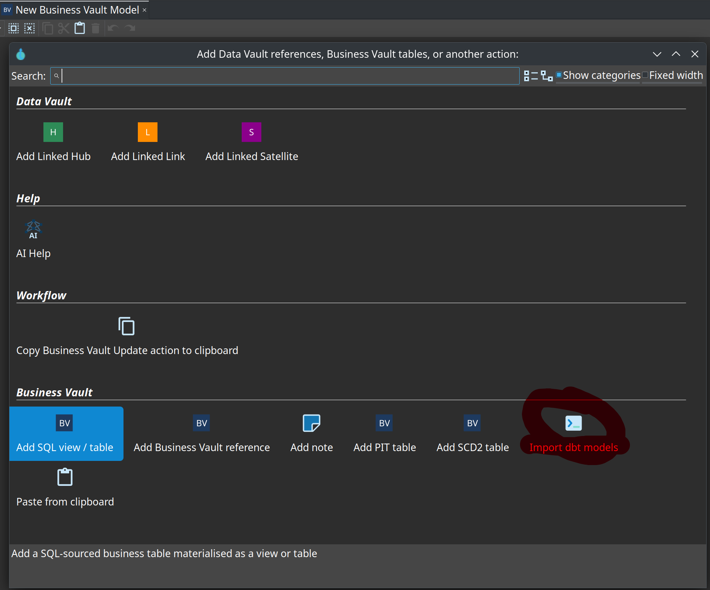

= Import dbt-core models into Business Vault
:toc: macro
:toclevels: 2

toc::[]

Hop can **import** a dbt-core project as SQL business tables on a Business Vault model (`.hbv`). This is a migration on-ramp, not a dbt runtime.

== What is imported

* `models/**/*.sql` — authoring SQL is kept as written (Jinja included)
* Adjacent or folder `schema.yml` / `*.yml` — table description, column notes, config
* `macros/**/*.sql` — `` blocks into a **Jinja macro library**
* `sources:` — declared on each table that uses `{{ source() }}`
* `dbt_project.yml` `vars:` — library default `var()` values (Hop variables override them)
* Folder `+materialized` / `+schema` and in-SQL `{{ config() }}`

== How to import

. Open or create a Business Vault model.
. Toolbar **Import dbt models**, or the same action on the canvas context menu.
+

. Browse to the folder that contains `dbt_project.yml`.
. Scan, filter, select models.
. Choose destination (current `.hbv`, new file, or split by first-level `models/` folder).
. Import macros into a named library (default `{project}-macros`).
. Review the report. **Check model** on each resulting `.hbv`.

image::images/business-vault-dbt-import-models-dialog.png[Import dbt models dialog — project folder, model list, destination, and macro library,align="center"]

== Jinja macro library

Imported `` blocks are stored as a **Jinja macro library** in project metadata (Metadata perspective). Enable the library, set optional default `var()` values, and use **Test render** to expand a snippet with dummy `ref` / `source` names.

image::images/jinja-macro-library-editor.png[Jinja macro library editor — macros, variables, and test render,align="center"]

See link:business-vault-sql-view.adoc[Business Vault SQL] for how libraries are applied at Check model and materialization.

== Materialization map

[cols="2,2,3", options="header"]
|===
|dbt `materialized` |Hop |Notes

|`view` or unset
|VIEW
|

|`table`
|TABLE
|

|`materialized_view`
|VIEW
|Warning

|`incremental`
|TABLE
|Full refresh only; `is_incremental()` is always false

|`ephemeral`
|VIEW
|Not inlined as a CTE

|other
|skipped
|Listed in the report
|===

Snapshots, seeds, analyses, and Python models are skipped.

== What will not run unchanged

* `dbt_utils` / other package macros (`adapter.dispatch`)
* `run_query`, `graph`, Relation methods (`.identifier`)
* Incremental merge logic
* Per-model `database=` (uses the BV target connection)
* Export back to dbt

Those models still import as cards. **Check model** reports Jinja render errors so you can rewrite them as Hop SQL, SCD2, or pipelines.

== Workflow action

**Import dbt project** (`IMPORT_DBT_PROJECT`) is the headless counterpart of the canvas dialog. Point it at a dbt folder and a target `.hbv` (or an output folder for split). It imports every importable model. Use this in CI after the canvas import has been proven.

== After import

* Authoring SQL stays Jinja. Generated SQL / BV Update render it with the sandboxed engine.
* One-arg `{{ ref('stg_customers') }}` resolves in the same `.hbv` or a sibling `.hbv` / `${PROJECT_HOME}/models/*.hbv`.
* Optional table **schema** and **dbt origin** path are stored on each SQL business table.
* Column descriptions from YAML appear on the **Columns** tab (documentation only).

See link:business-vault-sql-view.adoc[Business Vault SQL] and issue https://github.com/mattcasters/hop-data-vault/issues/72[#72].
