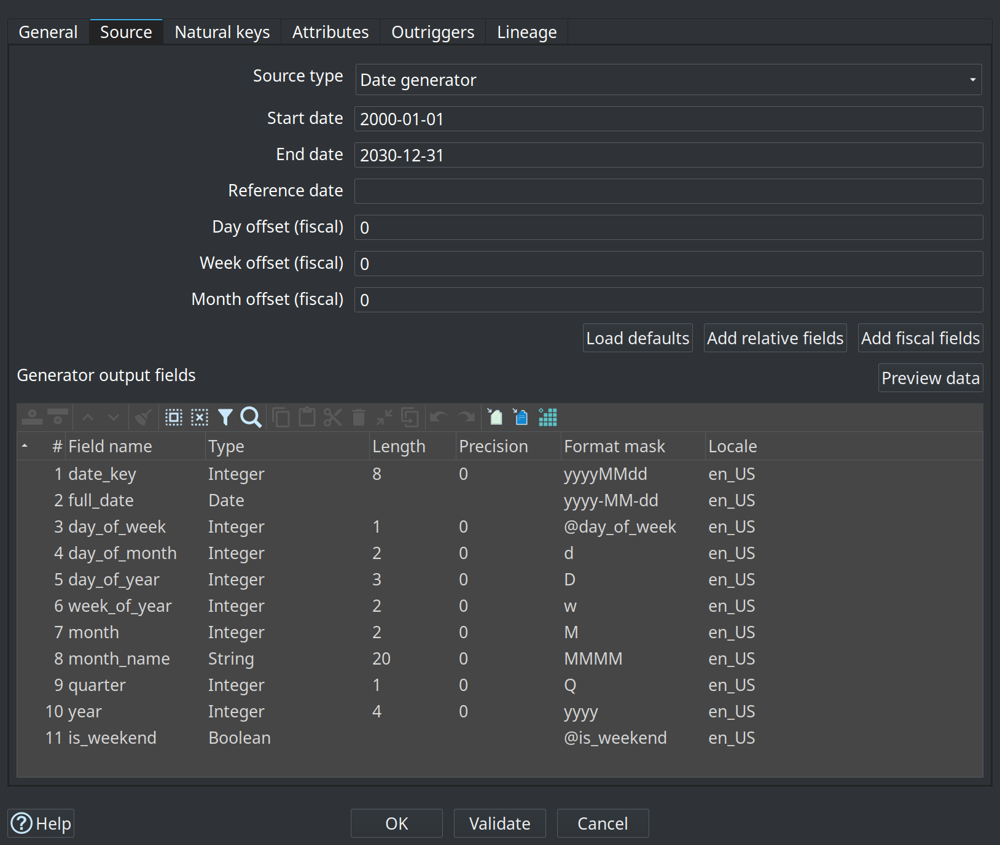

= Dimensional modeler overview
:toc: macro
:toclevels: 3

toc::[]

The dimensional modeler adds Kimball star/snowflake modeling to the hop-data-vault plugin. Models are saved as `.hdm` files and drive native Hop warehouse transforms for dimension and fact loads.

== Why a separate modeler

Data Vault and Kimball semantics differ enough that they use separate model files:

* `.hdv` — hubs, links, satellites, hashing, insert-only history
* `.hdm` — dimensions, facts, bridges, grains, measures, SCD policies

The plugins share infrastructure (graph shell, ELK layout, orchestrator, workflow action pattern) but keep domain metadata separate.

== Dimensional model (`.hdm`)

A dimensional model contains:

* **Configuration** — target database, default standard column names (`dim_key`, `date_from`, `date_to`, …), pipeline naming, optional **Generate primary keys** / **Generate foreign keys** for CREATE TABLE DDL
* **Per-dimension surrogate keys** — optional override of strategy (none, auto-increment, source field such as a DV hash key) and column name; fact foreign key columns remain per join
* **Tables** — dimensions, facts, junk dimensions, bridges, factless facts, snapshot facts, aggregates
* **Conformed dimension registry** — logical name → physical dimension table
* **Notes** — canvas documentation only

Optional DDL constraints (both off by default):

* **Generate primary keys** — dimension and junk surrogate keys, and bridge composite keys, as `PRIMARY KEY` on CREATE TABLE. Fact tables do not receive a primary key in this release.
* **Generate foreign keys** — fact/bridge roles and dimension outriggers emit `FOREIGN KEY` clauses when the target engine supports them (not SingleStore). Parent dimensions receive a primary key when FK generation is enabled so references are valid. CREATE only; no ALTER retrofit.

Open a `.hdm` file in Hop GUI for the visual editor (same interaction model as the Data Vault canvas).

The retail example `retail-f-order-lines.hdm` shows a transaction fact with conformed dimension aliases and multiple date roles on one canvas:

image::images/dimensional-model-f-order-lines.png[Dimensional model — f_order_lines fact with conformed dimensions and date roles,align="center"]

=== Table types

[cols="1,3", options="header"]
|===
|Type |Kimball role

|Dimension (`DmDimension`)
|SCD1, SCD2, or SCD3/hybrid dimension loads

|Fact (`DmFact`)
|Transaction fact with dimension roles and measures

|Junk dimension (`DmJunkDimension`)
|Low-cardinality flag combinations via Combination Lookup

|Bridge (`DmBridge`)
|Many-to-many resolution between two or more dimensions

|Factless fact (`DmFactlessFact`)
|Coverage/attendance pattern — dimension FKs only

|Periodic snapshot (`DmPeriodicSnapshotFact`)
|Grain includes snapshot period

|Accumulating snapshot (`DmAccumulatingSnapshotFact`)
|Milestone grain with row updates across a lifecycle

|Aggregate fact (`DmAggregateFact`)
|Pre-computed rollup from a base fact
|===

=== Staging sources

Each dimension or fact has a **Source** tab that defines how staging rows are obtained for generated load pipelines. Supported source types:

* **Database / SQL** — SQL executed by a generated `TableInput` (the traditional path)
* **Pipeline** — a Hop `.hpl` whose output is injected via MetaInject
* **Record definition** — a data catalog record definition
* **Date generator** — built-in calendar generation (dimensions; see below)

Model validation requires a complete source configuration for the selected type before running **Dimensional Update**.

[[date-dimension]]
==== Date dimension (`dim_date`)

For the standard calendar dimension:

* Canvas action **Add date dimension** creates `dim_date` / `d_date` with source type **Date generator**, default calendar fields, and TYPE1 attributes.
* On the **Source** tab, **Date generator** embeds the link:date-dimension-generator.adoc[Date Dimension Generator] in the generated Dimensional Update pipeline: start/end dates, optional reference date, fiscal day/week/month offsets, and a field table. No external `.hpl` is required for the standard calendar.
* Use **Load defaults**, **Add relative fields**, **Add fiscal fields**, and **Add load timestamp** to manage the output field pack; **Preview data** generates sample rows with the same logic as the transform.
* Type 1 loads need the model load timestamp column (for example `x_load_ts`) on the source stream. The date generator adds that field automatically as a `Timestamp` with mask `@now` when it is not already in the field table.
* Advanced customizations (holidays, bespoke SQL) can still use **Pipeline** or **SQL** sources.

The generator's **Load defaults** field pack matches the modeler template (`date_key`, `full_date`, `day_of_week`, and related columns). Optional relative and fiscal field packs support dynamic reporting filters (`month_rel = 0`, YTD) and fiscal calendars.

== Workflow integration

Production loads and DV-to-dimensional publish use workflow actions documented in link:dimensional-update-action.adoc[Dimensional Update and Publish actions].

== GUI workflows

=== Canvas context menu

Left-click the dimensional canvas background to:

* **Import database tables** — scaffold draft tables from an existing database schema
* **Add date dimension** — standard calendar `dim_date` with **Date generator** source (see <<date-dimension>>)
* Add dimension, fact, junk dimension, bridge, factless fact, or note

=== Data Vault canvas

From a `.hdv` model, use **Publish draft dimensional model** to create a draft `.hdm` via the same publish adapter as the workflow action.

== Pipeline generation strategy

Generators are thin builders over native Hop warehouse transforms:

[cols="2,2,3", options="header"]
|===
|Kimball pattern |Hop transform |Notes

|SCD Type 1 (all attributes Type 1) |Insert/Update |Overwrite attributes on natural key match

|SCD Type 2 (all attributes Type 2) |MergeRows chain (satellite pattern) |Ported from `DvSatellite` load-end-date chain

|Hybrid / Type 3 (mixed attribute policies) |Dimension Lookup (`update=true`) |Per-attribute update types; optional source→target rename; `is_current` via Last Version

|Junk dimension |Combination Lookup |Key field combinations → surrogate key

|Fact FK resolution |Dimension Lookup (`update=false`) |One lookup per dimension role

|Bridge / factless / snapshots |Mix of above + TableOutput/InsertUpdate |Catalog-specific builders
|===

== Database import heuristics

**Import database tables** infers table type from naming:

* `d_*`, `dim_*` → dimension
* `f_*`, `fact_*` → fact
* `bridge_*` → bridge
* `factless_*`, `f_factless_*` → factless fact

Column heuristics:

* Skip standard warehouse columns (`dim_key`, `version`, `date_from`, …)
* `*_id` / `*_code` → natural key candidate on dimensions
* Integer `*_key` columns → dimension roles on facts/bridges/factless facts
* Numeric columns → measures on facts

Imported tables are **draft** metadata — review grains, roles, and source SQL before production loads.

== Test fixtures

[cols="2,3", options="header"]
|===
|Fixture |Purpose

|`integration-tests/tests/basic/basic-star.hdm`
|Minimal customer/product/sales star (SCD1 dims + transaction fact)

|`integration-tests/tests/basic/extended-catalog.hdm`
|Full Phase C catalog: SCD3, junk, bridge, factless, snapshots, aggregate

|`integration-tests/tests/basic/vault1.hdv` + publish
|DV → draft dimensional publish golden path
|===

Unit tests: `DmBasicStarPipelineTest`, `DmCatalogPipelineTest`, `DvToDimensionalPublishTest`, `DmDatabaseTableImportTest`, `DmGoldenFixtureTest`.

== Related documents

* link:dimensional-update-action.adoc[Dimensional Update and Publish actions]
* link:getting-started-edw.adoc#after-first-load[Getting started — after the first load]
* link:getting-started-retail.adoc[Getting started — retail example]
* link:datavault-plugin.adoc[Data Vault plugin overview]