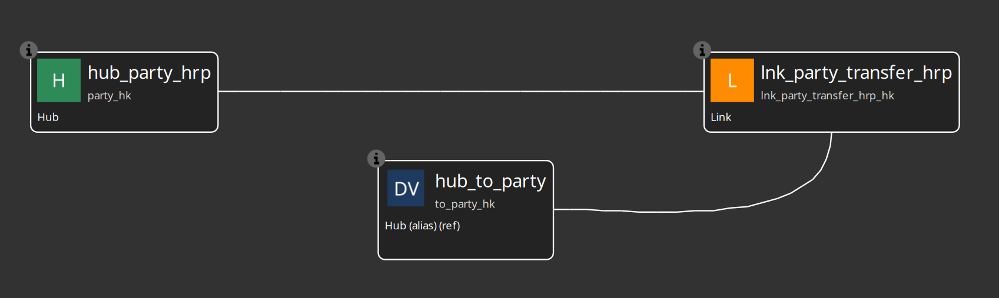

= Data Vault table references and hub aliases
:toc: macro
:toclevels: 3

toc::[]

Data Vault models use **table references** (`tableType=TABLE_REFERENCE`) for two related cases:

1. **Cross-model references** — read-only canvas cards that point at hubs, links, or satellites defined in another `.hdv` file (subject-area models around a shared core).
2. **Same-model hub aliases** — role-playing names for the **same physical hub** so a link can participate that hub more than once with distinct source mappings and link columns (for example primary and secondary sales rep, or from/to location).

Both patterns mirror dimensional `DIMENSION_ALIAS` / `referencedModelFilename`.

== When to use

* **Enterprise core + subject areas** — shared hubs live in `shared-core.hdv`; subject models reference them and define local links and satellites. For team ownership, git, catalog, and personas, see link:enterprise-modeling-and-team-collaboration.adoc[Organizing large Data Vault programs].
* **Avoid metadata duplication** — hash keys, business keys, and source mappings stay authoritative on the physical hub.
* **Independent load workflows** — each `.hdv` file runs its own Data Vault Update action; references/aliases do not generate DDL or loads.
* **Same hub twice on one link (role-playing)** — prefer the **natural hub + one alias per extra role** (not an orphan physical hub). See link:dv-link.adoc[Data Vault Link] and the role-playing section below.

== Table reference metadata

A table reference is stored as `tableType=TABLE_REFERENCE`:

[source,xml]
----
<!-- Cross-model reference (canvas name usually matches the physical hub) -->
<table>
  <referencedTableName>hub_customer</referencedTableName>
  <referencedModelFilename>${PROJECT_HOME}/models/shared-core.hdv</referencedModelFilename>
  <referencedTableType>HUB</referencedTableType>
  <tableName>hub_customer</tableName>
  <name>hub_customer</name>
</table>

<!-- Same-model hub alias for an *extra* role (distinct name + role hash key column) -->
<table>
  <referencedTableName>hub_sales_rep</referencedTableName>
  <referencedTableType>HUB</referencedTableType>
  <hashKeyFieldName>secondary_rep_hk</hashKeyFieldName>
  <tableName>hub_sales_rep</tableName>
  <name>hub_secondary_rep</name>
</table>
----

* `referencedModelFilename` — optional; empty means **same model**.
* `name` — unique canvas name (may differ from `referencedTableName` for aliases).
* `hashKeyFieldName` — role column used when the alias participates in a **link** (must differ from the physical hub hash column and from other roles).
* Physical `tableName` is synced from the target hub; aliases never create a second hub table.

References and aliases do not generate DDL or load pipelines.

== Canvas workflow

From the Data Vault canvas context menu:

* **Add Hub reference** / **Add Link reference** / **Add Satellite reference** — browse an external `.hdv` and pick a table.
* **Add Hub alias** — pick a physical hub **in this model**, enter a unique alias name and a role hash key column (for example `secondary_rep_hk` or `to_party_hk`).
* Drag relationships from local links or satellites to references/aliases (same rules as local tables).

Cards show `(ref)` for cross-model references and `(alias)` for same-model role-playing aliases, plus the source model basename when external.

== Navigate to the source table

* **Click the table name** on a reference/alias card to open the owning model (or select the physical hub in the same model) and select the referenced table.
* Or use the table context menu action **Go to source table**.

== Role-playing on links (issue #103)

Data Vault 2.0 allows multiple foreign hash keys of the **same hub domain** on one link, distinguished by **role-named columns** (from/to location, employee/manager, primary/secondary rep).

=== Recommended canvas shape: natural hub + alias(es)

Avoid leaving the physical hub as an orphan card that never participates in the link. Prefer:

1. Create and load the physical hub once (`hub_sales_rep`).
2. On the link, use the **physical hub for the primary / natural role** (column = the hub’s own hash key, e.g. `sales_rep_hk`, mapped from `primary_rep_id`).
3. Add **one hub alias per additional role** only (`hub_secondary_rep` → `secondary_rep_hk`, mapped from `secondary_rep_id`).
4. List participants as `hub_sales_rep`, `hub_secondary_rep` (and any other hubs), not the physical hub name twice.

Canvas result: the real hub stays connected to the link (and its satellites); aliases are the extra role cards only.

Same idea for from/to transfers: `hub_party` + `hub_to_party` (alias with `to_party_hk`), not two aliases with a detached physical hub.

You *can* use two aliases (e.g. both primary and secondary as aliases) if you want symmetric role names and a free-standing hub, but the natural-hub-plus-alias pattern reads better.

The generated link has distinct columns such as `sales_rep_hk` and `secondary_rep_hk` (or `party_hk` and `to_party_hk`), both domain-equivalent to the physical hub hash.

Do **not** rely on link-level “driving key names” for this pattern; multi-active **satellite** driving keys remain a separate concept.

== Validation

Model check verifies:

* The referenced table exists (same model or external file) with the expected type
* No reference chains (reference → reference)
* No circular cross-model references
* Warnings when hash algorithm, hash key type, or target database differ between models
* Links: participating hub/alias hash columns are distinct

== Workflow pattern (cross-model)

1. Run **Data Vault Update** on the shared/core `.hdv` first (loads hubs and any shared entities).
2. Run **Data Vault Update** on each subject-area `.hdv` (loads local links/satellites only; references are skipped).

Same-model aliases do not change load order: the physical hub loads with its model; the alias is metadata only.

== Related patterns

* **Program organization (teams, git, catalog, personas)** — link:enterprise-modeling-and-team-collaboration.adoc[Organizing large Data Vault programs]
* **Business Vault** — multi-model DV aliases and BV table references. See link:business-vault-sql-view.adoc[Business Vault SQL views and tables].
* **EXTERNAL_READ** — physical tables exist but Hop does not generate loads.
* **Dimensional aliases** — `DIMENSION_ALIAS` + `referencedModelFilename` in `.hdm` files (order date / ship date).
* **Catalog model registry** — DV/BV/DM Update publish upserts `hop/{project}/models-registry/{basename}` for short-name discovery.

== Test fixtures

* `integration-tests/tests/basic/shared-dv-core.hdv` — shared hubs
* `integration-tests/tests/basic/cross-model-dv-subject.hdv` — hub references + local link
* `integration-tests/tests/hub-alias-role-playing/` — natural `hub_party_hrp` + `hub_to_party` alias on one link
