= Data Hopper EDW — feature overview
:toc: macro
:toclevels: 3
:openvar: ${
:closevar: }

toc::[]

**Data Hopper EDW** is a set of Apache Hop plugins for an **Enterprise Data Warehouse**: catalog, source models, **model-driven Data Vault 2.0**, **Business Vault**, and **dimensional** loading. Version **0.10.0-SNAPSHOT** (latest release **0.9.0**) requires **Apache Hop 2.19.0** and **Java 21**.

**Model once. Generate loads and consumption layers.** The visual models (`.hsm`, `.hdv`, `.hbv`, `.hdm`) are the contract between architects, modelers, and operations.

**Build an EDW:** link:getting-started-edw.adoc[Getting started — building an EDW]. **Architecture** (catalog, resource definition group, four controls): link:architecture.adoc[Architecture]. **Tour the sample:** link:getting-started-retail.adoc[Getting started — retail].

For a slide-style executive summary, see link:presentations/hop-data-vault-overview.md[presentations/hop-data-vault-overview.md]. Interactive HTML presentation: link:presentations/hop-data-vault-features.html[hop-data-vault-features.html]. For DV concepts and canvas usage, see link:datavault-plugin.adoc[Data Vault plugin].

**Large teams / hundreds of tables:** how to split models, assign personas (modeler, admin, ops, BV/DM, analysts), use git and the data catalog, and orchestrate loads — see link:enterprise-modeling-and-team-collaboration.adoc[Organizing large Data Vault programs].

== Feature maturity

[cols="3,2,4", options="header"]
|===
|Feature |Status |Documentation

|Data Catalog + `DV_SOURCE` record definitions
|Available
|link:data-catalog.adoc[Data Catalog], link:datavault-source.adoc[Data Vault sources]

|Source modeler (`.hsm`) + multi-table queries / composite feeds
|Available
|link:source-modeler-overview.adoc[Source modeler]

|Data type mappings (pre-modeling sources)
|Available
|link:data-type-mappings.adoc[Data type mappings], issue https://github.com/ProjectDataHopper/hopper-edw/issues/113[#113]

|Target type mappings (Hop type to DDL)
|Available
|link:target-type-mappings.adoc[Target type mappings], issue https://github.com/ProjectDataHopper/hopper-edw/issues/127[#127]

|Free SQL over source models (Calcite parse/plan, pushdown + residual pipeline)
|Available
|link:source-modeler-overview.adoc[Source modeler] (JDBC + DBeaver screenshots), link:plans/source-model-sql-virtualization-plan.md[source-model SQL plan], Free SQL + **Source model SQL** transform, `hop-hsm-jdbc` + **Source model service**

|Project / Search Everywhere for models and plugin metadata
|Available (Hop 2.19)
|link:search.adoc[Search]

|Resource definition validation (issues, proposals, acknowledgements)
|Available
|link:resource-definition-validation.adoc[Resource definition validation]

|Metadata harvesting (live source discovery + OPS history, distinct from load)
|Available (Phase 1–4)
|link:metadata-harvesting.adoc[Metadata harvesting]

|Schema gate `HARVEST_RUN` (reuse harvest without rediscovery)
|Available (Phase 2)
|link:metadata-harvesting.adoc[Metadata harvesting], link:resource-definition-validation.adoc[Resource definition validation]

|Schema harvest history browser (group + subject UI)
|Available (Phase 3)
|link:metadata-harvesting.adoc[Metadata harvesting]

|Model-check prefers harvest for type checks
|Available (Phase 4)
|link:metadata-harvesting.adoc[Metadata harvesting]

|PK/FK drift on harvest (OPS + optional catalog FK contract)
|Available
|link:metadata-harvesting.adoc[Metadata harvesting]

|Apply harvest FKs → catalog / generate `.hsm` from harvest
|Available
|link:metadata-harvesting.adoc[Metadata harvesting]

|Catalog version tags + schema impact simulation (CI/CD gate, blast radius)
|Available
|link:resource-definition-validation.adoc[Resource definition validation], link:data-catalog.adoc[Data Catalog]

|Data quality measure + quality gate (content rules, persist, alerts)
|Available (Phase 2)
|link:data-quality.adoc[Data quality]

|Data Vault modeler (`.hdv`)
|Available
|link:datavault-plugin.adoc[Data Vault plugin]

|Composite hub business keys (multi-source-field → one vault BK column)
|Available
|link:dv-hub.adoc#composite-hub-business-keys[Hubs], link:dv-satellite.adoc[Satellites], link:dv-link.adoc[Links]

|Hub aliases / same hub twice on a link
|Available
|link:dv-cross-model-references.adoc[Linked tables and hub aliases], link:dv-link.adoc[Links]

|Large-program / multi-team modeling guide
|Available (docs)
|link:enterprise-modeling-and-team-collaboration.adoc[Organizing large Data Vault programs]

|Architecture export (Draw.io)
|Available (SOLUTION + DATA inventory + aggregated DV/BV/DM ELK)
|link:architecture-export.adoc[Architecture export]

|Model validation (Check model, type checking)
|Available
|link:datavault-update-action.adoc[Data Vault Update]

|Data Vault Update action
|Available
|link:datavault-update-action.adoc[Data Vault Update]

|Optional DV orphan handling (seed parent hubs, INFER / SENTINEL / QUARANTINE / FAIL)
|Available
|link:datavault-configuration.adoc[Data Vault configuration], link:plans/orphan-prevention-plan.md[orphan-prevention plan], issue https://github.com/ProjectDataHopper/hopper-edw/issues/77[#77]

|Update resource definition group action
|Available
|link:update-resource-definition-group-action.adoc[Update resource definition group]

|Integration modes (managed / external / custom)
|Available
|link:dv-integration-modes.adoc[Integration modes]

|Business Vault modeler (`.hbv`)
|Available
|link:business-vault-overview.adoc[Business Vault overview]

|BV SCD2 (single + multi-satellite merge)
|Available
|link:business-vault-scd2.adoc[Business Vault SCD2]

|BV SCD2 SQL calculations (`CASE` / `COALESCE` / `CAST`) + Hop pipeline unit tests
|Available
|link:business-vault-scd2.adoc[Business Vault SCD2], issue https://github.com/ProjectDataHopper/hopper-edw/issues/150[#150]

|BV SCD2 hub business keys + calculation-only mappings
|Available
|link:business-vault-scd2.adoc[Business Vault SCD2], issue https://github.com/ProjectDataHopper/hopper-edw/issues/153[#153]

|BV source query (table/view or SQL on another connection for SCD2/PIT)
|Preview
|link:help/bv-source-query-dialog.adoc[Source query dialog], link:business-vault-scd2.adoc[Business Vault SCD2]

|BV PIT tables
|Available
|link:business-vault-pit.adoc[Business Vault PIT]

|BV SQL views / tables (`ref` / `source`)
|Available
|link:business-vault-sql-view.adoc[Business Vault SQL] (`vault1.hbv` + `retail-sql.hbv` samples)

|Jinja macros for BV SQL (Jinjava + metadata library)
|Available
|link:business-vault-sql-view.adoc[Business Vault SQL], issue https://github.com/ProjectDataHopper/hopper-edw/issues/72[#72]

|dbt-core importer (`.sql` + YAML → `.hbv`)
|Available
|link:dbt-import.adoc[Import dbt models] — BV canvas dialog + **Import dbt project** workflow action, issue https://github.com/ProjectDataHopper/hopper-edw/issues/72[#72]

|Catalog model registry (DV/BV/DM index)
|Available
|Published on catalog publish; short `ref('model', 'table')` lookup

|Source-to-target lineage (table + field, reason codes)
|Available
|link:source-to-target-lineage.adoc[Source-to-target lineage]

|Hop Lineage View (`.hlv`) over Marquez / export folder / local models
|Available
|link:hop-lineage-view.adoc[Hop Lineage View], issue https://github.com/ProjectDataHopper/hopper-edw/issues/79[#79]

|Explainable DDL + lineage drift gate
|Available
|link:source-to-target-lineage.adoc[Source-to-target lineage], link:resource-definition-validation.adoc[Resource definition validation]

|Reverse lineage browser (source field → consumers)
|Available
|link:source-to-target-lineage.adoc[Source-to-target lineage]

|BV→BV canvas references (multi-step BV)
|Available
|Alias cards + SQL `ref()` to tables in another `.hbv`

|Business Vault Update action
|Available
|link:business-vault-update-action.adoc[Business Vault Update]

|Dimensional modeler (`.hdm`)
|Available
|link:dimensional-modeler-overview.adoc[Dimensional modeler]

|Dimensional Update / Publish actions
|Available
|link:dimensional-update-action.adoc[Dimensional Update and Publish]

|Execution maps (`.hem`)
|Available
|link:execution-maps.adoc[Execution maps]

|EDW Journey perspective
|Available (map, Open, last-run, grow, contextual docs)
|link:edw-journey.adoc[EDW Journey]

|Hop Web modelers (`.hsm`/`.hdv`/`.hbv`/`.hdm`/`.hem`/`.hlv`)
|Available (experimental; needs Hop canvas SPI)
|link:hop-web-modelers.md[Hop Web modelers], issue https://github.com/ProjectDataHopper/hopper-edw/issues/119[#119]

|AI Help (model, pipeline, workflow)
|Available
|link:ai-advisory.md[AI advisory]

|Get Record Definition Names transform
|Available
|link:record-definition-input.adoc[Get Record Definition Names]

|Record Definition DDL transform
|Available
|link:record-definition-ddl.adoc[Record Definition DDL], link:target-type-mappings.adoc[Target type mappings]

|Catalog Record Definition Metadata Output transform
|Available
|link:record-definition-output.adoc[Record Definition Output]

|Record Definition Input transform (data rows)
|Available
|link:record-definition-data-input.adoc[Record Definition Input]

|Date Dimension Generator transform
|Available
|link:date-dimension-generator.adoc[Date Dimension Generator]

|Dimensional modeler date generator source (`DATE_GENERATOR`)
|Available
|Canvas **Add date dimension**; fiscal offsets + relative attrs; `@now` load timestamp for Type 1; link:date-dimension-generator.adoc[Date Dimension Generator], link:dimensional-modeler-overview.adoc[Dimensional modeler]

|`hop svg` export
|Available
|link:../README.md#command-line-tools[README — command-line tools]

|BV naming rules engine
|Planned
|link:plans/bv-naming-rules-engine-plan.md[BV naming rules plan]

|Marquez / OpenLineage export
|Available
|link:openlineage-export.adoc[OpenLineage export]
|===

== Architecture (logical)

Full pictures (catalog writers/readers, resource definition group spine, build vs run, harvest vs schema gate vs quality): link:architecture.adoc[Architecture].

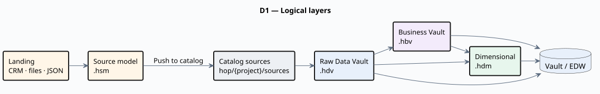

A **resource definition group** lists the `.hdv` / `.hbv` / `.hdm` files. **Update resource definition group** loads them (DV then BV then DM) and can publish target layouts back to the catalog. See link:resource-definition-group.adoc[Resource definition group].

== Major capabilities

=== Data Catalog and sources

Record definitions of type **`DV_SOURCE`** describe logical feeds: record-source indicator, optional **group** for partial loads, and physical layout (database table, file types, or **composite** multi-table query). Definitions live under namespace `hop/{project}/sources` in the project's FILE catalog storage directory (retail: `work/edw-catalog/`) and open in the **Data Catalog** perspective.

Hubs, links, and satellites reference source **names**, not raw connection details — one stable vocabulary from catalog through models to generated pipelines. A link:resource-definition-group.adoc[resource definition group] lists the warehouse models that harvest, validate, and load together. Pictures: link:architecture.adoc[Architecture].

=== Source modeler (`.hsm`)

Visual **source-system** modeler: import tables with PK/FK, draw relationships, **generate a raw Data Vault** (hubs, links, satellites, reference tables, hierarchy aliases) from selected tables, queries, JSON extractions, and pipelines after review, compose **source queries** (joins + projections), **source JSON** extractions (flatten a parent JSON field; chain steps for nested arrays), and **pipeline sources** (declare a `.hpl` + output transform + field contract; publish as catalog **`PIPELINE`**). **Validate** tables/queries/JSON/pipelines/relationships at design time. Publish queries as **`COMPOSITE`**, JSON as **`JSON`**, pipelines as **`PIPELINE`**; Data Vault loads generate SQL/Merge Join, parent + JsonInput, or MetaInject pipelines (with record-source injection and hub sort/distinct where needed). Catalog **Go to origin** opens the `.hsm` card for published pipeline/JSON/composite feeds. Retail sample: `retail-example/models/source-tables-crm.hsm` (shipment JSON + ASN pipeline) → `retail-360.hdv`. See link:source-modeler-overview.adoc[Source modeler].

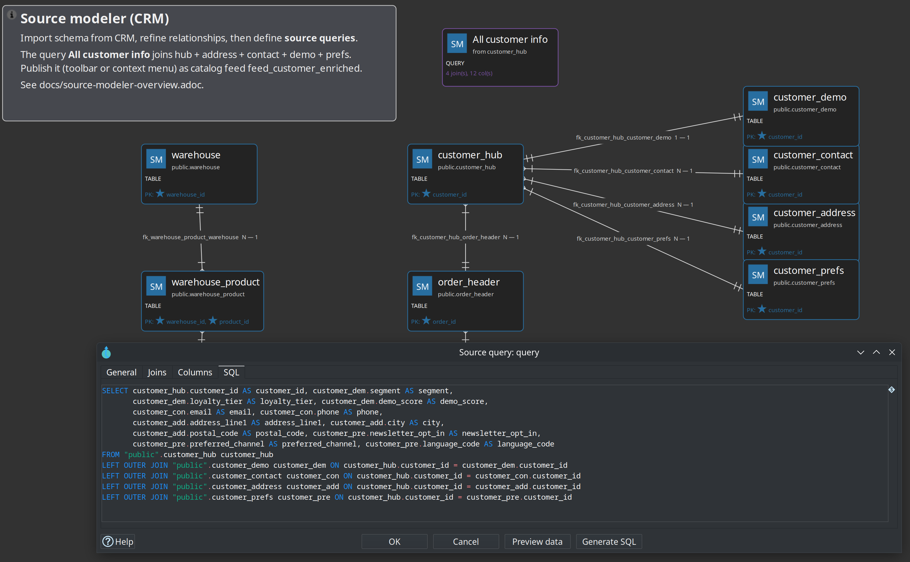

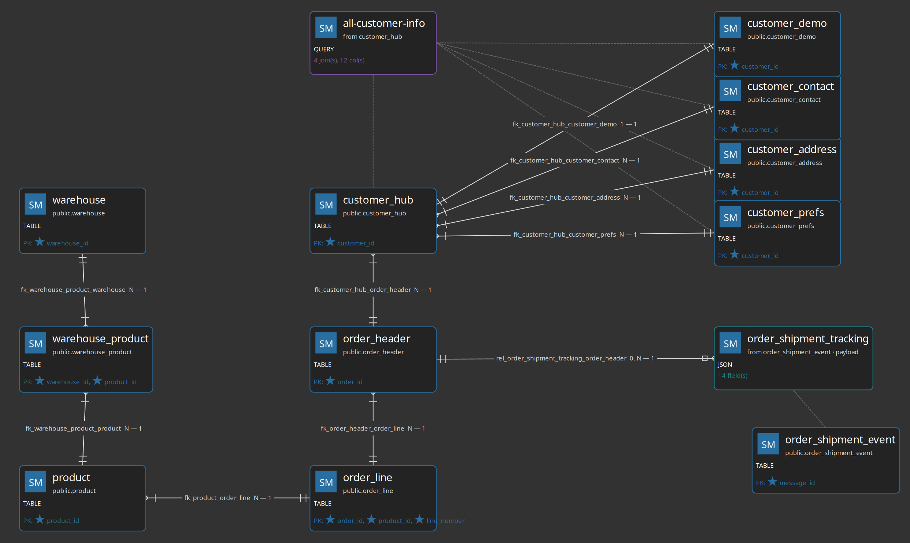

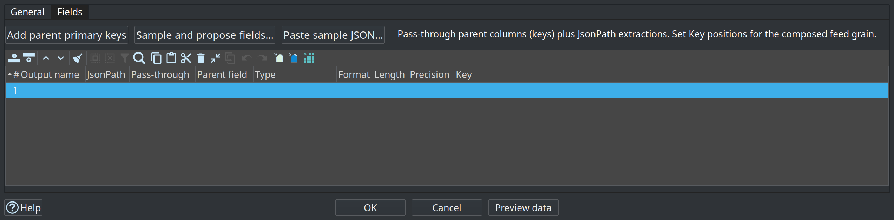

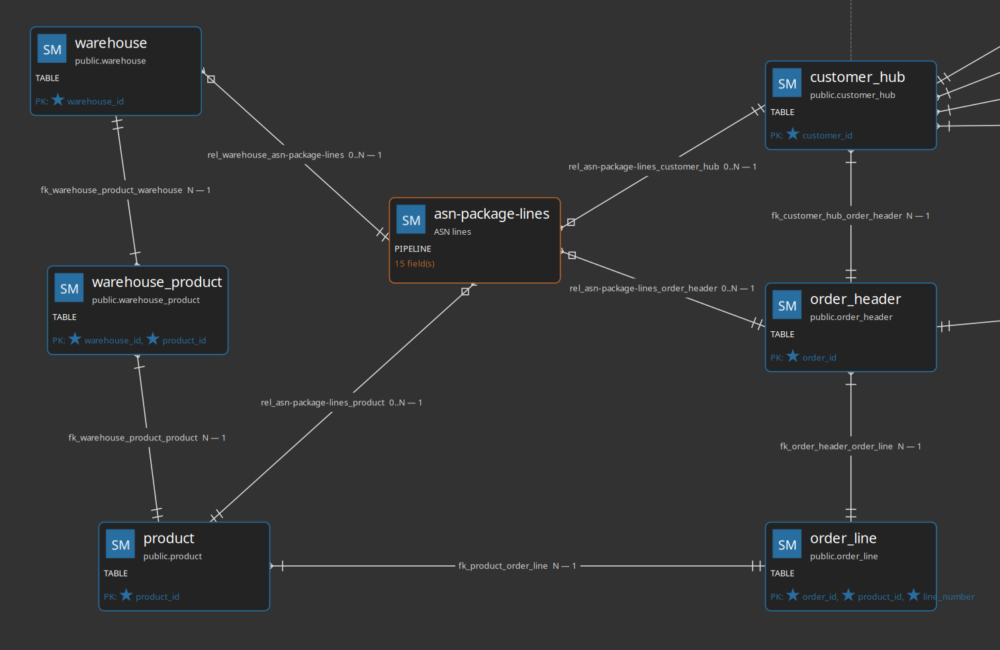

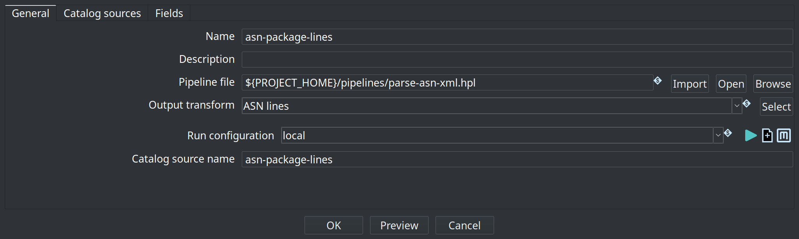

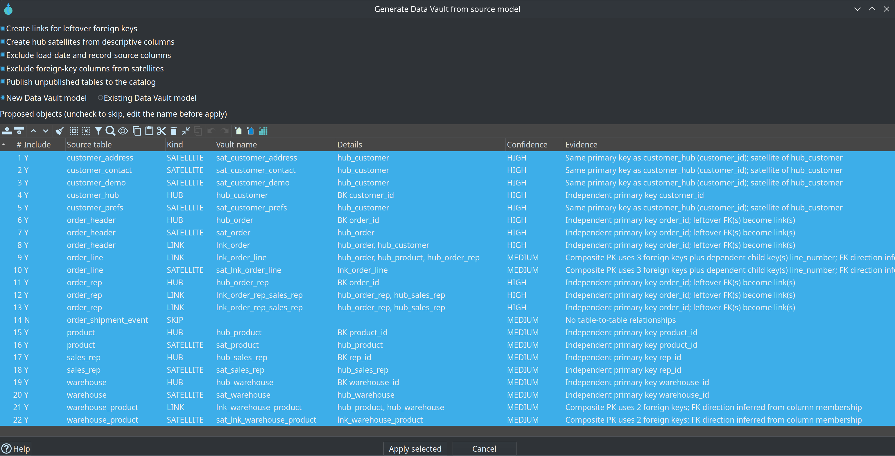

=== Project and metadata search (Hop 2.19)

Hop **Search Everywhere** / project search includes Data Hopper EDW models and metadata:

[cols="1,3", options="header"]
|===
|Scope |Examples of matches

|`.hsm`
|Source tables, relationships, multi-table **query** names, WHERE text, published feed names

|`.hdv`
|Hub / link / satellite names, physical names, configuration, canvas notes

|`.hbv` / `.hdm`
|BV and dimensional table names, paths, configuration, notes

|`.hlv`
|Lineage backend name, logical table, dataset/job names, model file

|Resource definition group
|Group name, catalog connection, listed `.hdv` / `.hbv` / `.hdm` paths

|Data catalog, metrics profile, quality rule set
|Connection paths, rule field names, metrics folder
|===

Open a model hit to open the file (or focus an open tab) and jump to the matching table or source query when the hit carries a component name. Open tabs search **unsaved** in-memory content. Full usage: link:search.adoc[Search].

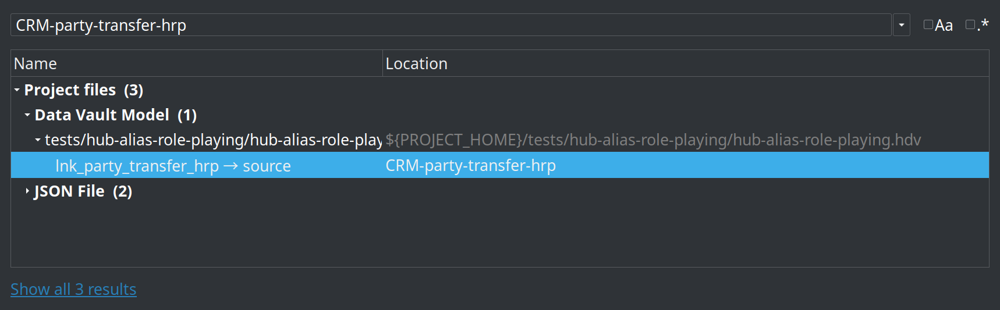

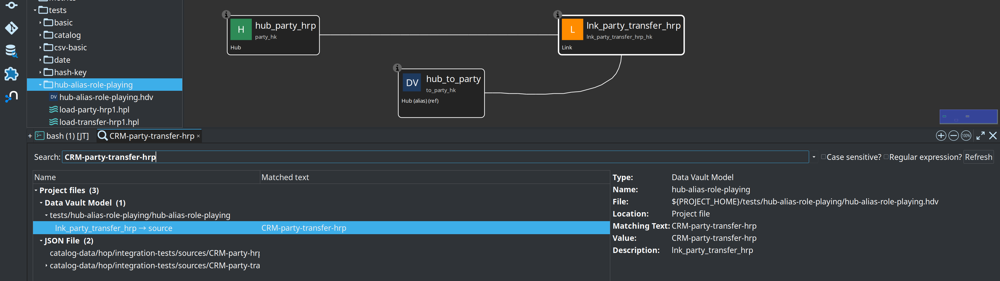

=== Raw Data Vault (`.hdv`)

Visual modeler for hubs, links, and satellites with embedded configuration (target database, hashing, sentinels, column names, pipeline options). Toolbar actions: **Edit model**, **Import sources**, **Check model**, **Generate DDL**, **Debug**, optional **AI Help**. A configuration **Read-only existing vault** checkbox documents an already-built vault so Business Vault and dimensional models can sit on top without Hop loading or altering those tables.

**Data Vault Update** workflow action validates (optionally), generates DDL, stages update pipelines, and runs them in parallel with a shared load timestamp.

=== Model validation and schema gate

**Check model** in the GUI and model checks in update actions share one engine: structural rules plus optional **detailed data type checking** against live source schemas.

Catalog **resource definition validation** adds feed-level checks with remediation proposals, acknowledgements, and **downstream impact** (Source→DV→BV→DM). From a **Resource definition group** you can **Tag catalog version**, **List catalog versions**, and **Validate sources** (options dialog for baseline + axes). Length remediation expands models and multi-layer DDL (DV/BV/DM) **from the catalog length** without rewriting the catalog. Retail sample package: `workflows/schema-remediation/accept-address_line1/` (see link:resource-definition-validation.adoc[Resource definition validation]).

The **Validate resource definitions** workflow action is the **CI/CD schema gate**:

* Compare modes: live source vs catalog, working tree vs tagged baseline, or version vs version
* Failure severity (`FAIL_ON_BLOCKING`, `FAIL_ON_WARNINGS`, `WARN_ONLY`)
* Markdown/HTML reports (for example under `work/reports/`) with blast-radius tables

See link:resource-definition-validation.adoc[Resource definition validation] and link:data-catalog.adoc#catalog-versions[Data Catalog — catalog versions].

image::images/validate-resource-definitions-action-dialog.png[Validate resource definitions action dialog,align="center"]

=== Business Vault (`.hbv`)

Linked to a `.hdv` model. Defines **SCD2** consumption tables (single- or multi-satellite merge), **PIT** helpers, and **SQL views/tables** (dbt-style `ref` / `source`, optional Jinja macros). **Import dbt models** on the canvas (and the **Import dbt project** workflow action) loads a dbt-core project as SQL business tables. **Business Vault Update** validates, optionally publishes target layouts to the catalog, generates SCD2 build pipelines (hash-key partitioned full rebuilds run as truncate-then-load wrapper workflows), and orchestrates parallel execution.

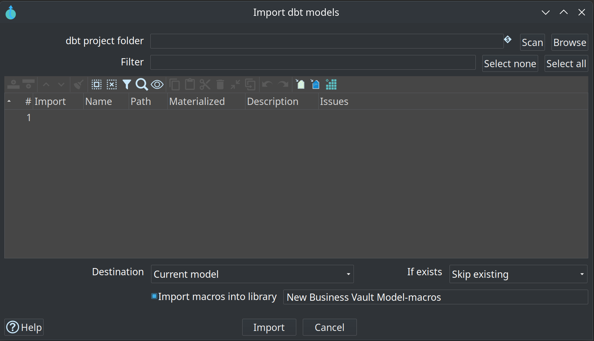

=== Dimensional modeler (`.hdm`)

Kimball star/snowflake modeling: dimensions, facts, junk dimensions, bridges, snapshot facts, and aggregates. **Dimensional Publish** drafts a `.hdm` from a `.hdv`; **Dimensional Update** loads the mart. Shares canvas interaction patterns with the DV modeler.

=== Execution maps (`.hem`)

Crawl a root workflow or model and persist a graph of workflows, models, generated pipelines, and source datasets. Open `.hem` files in Hop GUI for execution and lineage views. The retail example includes maps for its main update workflow and the six-month simulation.

image::images/execution-map-in-hop-gui-simulate-six-months.png[Execution map in Hop GUI — simulate-6-months,align="center"]

=== Hop Lineage View (`.hlv`)

Author a small view definition (seed table, depth, backend) and query **Marquez**, a folder of exported OpenLineage events, or the current models. The graph is not stored in the file. **Show lineage** on a DV/BV/DM table opens an unsaved upstream tab. Load-time badges come from the Hop OPS database — Marquez `latestRun` is the last _export_, not the last _load_. Retail sample: `retail-example/models/f_orders-upstream.hlv`. See link:hop-lineage-view.adoc[Hop Lineage View].

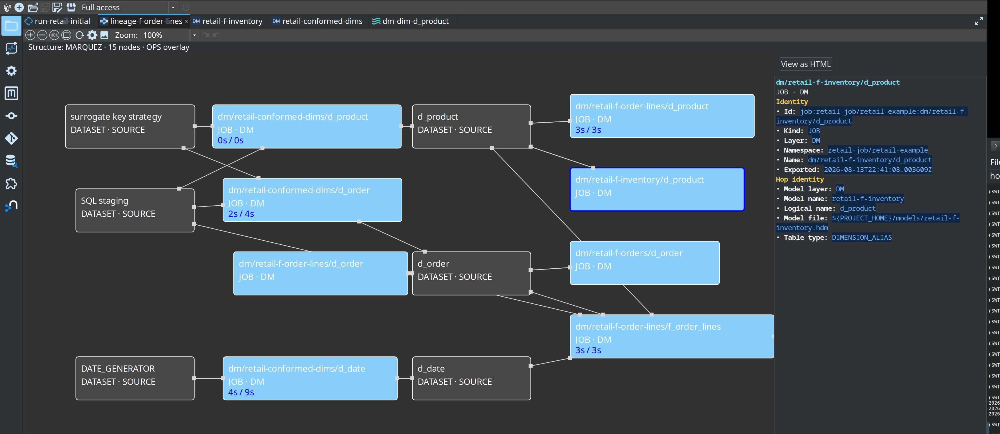

=== AI Help

Optional LLM advisory on Data Vault models, pipelines, and workflows — scenarios, context inclusions, review-before-apply proposals. Configure under Hop GUI → **Configuration → AI Assistant**.

The **Performance tuning** scenario can include load-run metrics and propose model configuration changes (parallel copies, preload lookup cache) after review:

image::images/ai-advisor-offering-performance-tuning-advice.png[AI advisor — performance tuning recommendations,align="center"]

=== Pipeline transforms

* **Get Record Definition Names** — stream catalog record definition metadata (or field layouts) as pipeline rows.
* **Catalog Record Definition Metadata Output** — discover or migrate field layouts into the data catalog (including stream field grouping).
* **Record Definition Input** — read actual data rows from a catalog record definition (same path as catalog Preview data).
* **Date Dimension Generator** — populate standard calendar dimension attributes.

=== Operations

Docker-based runners (`scripts/run-hop.sh`, `run-postgres.sh`), parallel pipeline orchestration, **record source group** partial loads, catalog-backed load-run metrics, workflow load overview reports, and per-table duration bars on model graphs.

**Preferred batch shape:** **Update resource definition group** runs every DV/BV/DM model listed on a resource definition group (layer order DV → BV → DM), manages Begin/End-style vault update metrics in one action, and can write Markdown/HTML **load overview** reports. See link:update-resource-definition-group-action.adoc[Update resource definition group], link:operations.adoc[Operations], and link:performance-tuning.md[Performance tuning].

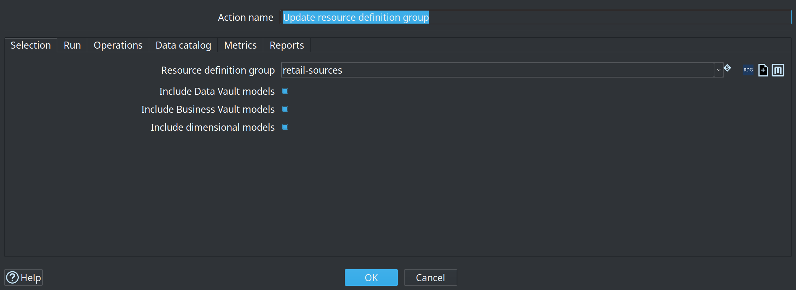

image::images/workflow-load-overview-summary-models.png[Workflow load overview — per-model summary,align="center"]

image::images/data-vault-retail-360-model-with-duration-metrics.png[Retail 360 model with load duration overview,align="center"]

== Sample projects

[cols="1,3", options="header"]
|===
|Project |Use for

|link:../retail-example/README.md[retail-example]
|Learning path — CSV → CRM → DV → BV → DM, initial and monthly updates

|link:../integration-tests/PROJECT.md[integration-tests]
|CI/regression — Customer 360, multi-active, external read-only, golden datasets
|===

image::images/data-vault-model-retail-example.png[Retail 360 Data Vault model,align="center"]

**Recommended path:** link:architecture.adoc[Architecture] → link:getting-started-edw.adoc[Getting started — building an EDW] to build → link:getting-started-retail.adoc[Getting started — retail] to tour the sample → link:getting-started-integration-tests.adoc[Getting started — integration tests] for advanced fixtures.

== 0.1.x focus

The transition from 0.0.x to 0.1.x emphasizes:

* Documentation completeness and accurate catalog-first workflows
* Validation UX (model checks + catalog issue handling, schema gates, catalog versions)
* First-time build order (link:getting-started-edw.adoc[Getting started — building an EDW]) plus the retail sample tour
* Hardening existing modelers and actions rather than large new subsystems
