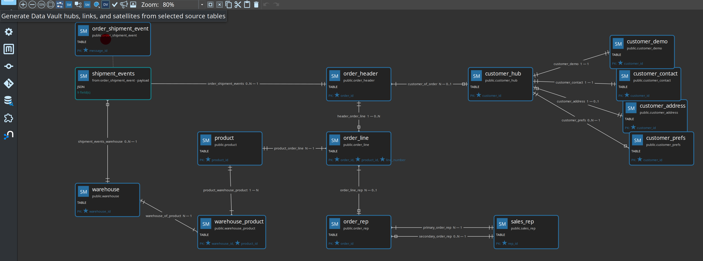
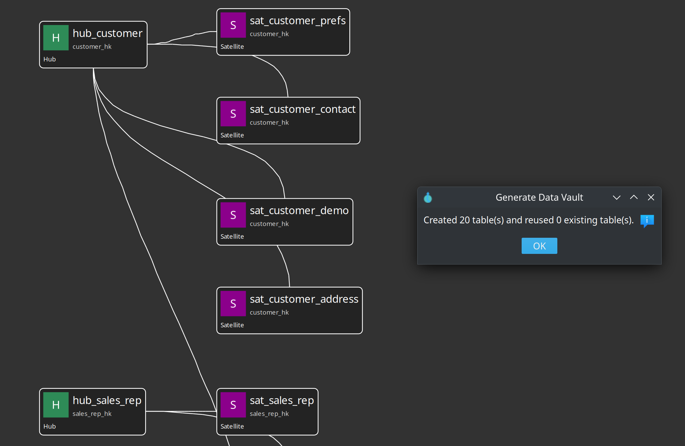

= Generate a Data Vault from a source model
:toc: macro
:toclevels: 2

toc::[]

When a link:source-modeler-overview.adoc[source model] (`.hsm`) already has tables, primary keys, and relationships, you can **generate hubs, satellites, links, and reference tables** into a new or existing Data Vault model (`.hdv`) instead of wiring every object by hand.

This is a **raw-vault starter**. Review the proposals, then refine names, business keys, and Business Vault work as usual.

== Where to start

* **Source modeler** toolbar / canvas: *Generate Data Vault…*  
  Uses the selected table, query, JSON, and pipeline cards, or every card if nothing is selected. You choose a **new** `.hdv` or an **existing** one.
* **Data Vault modeler** toolbar / canvas: *Generate from source model…*  
  Pick an `.hsm` and apply into the **open** vault (one undo). The coach panel **Generate DV** button opens the same path.
* **AI Help** on a Data Vault model includes a compact classification of sibling `.hsm` files in the same folder so the advisor can refine the same heuristic instead of starting from scratch.

All of those paths open the same review dialog.

== Review dialog

Uncheck a row to skip that object. Edit **Vault name** before Apply. Options on the same screen (not a wizard):

* Create links for leftover foreign keys (for example `order_header.customer_id` → `lnk_order`)
* Create hub satellites from descriptive columns
* Exclude load-date / record-source columns
* Exclude foreign-key columns from satellites (uncheck to keep them for raw audit)
* Classify lookup / code tables as **reference tables** (`ref_*`)
* Create hierarchy links (and a hub alias) for self-referencing foreign keys
* Create one n-ary transactional link when a query, JSON, or pipeline feed has leftover keys to two or more hubs
* Include source queries, JSON extractions, and pipeline cards
* Publish unpublished tables to the catalog when the source model has a catalog connection

image::images/source-modeler-generate-data-vault-model-dialog.png[Generate Data Vault from source model review dialog with proposed hubs, satellites, and links,align="center"]

== How sources are classified

The classifier uses **column membership**, not the stored child/parent labels, so inverted relationship edges still work. Query, JSON, and pipeline cards use the same grain rules as tables.

[cols="2,3", options="header"]
|===
|Source shape |Generated objects

|Several tables (or a query at the same grain) share the same primary key
|One hub (kernel table, preferring names like `customer_hub`) + one satellite per other table or composed feed

|Primary key is two or more foreign keys (+ optional extras)
|Link + optional link satellite; leftover key parts become dependent child keys

|Own primary key, plus leftover foreign keys
|Hub + optional satellite + binary link(s)

|Small lookup / code table (incoming FKs, few attributes, or a name like `country`)
|Reference table (`ref_*`). Parents of junction tables stay hubs.

|Self-referencing foreign key (for example `employee.manager_id`)
|Hub + hub alias (`hub_*_parent`) + hierarchy link

|Query / JSON / pipeline with its own identity and leftover FKs to two or more hubs
|Hub + satellite + one n-ary transactional link

|JSON or pipeline with its own key and a parent FK
|Hub + satellite + binary (or n-ary) link to the parent hub

|Isolated **table** with no table-to-table relationship
|Skipped — draw relationships first, or map it from a JSON/pipeline child

|No primary key (and no inferable identity on a feed)
|Skipped
|===

=== Retail CRM example

Selecting the landing tables in `retail-example/models/source-tables-crm.hsm` is expected to propose:

* `hub_customer` plus `sat_customer_demo`, `sat_customer_contact`, `sat_customer_address`, `sat_customer_prefs`
* `hub_product` / `sat_product`, `hub_warehouse` / `sat_warehouse`, `hub_sales_rep` / `sat_sales_rep`
* `hub_order` / `sat_order` / `lnk_order`
* `hub_order_rep` and leftover-FK links to `hub_sales_rep` when `order_rep` is in the model
* `lnk_order_line` / `sat_lnk_order_line` (dependent child key `line_number`)
* `lnk_warehouse_product` / `sat_lnk_warehouse_product`
* `order_shipment_tracking` (JSON) as `hub_order_shipment_tracking` plus a leftover-FK link to `hub_order`
* `asn-package-lines` (pipeline) as `hub_asn_package_lines` plus one n-ary link to the order, product, warehouse, and customer hubs

`order_shipment_event` is skipped (no table-to-table relationship). The JSON child of that event is classified.

== After apply

. **Check model** on the `.hdv`.
. Open each new table if you need to adjust keys or mappings.
. Run **Data Vault Update** as usual. Generation does not create pipelines by itself.

Existing vault tables are **reused** when a hub already has the same business-key source fields or catalog feed. Objects are never overwritten.

== Related documentation

* link:getting-started-edw.adoc#chapter-2[Getting started — generate the Data Vault]
* link:architecture.adoc[Architecture]
* link:source-modeler-overview.adoc[Source modeler overview]
* link:dv-hub.adoc[Hubs]
* link:dv-link.adoc[Links]
* link:dv-satellite.adoc[Satellites]
* link:dv-cross-model-references.adoc[Linked tables / hub aliases] (hierarchy generation uses a same-model hub alias)
* link:ai-advisory.md[AI Help]
* link:datavault-plugin.adoc[Data Vault plugin]
