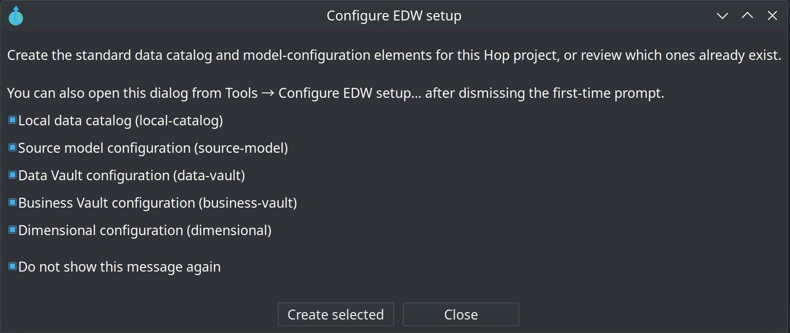

= Getting started — building an EDW with Apache Hop
:toc: macro
:toclevels: 3

toc::[]

This is the **build-from-scratch** guide. You create a source model, publish contracts to the Data Catalog, generate a Data Vault, put it on a **resource definition group**, and load with **Update resource definition group**. After that you grow the *same* group with Business Vault and dimensional models.

Architecture pictures (catalog in/out, RDG spine, four controls): link:architecture.adoc[Architecture].

To **run a finished warehouse** instead of building one, use link:getting-started-retail.adoc[Getting started — retail example]. Advanced fixtures: link:getting-started-integration-tests.adoc[integration test fixtures].

Estimated time for a small source system (a handful of tables): a few hours in Hop GUI once connections exist.

== What you will have at each checkpoint

[cols="1,3", options="header"]
|===
|After chapter |You can stop here with

|0
|Hop project, connections, FILE catalog, shared model configurations

|1
|`.hsm` published as `hop/{project}/sources` feeds

|2
|A `.hdv` that **Check model** accepts (no load yet)

|3
|A resource definition group listing that `.hdv`

|4
|Vault tables loaded; catalog has published DV layouts

|5
|Optional `.hbv` / `.hdm` on the same group, loaded in layer order
|===

[[chapter-0]]
== Chapter 0 — Project bootstrap

. Create or open a Hop project (folder with `project-config.json`).
. Add database connections:
** A **source** connection (landing / CRM).
** A **Vault** connection (where DV / BV / DM tables will live).
** Optional **OPS** if you want harvest history, quality history, or load-run metrics.
. Create an empty source model or Data Vault model file (Explorer → New) so the first-time prompt can run — or skip ahead to the menu in the next step.
. Accept **Configure EDW setup**, or open **Tools → Configure EDW setup...** if you dismissed it.

That dialog creates, when missing:

* Data catalog connection **`local-catalog`** (FILE catalog; default storage `${PROJECT_HOME}/catalog-data` — retail uses gitignored `work/edw-catalog/` instead)
* Shared configurations **`source-model`**, **`data-vault`**, **`business-vault`**, **`dimensional`**

It does **not** create a resource definition group. You will do that in chapter 3.

On each model, **Edit model** and point **Configuration** at the shared object. Set the Data Vault configuration's **target database** to your Vault connection. Set the source model's **catalog connection** to `local-catalog`.

Optional now, useful before publish: a project **Data type mapping** profile for weak source types. See link:data-type-mappings.adoc[Data type mappings].

Reference: link:datavault-configuration.adoc#configure-edw-setup[Configure EDW setup], link:data-catalog.adoc[Data Catalog].

[[chapter-1]]
== Chapter 1 — Source model and publish to the catalog

Contracts go **into** the catalog before you generate hubs.

. New file → source model (`.hsm`). Save it under the project (for example `models/crm.hsm`).
. **Edit model** — catalog connection `local-catalog`, configuration `source-model`.
. Toolbar **Import schema**: pick the source connection, select tables, import columns and primary keys. Foreign keys become relationship edges when the database has them; otherwise **Shift+drag** (or middle-button drag) between cards.
. Optional: source queries (joins), Source JSON, or pipeline cards. Skip these on a first pass if every feed is one table.
. Toolbar **Push to catalog** — publish selected tables (and any queries / JSON / pipelines). Existing feeds with the same name are overwritten.

image::images/source-modeler-example.png[Source modeler canvas with tables, relationships, a query, and a JSON source,align="center"]

Checkpoint: Data Catalog perspective → `hop/{your-project-folder}/sources`. Hubs will bind to these **names**, not to JDBC URLs.

Per-object **Publish to catalog** still works for a single query or JSON card. Toolbar **Push to catalog** is the usual bulk path.

=== Alternative: catalog import without an `.hsm`

If every feed is one physical table and you do not need joins, JSON, or pipeline contracts yet, you can **Import tables** from the Data Catalog perspective (the video / coach-panel path). You can add a source model later. For a first warehouse, prefer the `.hsm` so **Generate Data Vault…** has PK/FK to classify.

Reference: link:source-modeler-overview.adoc[Source modeler], link:datavault-source.adoc[Data Vault sources].

[[chapter-2]]
== Chapter 2 — Generate the Data Vault

. On the `.hsm` toolbar, **Generate Data Vault…** (or on an open `.hdv`, **Generate from source model…**).
. Review the proposed hubs, links, satellites, and reference tables. Uncheck rows you do not want. Turn on **Publish unpublished tables to the catalog** if some cards were never pushed.
. Apply into a new `.hdv` (or the open one). Save the file (for example `models/sales.hdv`).
. **Edit model** — configuration `data-vault`, target database = Vault.
. **Check model**. Fix missing keys or mappings. Refine names and business keys before you load.

image::images/source-modeler-generate-data-vault-model-dialog.png[Generate Data Vault from source model — review proposed hubs, links, and satellites,align="center"]

image::images/source-modeler-generated-data-vault-result.png[Generated Data Vault canvas after apply,align="center"]

Generation does **not** create load pipelines or tables. That is chapter 4.

**Same destination, more manual:** empty `.hdv`, add catalog sources in the coach panel, drag a source onto the canvas to create a hub or satellite. Use this when you are mapping a few tables by hand. The recommended first path is generate-from-HSM.

Checkpoint: `.hdv` exists, **Check model** is clean, no vault tables required yet.

Reference: link:generating-data-vault-from-source-model.adoc[Generate a Data Vault from a source model], link:datavault-plugin.adoc[Data Vault plugin], link:dv-hub.adoc[Hubs] / link:dv-link.adoc[Links] / link:dv-satellite.adoc[Satellites].

[[chapter-3]]
== Chapter 3 — Resource definition group

The group is the list of warehouse models the rest of the product will harvest, validate, tag, and load.

. Metadata → **Resource definition group** → New.
. **Name** (for example `sales-edw`). **Default catalog connection** = `local-catalog`.
. **Data Vault models** tab → **Add models** → your `.hdv`.
. Leave Business Vault and dimensional tabs empty.
. Save.
. Optional: **Tag catalog version** as `v1.0.0` so later schema gates have a baseline.

image::images/resource-definition-group-editor.png[Resource definition group editor with model lists and catalog actions,align="center"]

Checkpoint: harvest, **Validate sources**, and **Update resource definition group** now have a scope.

Open the **EDW Journey** sidebar (after Data catalog) and select this group. The tree is the warehouse map: sources, controls, DV (then empty BV/DM), workflows, reports. Details buttons open the catalog, models, and group editor; **Documentation** buttons open the matching HTML guide. See link:edw-journey.adoc[EDW Journey perspective].

Do **not** wait for BV/DM to create the group. Add those files to this same group in chapter 5.

Reference: link:resource-definition-group.adoc[Resource definition group].

[[chapter-4]]
== Chapter 4 — First load (catalog out)

. New workflow. Add **Update resource definition group** (category General).
. **Selection:** your group; include **Data Vault** models (BV/DM off until those files exist).
. **Operations:** enable **Update target database structure** so CREATE TABLE runs on the empty Vault.
. **Data catalog:** enable **Publish target tables to catalog**.
. **Validation:** log model checks; abort on errors if you want a hard stop.
. Run the workflow (GUI or `hop-run` / `./scripts/run-hop.sh` if you use the repo Docker runners).

image::images/update-resource-definition-group-action-dialog.png[Update resource definition group action — Selection tab,align="center"]

Checkpoint:

* Vault database has hub / link / satellite tables.
* Data Catalog has `hop/{project}/models/{model-name}/` layouts (and lineage siblings when publish is on).

That catalog write-back is expected. The group update publishes *targets*; it does not replace your source feeds. Picture: link:architecture.adoc#d2-catalog-bus[Architecture — D2].

=== Production wave (add as soon as the first load works)

Put these actions **before** Update resource definition group:

[source]
----
Harvest source metadata
  → Validate resource definitions   (schema gate)
  → Measure data quality + Evaluate quality gate
  → Update resource definition group
  → optional Measure target quality (ALERT_ONLY)
----

On a first load, enable **Target tables are created automatically** on the schema-gate action so expected CREATE is not treated as a defect. On later waves, turn that off.

Harvest is **not** chapter 1. It needs this group and models that already reference catalog sources. link:metadata-harvesting.adoc[Metadata harvesting] and link:architecture.adoc#d5-four-controls[Architecture — D5] explain how harvest, the schema gate, Check model, and data quality differ.

Single-model **Data Vault Update** still exists. Use it for one file. Prefer **Update resource definition group** as soon as you have a group — including a group with only one `.hdv`.

Reference: link:update-resource-definition-group-action.adoc[Update resource definition group], link:operations.adoc[Operations], link:resource-definition-validation.adoc[Schema gate], link:data-quality.adoc[Data quality].

[[after-first-load]]
== Chapter 5 — After the first load (same group)

Grow the warehouse; do not start a second group.

=== Business Vault

. New `.hbv`. Point it at the `.hdv` (and/or place DV table aliases on the canvas).
. **Edit model** — configuration `business-vault`, target database (often the same Vault).
. Add SCD2 / PIT / SQL business tables. **Check model**.
. Resource definition group → **Business Vault models** tab → **Add models**.
. Run **Update resource definition group** again with Business Vault included.

image::images/business-vault-model-customer-360.png[Business Vault canvas — Customer 360 SCD2,align="center"]

Reference: link:business-vault-overview.adoc[Business Vault overview], link:business-vault-scd2.adoc[SCD2], link:business-vault-update-action.adoc[Business Vault Update].

=== Dimensional marts

. New `.hdm`, or from the `.hdv` canvas **Publish draft dimensional model** (workflow action **Dimensional Publish**). Review the draft.
. **Edit model** — configuration `dimensional`. Configure dimension/fact sources (SQL, pipeline, record definition, or date generator).
. **Check model**.
. Resource definition group → **Dimensional models** tab → **Add models**.
. Update the group again with dimensional included.

image::images/dimensional-model-f-orders.png[Dimensional model — f_orders,align="center"]

Reference: link:dimensional-modeler-overview.adoc[Dimensional modeler], link:dimensional-update-action.adoc[Dimensional Update and Publish].

The action always loads **all DV, then all BV, then all DM** listed on the group. List order inside each tab is the order within that layer.

=== Day-2 (not required to have an EDW)

[cols="1,2", options="header"]
|===
|When you need |Go here

|Live schema drift history; apply FKs; generate an `.hsm` from what the database has now
|link:metadata-harvesting.adoc[Metadata harvesting] (day-2 discovery — not a greenfield first step)

|CI schema gate, version tags, length remediation
|link:resource-definition-validation.adoc[Resource definition validation]

|Row-level rules on sources or published targets
|link:data-quality.adoc[Data quality]

|Load overview reports, partial loads, Docker runners
|link:operations.adoc[Operations]

|Field lineage, reverse browser, explainable DDL
|link:source-to-target-lineage.adoc[Source-to-target lineage]

|Hop Lineage View / Marquez
|link:hop-lineage-view.adoc[Hop Lineage View], link:openlineage-export.adoc[OpenLineage]

|Many subject-area files, shared core hubs
|link:enterprise-modeling-and-team-collaboration.adoc[Organizing large Data Vault programs]
|===

== Troubleshooting

[cols="1,3", options="header"]
|===
|Symptom |What to check

|Configure EDW never appears
|**Tools → Configure EDW setup...**. Uncheck “Do not show this message again” if you want the automatic prompt back.

|Push to catalog does nothing / wrong place
|Source model **Edit model** → catalog connection. Namespace is `hop/{project-folder-name}/sources`. Refresh the catalog (F5).

|Generate Data Vault skipped a table
|Isolated tables with no relationship are skipped. Draw PK/FK edges, or map JSON/pipeline children.

|Update RDG has nothing to load
|The group’s DV/BV/DM tabs must list the files. The action’s include checkboxes must match.

|Schema gate fails on missing target tables (first load)
|Enable **Target tables are created automatically** on that first run.

|Catalog “lost” my source feeds after a load
|It did not — look under `sources` vs `models`. Publish writes *targets*. Harvest does not overwrite sources unless you **Apply harvest to catalog…**.

|Two groups and a confusing load order
|Use one group per warehouse wave. Split only for independent team loads.
|===

== Next steps

[cols="1,2", options="header"]
|===
|Topic |Document

|Pictures: catalog bus, RDG, four controls
|link:architecture.adoc[Architecture]

|Resource definition group reference
|link:resource-definition-group.adoc[Resource definition group]

|Tour the finished retail project
|link:getting-started-retail.adoc[Getting started — retail example]

|Feature index
|link:feature-overview.adoc[feature-overview]
|===
