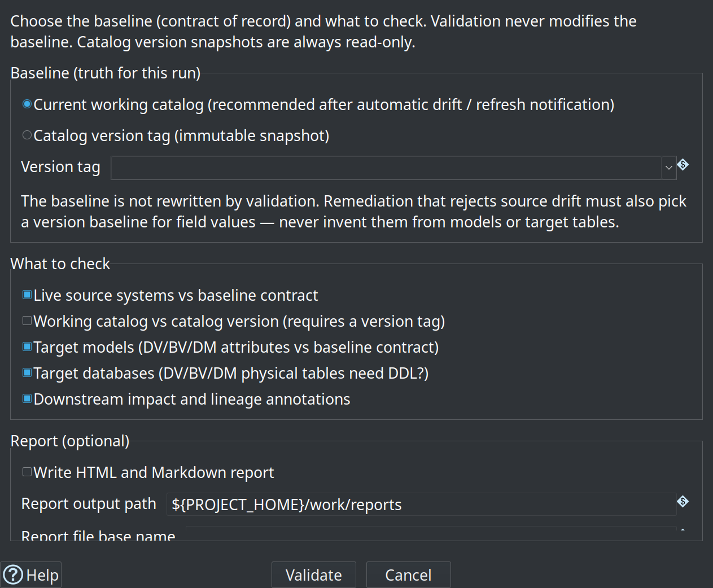

= Getting started — retail example
:toc: macro
:toclevels: 3

toc::[]

This is the **primary tutorial** for the hop-datavault plugin. You will run a full retail pipeline: source data → Data Vault → Business Vault → dimensional marts, including an incremental update wave.

For Customer 360 and other regression fixtures, see link:getting-started-integration-tests.adoc[Getting started — integration test fixtures].

Estimated time: 2–3 hours with Hop GUI, or follow command-line steps only in under an hour.

== Prerequisites

. Install Docker with Compose v2 and Python 3 (stdlib only).
. Build or download the plugin for Apache Hop **2.19.0** (or current **2.19.0-SNAPSHOT** until GA; see link:../README.md[repository README]).
. Register `retail-example/` as a Hop project named **`retail-example`**.
. Configure database connections **`CRM`** and **`Vault`** from project metadata.
. Start PostgreSQL: from repo root, `./scripts/run-postgres.sh up`.

If you previously used an older single-database layout, reset once:

[source,bash]
----
./scripts/run-postgres.sh reset
./scripts/run-postgres.sh up
----

Project details: link:../retail-example/README.md[retail-example/README.md].

== Chapter 1 — Understand the layout

Retail uses two databases on port **54320**:

* **CRM** (`test_source`) — landing tables mimicking a source system
* **Vault** (`test_edw`) — Data Vault, Business Vault, dimensional tables, load control

Key files:

[cols="2,3", options="header"]
|===
|Path |Purpose

|`work/edw-catalog/hop/retail-example/sources/`
|`DV_SOURCE` record definitions (namespace `hop/retail-example/sources`; gitignored runtime catalog)

|`fixtures/schema-gate-baseline/`
|Seed for schema-gate tag `v1.0.0` (copied into `work/edw-catalog/catalog-versions/`)

|`models/retail-360.hdv`
|Data Vault model

|`models/retail-360.hbv`
|Business Vault model (SCD2 Customer 360)

|`models/retail-warehouse.hdm`
|Dimensional mart model

|`workflows/run-retail-initial.hwf`
|Full initial load

|`workflows/run-retail-update.hwf`
|Incremental monthly-style update

|`work/execution-maps/*.hem`
|Generated execution maps (after a run; gitignored)
|===

== Chapter 2 — Tour the Data Catalog

. Open Hop GUI with project **retail-example**.
. Switch to the **Data Catalog** perspective.
. Expand `hop/retail-example/sources` — entries such as `E2E-customer-hub`, `E2E-order-header`.
. Open one source — note **physical table** on CRM, **record source** field, and column layout.

Sources are JSON under the FILE catalog root (`work/edw-catalog/` for retail); the namespace in each file must match its folder path (`hop/retail-example/sources`). Initial setup runs `scripts/bootstrap-retail-work.py` to create the `work/` tree and generate E2E sources.

If entries appear in the tree but fail to open, press **F5** to refresh the catalog.

Reference: link:data-catalog.adoc[Data catalog], link:datavault-source.adoc[Data Vault sources].

== Chapter 2b — Source modeler (optional multi-table feeds)

Retail ships a **source model** of the CRM landing tables:

[source,text]
----
models/source-tables-crm.hsm
----

image::images/source-modeler-retail-example-with-query-dialog-generated-sql.png[Retail source modeler with All customer info query and generated SQL,align="center"]

. Open the `.hsm` file — table cards, relationship edges, a purple **query** card, and a teal **JSON** card.
. Open query **All customer info** — customer hub left-joined to address, contact, demo, and prefs.
. **Generate SQL** / **Preview data** (CRM connection required).
. **Publish to catalog** to create composite feed `feed_customer_enriched` (model **Catalog connection** should be `local-catalog`).

=== Kafka-style shipment events (Source JSON → vault)

Retail lands a simulated **Kafka consumer** table `order_shipment_event` (UUID `message_id`, JSON `payload`, topic/partition/offset). `generate-retail-data.py` writes shipment-tracking events for a subset of orders during initial and update waves (statuses such as `LABEL_CREATED`, `PICKED_UP`, `IN_TRANSIT`, `DELIVERED`).

. On the same `.hsm`, open Source JSON **order_shipment_tracking** (parent = `order_shipment_event`, JSON field = `payload`).
. After CRM is loaded, use **Sample and propose fields** / **Preview data** / **Validate** on the JSON card.
. **Publish to catalog** as **`feed_order_shipment_tracking`** (type `JSON`) — already wired for the tutorial when you bootstrap / publish from the sample model.

The main retail vault still uses one catalog source per physical table for classic hubs/sats, **plus** this JSON feed for shipment tracking. Use the source modeler for **composed feeds** (SQL joins or JSON extractions). Full walkthrough: link:source-modeler-overview.adoc[Source modeler overview].

=== Advanced Shipping Notice XML (pipeline parse)

Alongside tracking **events** (JSON), retail includes nested **ASN** documents (what left the warehouse: packages and lines).

* Committed sample: `files/asn_demo.xml` (two ASNs, five package lines).
* Generated waves: `files/asn_${RETAIL_CSV_WAVE}.xml` from `generate-retail-data.py` (subset of SHIPPED/DELIVERED orders).
* Parse pipeline: `pipelines/parse-asn-xml.hpl` — **Get data from XML** loops `/AdvancedShipmentNotices/ASN/Packages/Package/Lines/Line`, flattens parent attributes via relative XPath, adds `record_source=E2E-asn-line`, and ends on dummy **ASN lines** (preview / pipeline-source output).

Default parameter `RETAIL_CSV_WAVE=demo` reads the committed fixture. After a data generate, set the wave to `initial` or `2024-01` to parse the matching file. This path is meant for **pipeline sources** in the source modeler; it is not loaded into CRM by the default workflows.

== Chapter 3 — Explore the Data Vault model

. Open `models/retail-360.hdv`.
. Click **Edit model** — target database **Vault**, hashing and sentinel settings.
. Inspect hubs, links, and satellites on the canvas — including **`hub_order_shipment`**, **`lnk_order_shipment`**, and **`sat_order_shipment`** (record source `feed_order_shipment_tracking`).
. Click **Check model** — resolve any errors before loading.

image::images/data-vault-model-retail-example.png[Retail 360 Data Vault model — hubs, links, and satellites on the Hop canvas,align="center"]

Optional: select a satellite, **Show update pipeline** — same generation logic as **Data Vault Update**.

== Chapter 4 — Run the initial load

From the repository root:

[source,bash]
----
./scripts/run-hop.sh retail-example workflows/run-retail-initial.hwf
----

The workflow drops and recreates schemas, bootstraps `work/` (FILE catalog + schema-gate baseline `v1.0.0`), generates CSV source files (including shipment event CSVs), loads CRM, runs the **schema gate**, **measures source data quality and applies a quality gate** (blocking findings stop the load), then runs **Update resource definition group** for `retail-sources` (all DV → BV → DM models). That action manages vault metrics and writes load-overview reports under `work/reports/` (`retail-dv-initial-report` / `retail-dv-update-report` via `REPORT_BASE_NAME`). After the update it re-measures sources in **alert-only** mode.

In Hop GUI you can open `workflows/run-retail-initial.hwf` and run it with a configured pipeline run configuration.

== Chapter 4b — Schema gate and catalog versions

Retail wires **Validate resource definitions** in `workflows/run-retail-update-models.hwf` (shared by initial and update):

* Group: `retail-sources`
* Compare mode: `WORKING_VS_VERSION` against baseline tag **`v1.0.0`**
* Reports: `work/reports/retail-schema-validation.md` and `.html`
* Downstream impact enabled

Design-time: open metadata **Resource definition group** `retail-sources` for **Tag catalog version**, **List catalog versions**, and **Validate sources** (options dialog, then results + optional expand-from-catalog remediation). A sample multi-table remediation package for `address_line1` length 75 is under `workflows/schema-remediation/accept-address_line1/`.

image::images/resource-definition-group-editor.png[Resource definition group retail-sources with harvest, lineage, catalog version, and Validate sources buttons,align="center"]

image::images/validate-resource-definitions-action-dialog.png[Validate resource definitions workflow action as used in the retail schema gate,align="center"]

Full parameter reference, GUI issue dialogs, and sample HTML reports: link:resource-definition-validation.adoc[Resource definition validation]. Content rules (nulls, domains) are separate — see link:data-quality.adoc[Data quality].

== Chapter 5 — Run an incremental update

[source,bash]
----
./scripts/run-hop.sh retail-example workflows/run-retail-update.hwf
----

Repeat to simulate monthly batches. Load control in Vault tracks `progress_date`; data generation scripts produce update-wave CSVs.

== Chapter 5b — Transactional links: order lines

Open `models/retail-360.hdv` and inspect **`lnk_order_line`**:

* Participating hubs: `hub_order`, `hub_product`
* **Dependent child key:** `line_number` (source field `line_number`) on the link dialog **Dependent child keys** tab
* Link satellite **`sat_lnk_order_line`**: measures `quantity`, `unit_price`, `discount_pct` (no multi-active driving key — line identity is on the link)

image::images/data-vault-link-table-with-dependent-child-keys.png[Edit Link dialog for lnk_order_line — Dependent child keys tab with line_number, retail-360 model in the background,align="center"]

Grain is one vault link row per order line. The same product can appear on more than one line of the same order (different prices); the data generator plants this on the first order of each wave so you can verify two distinct `lnk_order_line_hk` values for the same order + product.

Contrast:

* **`lnk_order`** — standard relationship (customer ↔ order)
* **`lnk_order_line`** — transactional link (order ↔ product ↔ line number)
* **`lnk_warehouse_product`** — relationship + stock attributes over time

Reference: link:dv-link.adoc#transactional-links-dependent-child-keys[Transactional links].

== Chapter 6 — Business Vault and dimensional layers

. Open `models/retail-360.hbv` — linked to `retail-360.hdv`.
. Inspect SCD2 table **customer_360_bv** (multi-satellite merge).
. Open `models/retail-conformed-dims.hdm` for shared dimensions, `models/retail-f-orders.hdm` for `f_orders`, and `models/retail-f-order-lines.hdm` for `f_order_lines`.

image::images/dimensional-model-f-orders.png[Dimensional model — f_orders,align="center"]

The `f_order_lines` fact in `retail-f-order-lines.hdm` reuses conformed dimensions from `retail-conformed-dims` and adds role-playing date dimensions for order, shipping, and delivery dates. Its source SQL reads `line_number` from **`lnk_order_line`** (dependent child key on the transactional link) and measures from the current row of `sat_lnk_order_line`:

image::images/dimensional-model-f-order-lines.png[Dimensional model — f_order_lines with conformed dimension roles,align="center"]

Reference: link:business-vault-overview.adoc[Business Vault overview], link:dimensional-modeler-overview.adoc[Dimensional modeler overview].

== Chapter 7 — Execution map (optional)

. Open a generated map under `work/execution-maps/` (for example `update-retail-dv-bv-dm.hem` or `simulate-6-months.hem` after a crawl/run).
. Explore the crawled graph: root workflow → nested workflows and pipelines → models → generated pipelines → source datasets.
. Drill into nodes (double-click) to focus on one layer at a time; use the breadcrumb bar to navigate back.

image::images/execution-map-in-hop-gui-simulate-six-months.png[Execution map — simulate-6-months workflow opened in Hop GUI,align="center"]

The **simulate-6-months** map crawls `workflows/simulate-6-months.hwf`: an initial load followed by `update-6-times.hpl`, which runs `run-retail-update.hwf` six times.

Reference: link:execution-maps.adoc[Execution maps].

== Chapter 8 — Troubleshooting

[cols="1,3", options="header"]
|===
|Symptom |What to check

|Connection errors
|Postgres running on 54320; `environments/local-docker-postgres.json` variables

|Catalog entry won't open
|Namespace matches folder; refresh catalog (F5)

|Model check type errors
|CRM tables exist; run initial workflow's CRM load first; validate catalog fields vs live schema

|Stale plugin behavior
|Restart Hop GUI after installing **0.8.0** (on Apache Hop **2.19.0** / recent **2.19.0-SNAPSHOT**)

|Need clean slate
|`./scripts/run-postgres.sh reset` then `up`, rerun initial workflow
|===

== Next steps

[cols="1,2", options="header"]
|===
|Topic |Document

|All major features
|link:feature-overview.md[feature-overview.md]

|Integration test fixtures (Customer 360, external read-only)
|link:getting-started-integration-tests.adoc[getting-started-integration-tests.adoc]

|Catalog validation UX
|link:resource-definition-validation.adoc[resource-definition-validation.adoc]

|Operations (Docker, partial loads)
|link:operations.adoc[operations.adoc]
|===