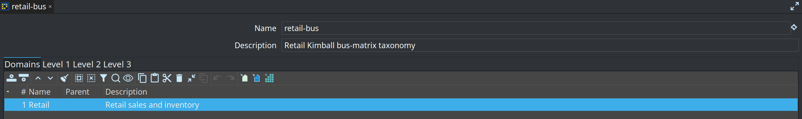
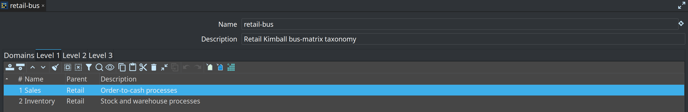
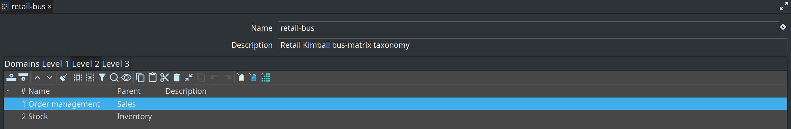
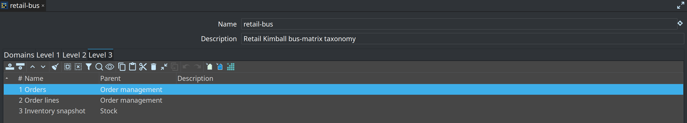

= Business process catalog
:toc: macro
:toclevels: 2

toc::[]

Related guide: link:../bus-matrix.adoc[Kimball bus matrix].

A **business process catalog** is EDW metadata that lists:

* **Domains** (the **Business** field on a fact)
* **Level 1 / 2 / 3** process names, each with an optional parent and description

Facts on a `.hdm` canvas pick these values on the General tab. The bus matrix groups rows by that taxonomy.

== Fields

[cols="1,3", options="header"]
|===
|Field |Purpose

|Name
|Metadata name (for example `retail-bus`). A resource definition group can point at this catalog.

|Description
|Optional.

|Domains tab
|Business domains (`Retail`, `Finance`, …).

|Level 1 / 2 / 3 tabs
|Process levels. **Parent** is a combo of names from the previous level (domain for L1, L1 for L2, L2 for L3). You can still type a value.
|===

Retail catalog `retail-bus`:

