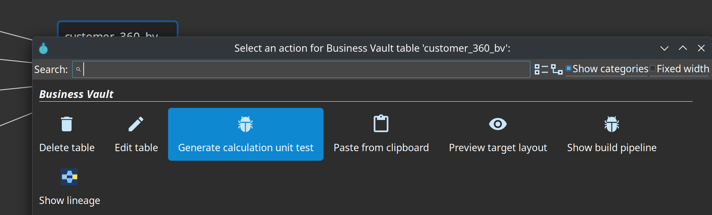
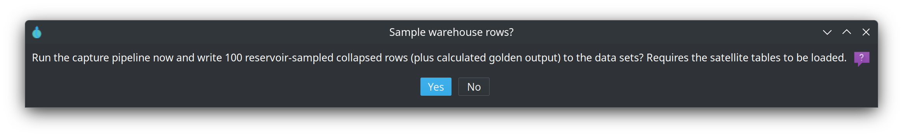
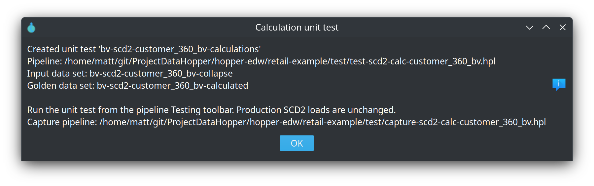

= Business Vault SCD2 table
:toc: macro
:toclevels: 3

toc::[]

Related guide: link:../business-vault-scd2.adoc[business-vault-scd2].

An SCD2 table in the Business Vault model (`.hbv`) materializes a **functional Type 2 timeline** from one or more raw Data Vault satellites: version rows with validity bounds (`valid from` / `valid to`), not a Type 1 overwrite table and not a PIT pointer table.

Use this dialog to name the target, choose satellite derivatives, set the functional timestamp and build mode, and map attributes for multi-satellite merges.

== What this table is for

- **Harmonize** multi-satellite history into one consumable timeline (for example Customer 360).
- Keep **organizational memory**: each business change becomes a new version with closed/open validity intervals.
- Feed **downstream** dimensional models, reports, and other BV objects with a clean SCD Type 2 grain.

Raw vault satellites remain insert-only (technical load history). SCD2 rewrites that history into **business-effective** intervals driven by the functional timestamp you configure.

== General

[cols="1,1", options="header"]
|===

|Field
|Purpose

|**Name**
|Logical name of the SCD2 table on the canvas and in the model.

|**Physical table name**
|Target table in the Business Vault database.

|**Derivatives**
|DV satellite references and/or source queries. At least one satellite or source query is required.

|**Include hash key**
|When enabled, the parent hub hash key is written to the BV table.

|**Parent hub**
|The hub this SCD2 timeline is for, and where the business key(s) live. Drag a **Linked Hub** onto the SCD2 table on the canvas (one hub only) or pick it here. The canvas draws that link so you can see grain identity next to the satellite feeds. Linked satellites and source queries are all sorted and merged on that hub's hash key plus the functional timestamp. Leave empty to infer from linked satellites. Set this when the SCD2 is fed only by source queries. **Validate** / Check model reports an error if the name is not a Linked Hub or a hub in the loaded Data Vault model.

|**Include hub business keys**
|When enabled, that hub's business key columns are left-outer Merge Joined after collapse, immediately before SQL calculations. They are available for calculations but they do not drive new versions. Requires Include hash key. The SCD2 merge/repeat/incremental path is unchanged.

|**Load hub business keys**
|Enabled when Include hub business keys is selected. When checked (default), hub business key columns are written to the BV table. Uncheck to keep them on the stream for SQL calculations only.

|**Functional timestamp**
|Column used as the timeline for validity bounds (see resolution order below).

|**Build mode**
|`FULL_REBUILD` (truncate and reload) or `INCREMENTAL` (watermark, append, close open rows).

|**Hash-key partitions**
|`None` (default) or 4 / 8 / 16. Full rebuild only: truncate once, then load hash-key slices so each satellite `ORDER BY` is smaller. Works with Table Output, Native bulk, and Staging file (one CSV set per partition, then bulk-load).

|**Incremental watermark field**
|Optional BV column for `MAX(...)` watermark reads; defaults to the functional timestamp.

|**Valid from / Valid to**
|Output column names for SCD2 interval bounds (model defaults apply when empty).

|===

=== Functional timestamp resolution

Priority order:

1. Per-satellite override in **Satellite configs**
2. Per-table **functional timestamp** on this dialog
3. Model-level functional timestamp in Business Vault configuration
4. Load-date fallback from Data Vault configuration (often `x_load_ts`)

The functional timestamp drives interval boundaries — not the technical load date unless you choose that column explicitly.

=== Build mode

- **Full rebuild** — truncate and reload the BV table from satellite history.
- **Incremental** — read satellite deltas above a watermark, close the prior open version, append new versions. Prefer after an initial full load when history is large.
- **Hash-key partitions** — optional 4 / 8 / 16 split on Full rebuild. A wrapper workflow truncates the target, then runs the SCD2 pipeline per partition with `'${PARTITION_COUNT}'` and `'${PARTITION_NUMBER}'`. Honors Table Output, Native bulk, and Staging file. Disabled for Incremental.
- **SQL Expression copies** — parallel copies of the SQL Expression transform after collapse (default 1). Enter a number or a variable such as `'${SQL_EXPRESSION_COPIES}'` so each environment can set its own value. Rows are round-robin distributed. Use this for CPU-heavy calculations on wide rows.

Use **Debug** or **Show build pipeline** on the canvas to inspect the generated Hop pipeline (and the partition workflow when enabled) before workflow runs.

== Field mappings

Required when **two or more** satellites or source queries feed the table. Map each `(source, source field)` to a BV target column name. **Validate** / Check model checks parent hub existence, source field existence on the satellite or source query, unique source and target names, and that targets do not collide with hash key / validity / record-source columns. Hash key, functional timestamp, and load date cannot be mapped as attributes.

**Suggest mappings** first asks which linked satellites and source queries to fill (all are selected by default). It then reloads the linked `.hdv` from disk and adds one row per unmapped satellite attribute **and** per unmapped source-query column among the selection (hash key, functional timestamp, and load date on the source query are skipped). Target names stay unique on collisions, including names already used by sources you did not select. If nothing is added, a message explains why: Data Vault model not loaded (satellites only), satellite not in that model, source query not on the canvas, the satellite has no attributes (use **Get attributes**), or the source query has no columns (use **Get fields**). You do not need to close the BV tab after editing the `.hdv` or a source query.

The Field mappings tab shows how many Data Vault tables were loaded and how many attributes each linked satellite or source query has.

Single-satellite tables can pass attributes through under DV names unless you add explicit mappings for renaming or subsetting.

**Validate** always shows a result, including a short Data Vault resolution summary. It is not a silent no-op when there are no errors.

== Satellite configs

Optional per-satellite settings for multi-satellite merges:

- Functional timestamp override for that satellite
- Source indicator value when you need to tag which satellite contributed a version (and to fill the BV record-source column when that satellite does not store a physical source-indicator column)

If a derivative satellite has **Store record source indicator** unchecked, generated satellite `TableInput` SQL does not select the vault record-source column. The BV table still receives a record-source value from this config (or the satellite name).

== Calculations

Optional SQL scalars applied **after** collapse. **Add** / **Edit** / double-click opens the SQL expression editor: result field name, type, length, precision, and description as widgets; a large SQL box; Fields and Patterns (`CASE WHEN`, `COALESCE`, `CAST`, …) insert at the caret.

Target names must be new columns. Expressions do not drive new SCD2 versions.

See link:../business-vault-scd2.adoc[Business Vault SCD2] and link:sql-expression-dialog.adoc[SQL Expression].

== Tests

When calculations are ready, **Generate unit test...** (or the table context action **Generate calculation unit test**) creates a Hop pipeline unit test: input data set of collapsed rows, golden calculated rows, and a slim pipeline whose SQL Expression transform is linked to this table. Optionally sample 100 warehouse rows into those data sets. Production SCD2 loads are not sampled.

== Type 1 vs Type 2 (important)

**This dialog builds pure SCD Type 2 only.** Every mapped business attribute is carried on version rows; history is not rewritten when a “current” value changes later.

[cols="1,1", options="header"]
|===

|Need
|Recommended approach

|Full history / as-of attributes
|Keep them on this SCD2 table (Type 2).

|Always show the **current** value (e.g. current sales rep on old facts)
|Join a **current** object at mart or query time — open SCD2 row, latest satellite, or a BV SQL “current” table/view. Prefer **hybrid Type 1 + Type 2 in the dimensional model**, not by overwriting SCD2 history.

|Mix Type 1 and Type 2 **in the same BV SCD2 table**
|Not supported as a field mapping mode. Hybrid presentation belongs downstream or in a separate current-state object.

|Type 1 / Type 2 modes **on a PIT table**
|Wrong layer. PIT stores hub key + snapshot + satellite load-timestamp **pointers**; compose attributes (including always-current ones) when you join.

|===

**Why not Type 1 “update all history” on BV SCD2?**

1. As-of queries become silently wrong for columns that only *look* historical.
2. BV intermediate history should stay audit-friendly; back-propagating current values fights that role.
3. Mass updates across all versions are expensive and awkward with incremental watermarks.

Business Vault SCD2 is **consumable organizational memory**. Dimensional models own presentation rules such as hybrid slowly changing dimensions.

Longer guidance: project doc `docs/business-vault-scd2.adoc` (section *Type 1 vs Type 2 and hybrid attributes*).

== Tips

- **OK** can save the table even when Check reports errors. Some issues live in Business Vault or Data Vault configuration and cannot be fixed in this dialog. Use **Validate** or **Check model** to review them; **Business Vault Update** still fails until they are fixed.
- Run **Check model** on the `.hbv` file before **Business Vault Update** or Debug.
- Confirm **Data Vault target** (read satellites) and **Business Vault target** (write SCD2) connections both resolve in project metadata.
- After changing the linked `.hdv` on disk, **Suggest mappings** and **Validate** reload it automatically. Saving the `.hdv` also refreshes open Business Vault tabs that reference it. **Reload DV model** on the Business Vault toolbar remains available.
- External read-only satellites are skipped by Data Vault Update but remain valid SCD2 sources if the vault DB can read them.
- Multi-satellite example: `integration-tests/tests/multi-satellite-bv/customer-360.hbv`.
- Mono-source satellites often omit the physical source-indicator column. Uncheck **Store record source indicator** on the satellite; SCD2 loads still run.

== Related docs

- `docs/business-vault-scd2.adoc` — generation, incremental mode, multi-satellite
- `docs/business-vault-pit.adoc` — PIT (technical as-of pointers; sibling of SCD2)
- `docs/business-vault-overview.adoc` — BV layer roles
- `docs/business-vault-update-action.adoc` — workflow action that runs SCD2 and PIT builds
