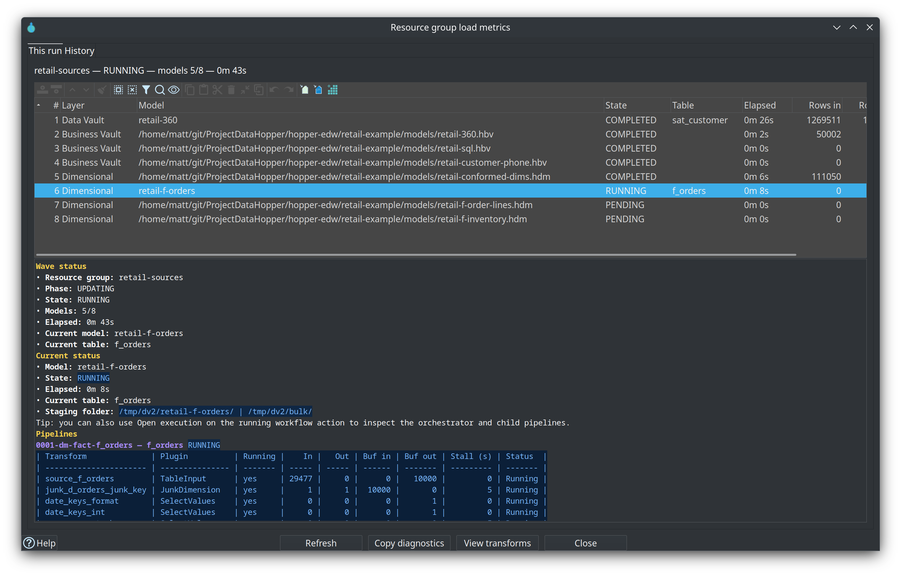

= Resource group load metrics
:toc: macro
:toclevels: 2

toc::[]

Related guide: link:../performance-tuning.md[Performance tuning] and link:../update-resource-definition-group-action.adoc[Update resource definition group].

While a workflow is running (or after it finishes in this Hop GUI session), the **Update resource definition group** action shows a small badge at the bottom-right of the icon:

* **Clock** — the wave is running
* **Warning** — a child pipeline has not made progress for about a minute
* **Failure** — a child model update reported errors
* **Metrics glyph** (idle) — open history of previous OPS load overviews

Click the badge, or use the action context menu **View load metrics**.

== This run

Lists every model in the current wave (layer, state, current table, elapsed time, row counts). The lower pane shows live transform metrics for the active model: rows in/out, buffer sizes, and stall seconds.

== History

Reads recent `workflow_load_overview` rows from the **Execution metrics profile** OPS database. Double-click a row for per-model and per-pipeline metrics. If no profile/OPS connection is configured, the tab explains that history is unavailable.

Live sampling only works when the workflow runs in the same Hop GUI JVM. Remote engines still publish OPS history when metrics publishing is enabled.
