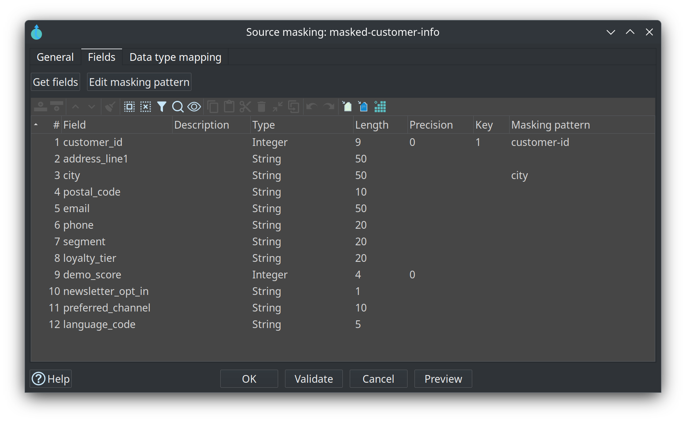

= Source masking
:toc: macro
:toclevels: 3

toc::[]

Related guide: link:../source-modeler-overview.adoc[source-modeler-overview].

A **Source masking** card is a virtual table over a parent feed. Hop **Mask fields** replaces the fields that name a masking pattern. The parent card stays available.

Pattern definitions live in Hop metadata (`metadata/masking-pattern/`). The card stores only the pattern name. The same source value stays the same token when the pattern remembers values (`MEMORY` for one run, `DATABASE` across runs). A `DATABASE` pattern stores the original value in its mapping table. Protect that connection.

Token, storage, and type rules are the Hop Mask fields transform. A date cannot take a synthetic token. `SET_EMPTY` applies to strings. A number cannot take a prefix, suffix, or UUID.

== General

* **Name** — Canvas name and the JDBC table name.
* **Catalog name** — Published `DV_SOURCE` name. Blank uses the card name.
* **Parent kind / Parent** — Table, query, JSON source, pipeline, or another masking card.

== Fields

**Get fields** copies the parent projection and keeps pattern names already chosen for the same field. A blank **Masking pattern** passes the value through. Unlisted parent columns are not on the card.

**Edit masking pattern** opens the Hop metadata editor for the selected row. A new or renamed pattern is stored on that row, and on every other row that used the old name. The pattern list includes it the next time the cell opens. With no row selected it opens the Masking pattern metadata type.

A primary key whose pattern uses `NONE`, `SET_NULL`, or `SET_EMPTY` is a check warning: hub identity would change or disappear.

Publish as catalog type `MASKING`. JDBC `SELECT` from the card name runs the masking pipeline. Data Vault hubs, links, and satellites bound to the published feed do the same.
