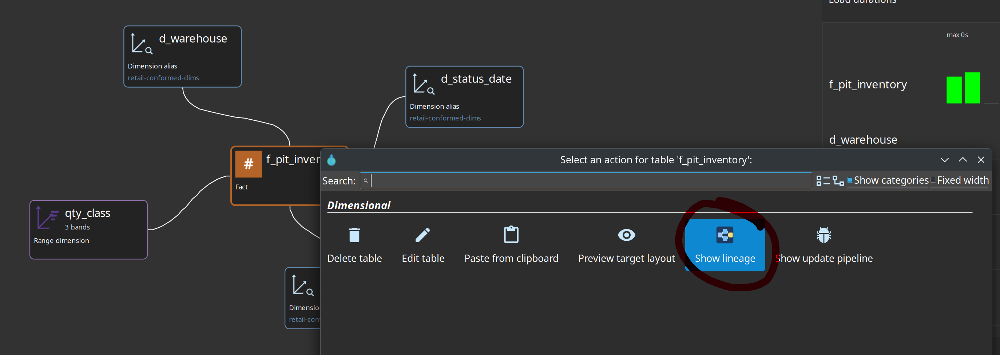

= Hop Lineage View
:toc: macro
:toclevels: 3

toc::[]

A **Hop Lineage View** (`.hlv`) is an authorable *question* you keep in the project tree: start at this table (or OpenLineage dataset/job), walk this far, on this backend. Open the file in Hop GUI and the tab **queries** Marquez, a folder of exported RunEvent JSON, or the current models. The graph itself is **not** stored in the file.

Use it when you are at the *end of the chain* — a new fact, a dimension, a Business Vault table — and need to stay in Hop while walking **upstream** to DV/BV/source, then jump into the responsible `.hdv` / `.hbv` / `.hdm`, catalog record, or generated pipeline.

== What it is (and is not)

|===
| Surface | Role
| **Hop Lineage View** (`.hlv`) | Saved *view definition* + live query. Cross-model, usually **upstream**, table grain.
| Lineage tab on a table dialog | One table, one model, read-only field grid. See link:source-to-target-lineage.adoc[Source-to-target lineage].
| Reverse lineage browser | Source field → consumers (grid). Opens a model element.
| Execution map (`.hem`) | *Persisted crawl* of workflows, models, and generated pipelines. Opposite persistence model. See link:execution-maps.adoc[Execution maps].
| Marquez UI | External job/dataset graphs after export. You leave Hop. See link:openlineage-export.adoc[OpenLineage export].
|===

The `.hlv` file stores backend name, seed, depth, direction, job/layer filters, and whether to overlay OPS times. It does **not** store node positions or a crawled snapshot.

=== Export is not a load

Today's **Export data lineage** action writes **model-derived COMPLETE** OpenLineage events. After export, Marquez's "latest run" is the last *export*, not the last *vault/dimensional load*.

Hop Lineage View therefore:

* Uses Marquez / the export folder / local collectors for **structure** (who feeds whom)
* Overlays "how long did the last load take?" from the **Hop OPS database** (`load_pipeline_metric` / `LoadRunDurationMetricsLoader`)
* **Never** treats Marquez `latestRun.durationMs` or `startedAt` as load telemetry

A duration badge labeled **export** is a stale `hop_ops` value stamped at export time, not a live OPS row.

== Lineage backends

Create a **Lineage backend** metadata object (**Metadata** perspective, type *Lineage backend*, key `lineage-backend`). The `.hlv` stores only the **name**. URLs, API keys, and folder paths stay on the metadata object.

Retail sample: `retail-example/metadata/lineage-backend/Marquez-Localhost.json`.

|===
| Type | What it queries | When to use
| **Marquez** | Marquez 0.50 `GET /api/v1/lineage` (plus follow-up run/dataset facets) | Shared or local Marquez after an export
| **Export folder** | Folder of RunEvent JSON from **Export data lineage** | Offline / no Marquez
| **Local models** | Current DV/BV/DM collectors → same OpenLineage mapper + BFS as the folder adapter | No export yet; unsaved model via **Show lineage**
|===

Use **Test connection** on the editor to list Marquez namespaces, count event files, or resolve the resource definition group.

If **exactly one** backend is **enabled**, File → New and **Show lineage** use it. If several are enabled, you pick one. Disable unused backends so the common case is one click.

=== `${MARQUEZ_BASE_URL}` vs `${MARQUEZ_API}`

These are *different* variables. Do not treat them as interchangeable without reading the path.

|===
| Variable | Typical retail value | Used by
| `${MARQUEZ_BASE_URL}` | `http://localhost:5001` | **Lineage backend** *Marquez base URL* (host root, no `/api/v1/lineage`)
| `${MARQUEZ_API}` | `http://localhost:5001/api/v1/lineage` | **Export data lineage** HTTP URL (`POST` one RunEvent per request)
| `${MARQUEZ_NAMESPACE_JOB}` | `retail-job` | Export *and* backend default job namespace
| `${MARQUEZ_NAMESPACE_DATASET}` | `retail-dataset` | Export *and* backend default dataset namespace
|===

Preferred backend URL: `${MARQUEZ_BASE_URL}` = `http://localhost:5001`.

If you paste `${MARQUEZ_API}` (or any URL ending in `/api/v1/lineage` or `/api/v1-beta/lineage`) into the backend field, the suffix is **stripped** so the client does not request `/api/v1/lineage/api/v1/lineage`. The retail `Marquez-Localhost` backend currently stores `${MARQUEZ_API}` and relies on that strip.

Do **not** put `${MARQUEZ_API}` on the backend *and* also append `/api/v1/lineage` in the same string.

=== Namespaces must match the export

Job names are `{layer}/{modelName}/{logicalTable}` (for example `dm/retail-f-orders/f_orders`).

If the configured job namespace has **no slash**, export and the view append the project key. Retail `${MARQUEZ_NAMESPACE_JOB}` = `retail-job` becomes `retail-job/retail-example`. Dataset namespace is **not** rewritten: `retail-dataset`.

A **MODEL_TABLE** seed recomputes job and dataset ids from the selected backend on every refresh. **DATASET** / **JOB** seeds keep the ids stored in the file.

For **Local models**, set the same job/dataset namespace variables as the export action so a seed that works on Marquez also works offline.

== Create and open a view

. Create at least one **Lineage backend**.
. **File → New → Hop Lineage View**. The settings wizard runs *before* a tab opens; **Cancel** does not create a tab.
. Choose backend, seed, direction (default **upstream**), depth (default **6**), whether to include jobs, optional layer chips, and **Overlay OPS load times**.
. Save. The tab name is the filename without `.hlv`. There is no separate name field.

Toolbar: **Refresh lineage** (background query), **View settings**, zoom, **Export SVG** of the *session* graph (not a substitute for `hop svg`). The right-hand pane shows the selected node as Markdown (identity, `hop_export` / `hop_location`, columns) with a **View as HTML** button.

image::images/lineage-view-with-information-pane.png[Hop Lineage View of retail f_order_lines — upstream jobs and datasets with OPS duration badges and the Markdown details pane for dm/retail-f-inventory/d_product,align="center"]

Project search matches backend name, logical table, dataset/job names, and model file on `.hlv` files.

=== Seed kinds

|===
| Kind | Start from
| **MODEL_TABLE** | Hop layer + model + logical table. Job/dataset ids are rebuilt from the backend namespaces.
| **DATASET** | OpenLineage dataset already in Marquez or the export folder (`namespace` + `name`).
| **JOB** | OpenLineage job (`namespace` + `{layer}/{model}/{table}`).
|===

Empty layer chips means no layer filter. Turning **Include jobs** off concatenates dataset-to-dataset edges.

=== Retail samples

|===
| File | Seed
| `retail-example/models/f_orders-upstream.hlv` | Dimensional fact `f_orders` on `retail-f-orders`, backend `Marquez-Localhost`
| `retail-example/test/lineage-f-order-lines.hlv` | Fact `f_order_lines` on `retail-f-order-lines` (same backend)
|===

Before a Marquez-backed view shows a graph, export once:

----
./scripts/run-marquez.sh up
./scripts/run-hop.sh retail-example workflows/send-lineage-to-marquez.hwf
----

`run-retail-update-models.hwf` can also POST lineage after the vault wave when that hop is enabled.

Open `models/f_orders-upstream.hlv` (or use **Show lineage** on the fact card). Refresh if the tab was open during export.

== Show lineage from a model table

On a Data Vault, Business Vault, or dimensional table, the context menu includes **Show lineage**. That opens an *unsaved* upstream `.hlv` tab seeded on the selected table.

* One enabled backend → used immediately.
* Several enabled → a chooser.
* **Local models** receives the open (possibly unsaved) model as `extraSnapshots` so you can walk that file without exporting. Cross-layer paths still need a resource definition group on the backend or the view.

Save the tab if you want the question in the project tree.

== Navigate from a node

Hover a node name to underline it; click the name to select it and refresh the right-hand details pane only. That pane renders Markdown (same viewer as dialog Help) with a **View as HTML** button. Click the rest of the card for the context menu (same split as the other modelers). Marquez nodes fetch missing run/dataset facets in the background before the menu appears (graph payloads often omit custom facets).

|===
| Action | When it appears
| **Open model** | `hop_export` (or job-name fallback) identifies a `.hdv` / `.hbv` / `.hdm` table
| **Open in catalog** | `hop_location` has a catalog key / connection
| **Show update pipeline** | DV or DM table with a generated update pipeline
| **Show build pipeline** | BV SCD2 or PIT table with a generated build pipeline (BV has no update-pipeline opener)
|===

Actions are hidden when the identity is missing. Models remain the source of truth; the view does not edit mappings.

== OPS load-time overlay

When **Overlay OPS load times** is on, cards can show last duration (and recent prior average when it differs).

* Keyed by `(modelName, dv\|bv\|dm)` — never pass `DV` into OPS SQL.
* Table lookup uses logical name, then physical name; not `schema.table` unless that is the element name.
* Last duration **> 2×** the average of earlier positive runs is marked slow.
* No OPS connection or no runs → overlay is omitted (`NO_DATABASE` / `NO_RUNS` / errors are not painted as zero).
* If OPS has no row, a stale `hop_ops` facet from the last export may appear, labeled **export**.
* Marquez `latestRun.durationMs` is never used.

The same OPS helpers power the duration bars on DV/BV/DM model canvases. See link:operations.adoc[Operations].

== Local Marquez and smoke test

From the repository root:

----
./scripts/run-marquez.sh up          # API :5001, UI :3001
./scripts/run-marquez.sh status
./scripts/run-marquez.sh down
./scripts/run-marquez.sh reset       # wipe volumes
----

Optional Docker smoke (not part of `mvn test`, not part of `run-tests-all-databases.sh`):

----
./scripts/smoke-lineage-view.sh              # Marquez already up + exported
./scripts/smoke-lineage-view.sh --export     # also run send-lineage-to-marquez.hwf
----

The script `GET`s `/api/v1/lineage` for the retail `f_orders` (then `f_order_lines`) seed, then follow-up run facets, and checks for `hop_export`. It does **not** treat `durationMs` as a load-time assertion.

Unit tests cover parsers, URL strip, graph clip/depth, XML round-trip, navigation, and OPS math from **checked-in** fixtures. They do not start Docker.

== Troubleshooting

* **Empty canvas / "No lineage graph"** — export has not run, wrong backend, or seed not in that backend. For Marquez: `./scripts/run-marquez.sh status`, then export. For Local models: set the resource group (or use **Show lineage** on an open model).
* **SEED_NOT_FOUND** — job/dataset namespace does not match export. Retail job id looks like `job:retail-job/retail-example:dm/retail-f-orders/f_orders`; dataset like `dataset:retail-dataset:f_orders`. Check `${MARQUEZ_NAMESPACE_JOB}` / `${MARQUEZ_NAMESPACE_DATASET}` on *both* the export action and the backend. MODEL_TABLE retries search when the stored namespace is stale.
* **HTTP errors** — backend base URL should be the host (`http://localhost:5001` or `${MARQUEZ_BASE_URL}`). A doubled `/api/v1/lineage` path means the strip did not run on that string.
* **Open model / pipeline missing** — facets were not on the graph node and follow-up failed, or the export predates `hop_export` enrichment. Re-export with a plugin that stamps `hop_export` / `hop_location`.
* **Duration looks like 1 second after every export** — that is export wall time on Marquez, not the load. Turn on OPS overlay and ignore Marquez run duration.
* **Show lineage asks every time** — more than one lineage backend is enabled; disable the extras.

== Relationship to other features

|===
| Feature | Relationship
| link:source-to-target-lineage.adoc[Source-to-target lineage] | Same collectors; the view is the cross-model graph, the tab is the per-table grid
| link:openlineage-export.adoc[OpenLineage export] | Fills Marquez / the export folder the Marquez and folder backends read
| link:execution-maps.adoc[Execution maps] | How the *batch* is wired, not field-level mapping
| Load-run metrics | OPS overlay only; not lineage structure
|===

Column-level *path highlight* (not a full column hairball) is a later increment. Runtime OpenLineage from update actions (`START`/`COMPLETE`/`FAIL` with `load_run` ids) is also later — until then, "what happened when" is the OPS overlay.

== Hop Web

Hop Lineage View uses the same experimental SVG canvas stack as the other model files (`.hsm` / `.hdv` / `.hbv` / `.hdm` / `.hem`). See link:hop-web-modelers.md[Hop Web modelers].

What to expect:

* Open, File → New (wizard first), save, zoom, pan, refresh, and **View settings** work in the browser.
* The session graph is an SVG overlay. Empty, loading, and error text are painted on that snapshot as well as the status line.
* Name-click updates the right-hand Markdown details pane. Card-click opens the context dialog after an unmoved mouse-up (same RAP click-vs-drag split as the other modelers).
* **Show lineage** from a DV/BV/DM table opens an unsaved `.hlv` tab.
* Lineage cards are not draggable; ELK still owns positions.

Marquez, the export folder, and OPS are queried by the **Hop Web server**, not the browser. `${MARQUEZ_BASE_URL}` of `http://localhost:5001` means localhost *inside that JVM* (or container). Point the lineage backend at a host the server can reach, or use **Local models** / **Show lineage**.

== Related documents

* link:source-to-target-lineage.adoc[Source-to-target lineage]
* link:openlineage-export.adoc[OpenLineage export]
* link:execution-maps.adoc[Execution maps]
* link:operations.adoc[Operations]
* link:getting-started-retail.adoc[Getting started — retail example]
* link:feature-overview.md[Feature overview]
* link:hop-web-modelers.md[Hop Web modelers]
* link:../scripts/README.md[Shared scripts]
