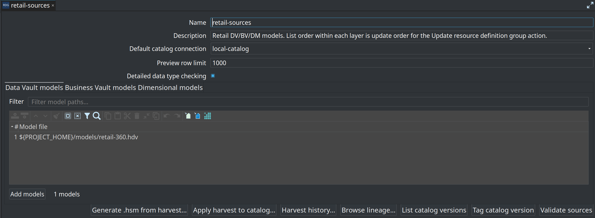
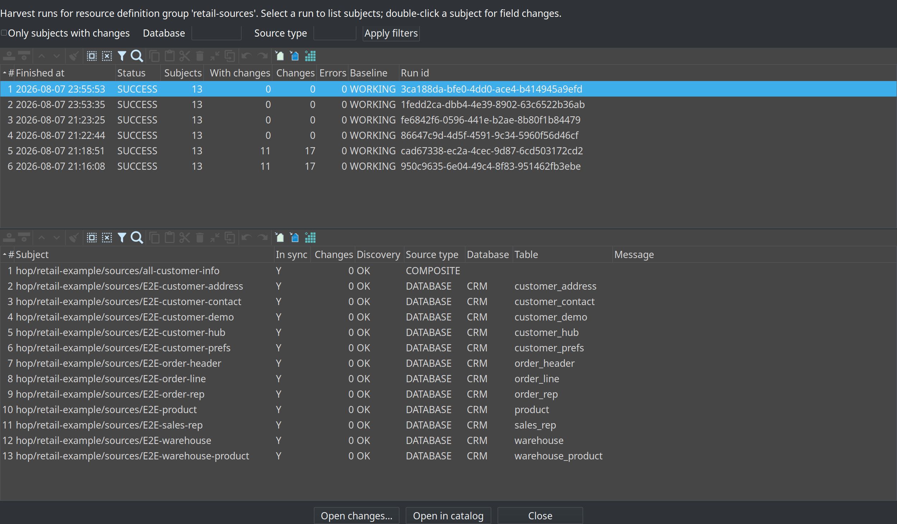
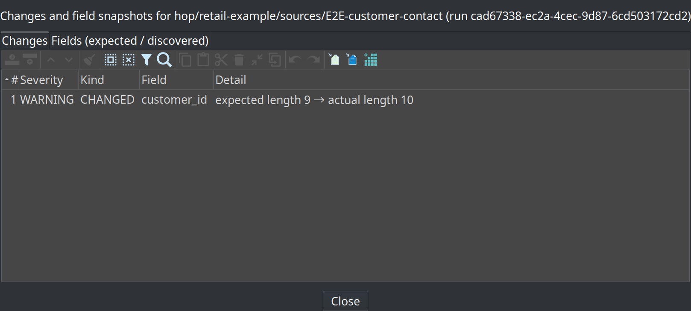

= Metadata harvesting
:toc: macro
:toclevels: 3

toc::[]

**Metadata harvesting** is a first-class **operational** step that discovers **live source schemas**, compares them to the catalog (or a catalog version tag), and **persists** snapshots and drift history — without loading the EDW and without rewriting the working catalog.

Harvest is **not** a greenfield first step. It needs a link:resource-definition-group.adoc[resource definition group] whose models already reference catalog sources. To *start* a warehouse, publish from a source model first — link:getting-started-edw.adoc[Getting started — building an EDW]. **Generate .hsm from harvest…** is a day-2 discovery path after you have already loaded (or at least modeled) those sources.

This is separate from:

* link:resource-definition-validation.adoc[Resource definition validation] (schema **gate** / policy)
* link:data-quality.adoc[Data quality measure] (row **content** rules)
* link:data-catalog.adoc#catalog-versions[Catalog versions] (design-time **frozen contracts**)
* DV/BV/DM **update** actions (load)

[Issue #112](https://github.com/ProjectDataHopper/hopper-edw/issues/112) motivates treating “what do the sources look like now?” as its own wave in an EDW update.

== Why a separate step?

|===
| Concern | Without harvest | With harvest
| When is live metadata read? | Inside validate / model check / load | Explicit **Harvest source metadata** action
| History over time? | Ephemeral reports only | OPS tables (`schema_harvest_*`)
| Efficiency at scale | One discovery per record definition | **Connection-batched** discovery (one JDBC session per source database)
| Detect drift without models? | Tied to validation axes | Harvest alone is enough to record and review drift
| Catalog rewritten? | Only via explicit refresh/remediation | **Never** by harvest
|===

== Recommended EDW update chain

[source]
----
Harvest source metadata          ← observation (this page)
  → Validate resource definitions  (schema gate / policy)
  → Measure / Evaluate source quality
  → Update resource definition group
  → (optional) Measure target quality ALERT_ONLY
----

Harvest **observes**. The schema gate **decides** whether drift should fail the workflow. Quality measures **content**. Update **loads**.

[[harvest-action-dialog]]
== Workflow action: Harvest source metadata

Category **General**. Plugin id `HARVEST_SOURCE_METADATA`.

=== Selection and baseline

|===
| Option | Description
| Resource definition group | Required. All catalog sources referenced by the group's DV/BV/DM models are harvested.
| Data catalog connection | Optional override; empty uses group/model defaults.
| Expected baseline | `WORKING_CATALOG` (default) or `CATALOG_VERSION`.
| Baseline catalog version | Tag when baseline is a version.
| Record source group filter | Optional `DV_SOURCE` group tag (e.g. `hourly`).
| Source database filter | Optional Hop connection name; only DATABASE feeds on that connection.
|===

=== History (OPS)

|===
| Option | Description
| Persist harvest history | Default on. Writes durable rows.
| History database | Default: configured name, else `SCHEMA_HARVEST_DATABASE`, else `OPS` if present.
| History schema | Empty = connection default database.
| Auto-create history tables | Creates `schema_harvest_*` when missing.
| Publish catalog definitions | Upserts operations record definitions under `hop/{project}/operations/`.
| Fail on persist error | Default on.
| Fail on discovery errors | Default **off**. Schema **drift never fails** this action.
|===

=== Reports

Optional Markdown report path (Hop VFS folder or `.md` file). The action also sets:

* Variable **`DV_SCHEMA_HARVEST_RUN_ID`** for downstream steps
* Extension data key `schemaHarvestReportText`

== What is stored

|===
| Table | Content
| `schema_harvest_run` | Run id, timestamps, group, baseline, status, counts, workflow execution id
| `schema_harvest_subject` | Per record definition: connection/schema/table, discovery status, in_sync, message
| `schema_harvest_field` | EXPECTED and DISCOVERED field snapshots (name, Hop type, length, precision, PK, native type)
| `schema_harvest_fk` | EXPECTED and DISCOVERED foreign-key constraints (child/parent columns, constraint name)
| `schema_harvest_change` | Diff events (field ADDED/REMOVED/CHANGED, PRIMARY_KEY_CHANGED, FOREIGN_KEY_*, severity)
|===

=== Primary keys and foreign keys

* **PK drift** — catalog field `primaryKeyPosition` vs live key composition (`PRIMARY_KEY_CHANGED`, typically **BLOCKING**).
* **FK discovery** — JDBC imported keys are always stored on the harvest (`schema_harvest_fk`) and can seed catalog contracts and `.hsm` models (see below).
* **FK vs catalog contract** — optional FK attributes on catalog source fields (`fkConstraintName`, `fkPosition`, `fkReferenced*`). When the catalog has **no** FK metadata yet, live-only FKs are recorded as **INFO** inventory (not a gate failure). When a catalog FK contract exists, removed/changed FKs are **BLOCKING** and extra FKs are **WARNING**.

Runs are **immutable**: reusing a `harvest_run_id` skips insert.

== Applying harvest to the catalog and source models

Harvest **never** rewrites catalog contracts by itself. After you review a good harvest run, you can promote FK (and optionally field) inventory deliberately:

=== Apply harvest to catalog (GUI)

On metadata type **Resource definition group**, bottom bar **Apply harvest to catalog…**:

1. Loads the latest harvest for the group (or the run id in `DV_SCHEMA_HARVEST_RUN_ID` when set).
2. Offers **Foreign keys only** (default choice) or **Field layouts and foreign keys**.
3. Writes DISCOVERED FKs onto matching catalog `DV_SOURCE` child columns (`fkConstraintName`, `fkPosition`, `fkReferencedSchema/Table/Column`), clearing any previous FK stamp first.

After apply, the next harvest/gate treats those FKs as a real contract (removed/changed → **BLOCKING**, extra → **WARNING**) instead of INFO inventory only.

=== Generate `.hsm` from harvest (GUI)

Same editor bar: **Generate .hsm from harvest…**

* Prompts for a `.hsm` path (variables allowed; default under `${PROJECT_HOME}/models/…-from-harvest.hsm`).
* Builds or **merges** a link:source-modeler-overview.adoc[source model]: DISCOVERED tables/columns, relationships from DISCOVERED FKs, and optional **stub parent** tables when a parent was not harvested as a subject.
* Existing relationships are not duplicated on re-run; existing tables get column layouts refreshed.

Use this when you want source-modeler canvas/relationships aligned with the same inventory the harvest already observed.

== Efficiency

For `DATABASE` sources that share a Hop connection, harvest opens **one** JDBC session and discovers every table in that partition serially on that session. Parallelism is across **source systems** (connections), not every table on the same VPN path.

CSV / Parquet / Iceberg / COMPOSITE feeds still use the shared discovery services (composite rediscovers from the `.hsm` projection).

== Catalog is never rewritten by harvest alone

The **Harvest source metadata** action does **not** update working-tree catalog contracts or catalog version tags. To accept live layout as the new contract:

* **Field layouts** — **Refresh from source** (catalog GUI) or remediation from link:resource-definition-validation.adoc[resource definition validation]
* **Foreign keys (and optional fields) from a harvest run** — **Apply harvest to catalog…** on the resource definition group (above)
* **Source model relationships** — **Generate .hsm from harvest…**

== Relationship to the schema gate

|===
|  Harvest | Validate resource definitions
| Live discovery | Primary | `LIVE_SOURCE` rediscovers; **`HARVEST_RUN` reuses OPS harvest** 
| Target DDL / lineage impact | No | Yes (optional axes)
| Persist history | Yes (OPS) | Report files only
| Fail on drift | No (by default) | Yes (severity policy)
|===

=== Compare mode `HARVEST_RUN`

On **Validate resource definitions**:

* **Compare mode** = `HARVEST_RUN`
* **Harvest run id** = `${DV_SCHEMA_HARVEST_RUN_ID}` (set by the harvest action), or empty → **latest** harvest for the group
* **Harvest history database / schema** = same OPS location as harvest (retail: `OPS` / `dv_ops`)

The gate rebuilds a normal validation report from `schema_harvest_change` / subject rows (no second JDBC discovery of sources). Severity policy is unchanged:

|===
| Harvest change | Typical gate severity
| Field removed / primary key changed | **BLOCKING**
| Field added / type or length changed | **WARNING**
| Source unavailable / discovery error | **BLOCKING**
|===

Optional **Check target databases** still runs live against the EDW (independent of harvest).

Retail `run-retail-update-models.hwf` uses **Harvest → Validate (HARVEST_RUN) → quality → update**.

== Exploring harvest history (GUI)

=== Resource definition group

Open metadata type **Resource definition group**. The bottom button bar includes harvest actions next to version management and validation:

* **Generate .hsm from harvest…** / **Apply harvest to catalog…** — promote harvest inventory (see above)
* **Harvest history…** — browse OPS runs and subject drift
* **Browse lineage…** — reverse lineage across models in the group
* **List / Tag catalog version**, **Validate sources** — design-time contracts and schema gate

=== Harvest history browser

**Harvest history…** opens a master/detail dialog over OPS `schema_harvest_*` tables:

* Master table: recent harvest runs for that group (status, subject counts, change counts, baseline, run id)
* Detail table: subjects for the selected run (in sync, discovery status, source type, database, table)
* Filters: **Only subjects with changes**, **Database** connection name, **Source type** (`DATABASE`, `CSV`, …)
* **Open changes…** / double-click subject → change events + expected/discovered field snapshots
* **Open in catalog** → jump to the record definition in the Data Catalog perspective

=== Subject changes drill-down

Double-click a subject (or **Open changes…**) to inspect persisted drift and field snapshots for that harvest run:

* **Changes** tab — severity, kind (`CHANGED`, `ADDED`, `REMOVED`, PK/FK kinds), field, detail
* **Fields (expected / discovered)** tab — side-by-side snapshots stored in `schema_harvest_field`

=== Catalog record (DV_SOURCE)

On the record detail **Quality** tab, **Schema harvest…** opens a timeline of harvest results for that subject key. Double-click a row for the same changes/fields drill-down.

OPS connection resolution matches harvest/gate: `SCHEMA_HARVEST_DATABASE`, published `schema_harvest_run` catalog definition, or connection **OPS**.

== Model check reuse (Phase 4)

After harvest (and optionally after the schema gate), **Data Vault Update** and **Update resource definition group** can reuse DISCOVERED layouts for detailed type checking:

* Option **Prefer last harvest for type checks** (default on)
* **Harvest run id** default `${DV_SCHEMA_HARVEST_RUN_ID}`
* **Harvest history database** (OPS) when not auto-resolved

Behavior:

1. Load DISCOVERED fields for each database subject from the harvest.
2. Pre-seed the model-check live-fields cache (same keys as JDBC resolution: connection/schema/table).
3. Cache hits skip live JDBC for those tables; missing keys still discover live.

This avoids a third full source-schema discovery after harvest + gate in the retail chain.

== Phase roadmap

* **Phase 1:** harvest engine, OPS history, workflow action, reports
* **Phase 2:** schema gate `HARVEST_RUN` + retail chain
* **Phase 3:** harvest history browser (group + catalog subject)
* **Phase 4:** model-check reuse of harvest for detailed type checking
* **Follow-on:** PK/FK drift inventory, apply harvest → catalog FKs, generate/merge `.hsm` from harvest (available)

== Related documentation

* link:architecture.adoc#d5-four-controls[Architecture — four controls]
* link:getting-started-edw.adoc[Getting started — building an EDW] (harvest is day-2, not chapter 1)
* link:resource-definition-group.adoc[Resource definition group]
* link:data-catalog.adoc[Data catalog]
* link:source-modeler-overview.adoc[Source modeler]
* link:resource-definition-validation.adoc[Resource definition validation]
* link:update-resource-definition-group-action.adoc[Update resource definition group]
* link:operations.adoc[Operations]
* link:data-quality.adoc[Data quality]
* link:database-table-metadata.adoc[Database Table Metadata transform]
* Plan: link:plans/metadata-harvesting-plan.md[Metadata harvesting plan (issue #112)]
