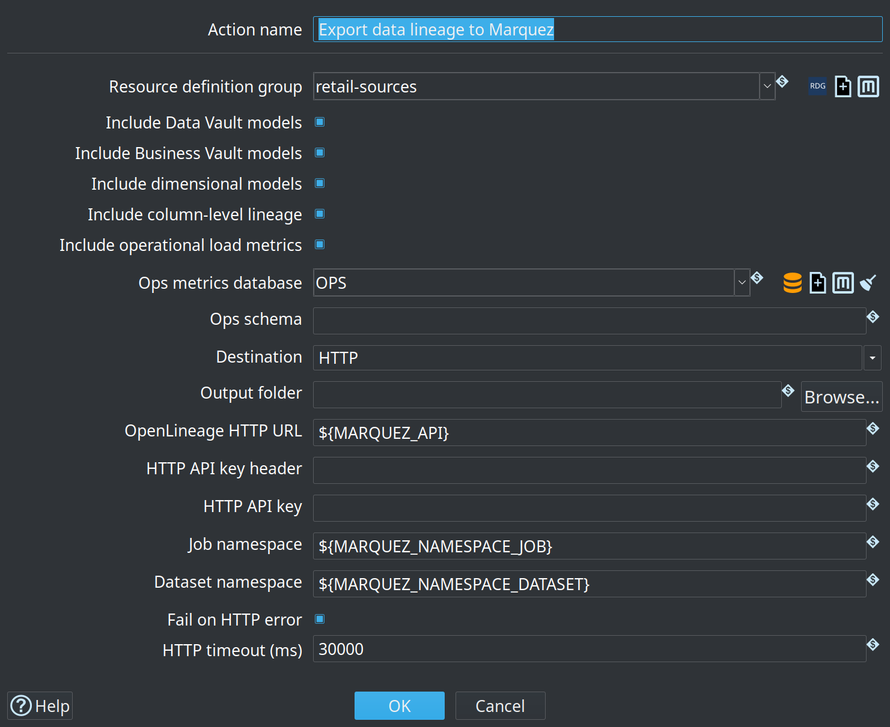
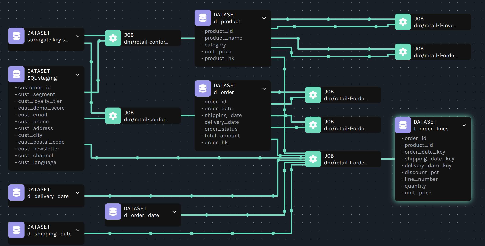
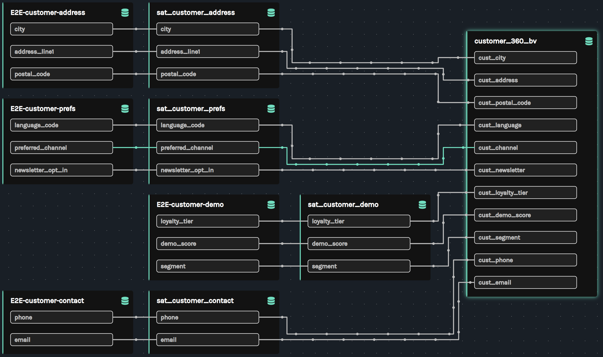
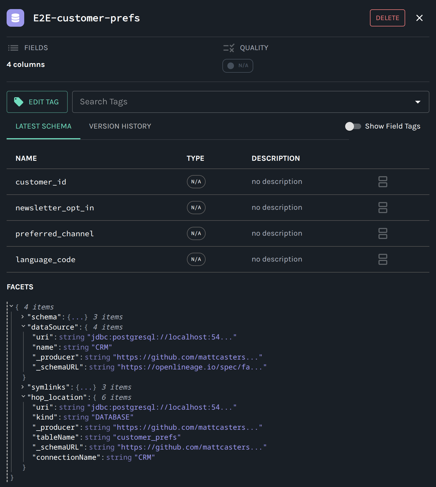

= OpenLineage export
:toc: macro
:toclevels: 3

toc::[]

Data Hopper EDW can emit **OpenLineage** `RunEvent` documents for every Data Vault (DV), Business Vault (BV), and dimensional (DM) target table. Events are **model-derived** from the same lineage collectors that power the modeler Lineage tab, explainable DDL, and catalog lineage siblings.

Use this to feed platforms such as **Marquez** or any OpenLineage-compatible HTTP endpoint (including Collibra OL integrations).

== What is exported

|===
| Aspect | Detail
| Source of truth | `.hdv` / `.hbv` / `.hdm` models (+ catalog resolution)
| Granularity | One COMPLETE `RunEvent` per target table (**unique OpenLineage `runId` per job**; export correlation id on `hop_export` facet)
| Column lineage | Output datasets always get a `schema` facet when fields are known; optional `columnLineage` facet when enabled
| Physical location | Datasets get OpenLineage `dataSource` plus hop `hop_location` facets (database connection/schema/table, CSV/Parquet folder+mask, Iceberg catalog/namespace/table) when resolvable from the model or catalog
| Source datasets | Input datasets (catalog feeds, parent tables) get a `schema` facet inferred from contributing field names; enriched from other events' outputs when the same dataset is a target elsewhere
| Cross-layer edges | BV/DM events list parent DV/BV tables as inputs when the model maps them
| Operational facts | Optional last-load enrichment from `load_pipeline_metric`
| Destinations | Folder of JSON files and/or HTTP POST
|===

Multi-hop paths (source → satellite → BV → fact) appear as **chained dataset edges** across jobs in Marquez, not as a single job spanning all layers.

== Workflow action: Export data lineage

Add **Export data lineage** to a workflow. Configure the resource definition group, layer filters, destination, and optional job/dataset namespaces:

The retail sample includes a dedicated workflow (`retail-example/workflows/send-lineage-to-marquez.hwf`) and an optional hop after **End Vault Update** in `run-retail-update-models.hwf`.

=== Main settings

|===
| Field | Purpose
| Resource definition group | All DV/BV/DM model files in the group are exported
| Include DV / BV / DM | Layer filters (default: all on)
| Include column-level lineage | Emit OpenLineage column facets (default: on)
| Include operational load metrics | Attach last pipeline run facts when an ops DB is configured
| Ops metrics database / schema | Hop connection (and optional schema) for `load_pipeline_metric`
| Destination | `FILE`, `HTTP`, or `FILE_AND_HTTP`
| Output folder | One `{layer}_{model}_{table}.json` per event + `export-summary.json`
| OpenLineage HTTP URL | e.g. `http://localhost:5001/api/v1/lineage` or `${MARQUEZ_API}`
| Job namespace | Default `hop-data-vault` (+ project key when available); e.g. `${MARQUEZ_NAMESPACE_JOB}`
| Dataset namespace | Optional override for **all** input/output dataset namespaces. When empty, namespaces are derived from Hop connection names (e.g. `Vault`), catalog sources, or staging labels; e.g. `${MARQUEZ_NAMESPACE_DATASET}`
| Fail on HTTP error | Fail the action when a POST fails (default on)
| HTTP timeout (ms) | Connect/request timeout (default 30000)
|===

=== HTTP behaviour

Marquez accepts **one** RunEvent object per `POST /api/v1/lineage` request. The action posts events sequentially. Optional API key header/value supports secured endpoints.

=== File behaviour

Each file is a single pretty-printed RunEvent (not an array). A non-OpenLineage `export-summary.json` lists counts, paths, and errors.

== Viewing lineage in Hop

After export, stay in Hop GUI with a **Hop Lineage View** (`.hlv`) pointed at a **lineage backend**. The view queries Marquez (or the export folder, or local models) and can open the responsible `.hdv` / `.hbv` / `.hdm`, catalog record, or generated pipeline.

Export events are **model-derived COMPLETE** documents. Marquez “latest run” is the last *export*, not the last *load*. Load duration on the view comes from the Hop OPS database — see link:hop-lineage-view.adoc[Hop Lineage View].

The Marquez **base URL** on a lineage backend is the host root (`${MARQUEZ_BASE_URL}` = `http://localhost:5001`). The export action still posts to `${MARQUEZ_API}` (`http://localhost:5001/api/v1/lineage`). Pasting `${MARQUEZ_API}` into the backend field is accepted: the `/api/v1/lineage` suffix is stripped.

Retail sample view: `retail-example/models/f_orders-upstream.hlv` (backend `Marquez-Localhost`).

== Viewing lineage in Marquez

After export, open the Marquez UI and inspect job and dataset graphs.

=== Job lineage graph

Jobs (generated loads) sit between source and target datasets. Expanded nodes show schema fields when facets were exported:

=== Column-level lineage

Column lineage shows how source feed columns flow through satellites into Business Vault tables (for example customer address, prefs, demo, and contact into `customer_360_bv`):

=== Dataset physical location

Opening a dataset in Marquez shows field lists and, under **Facets**, the physical system details (`dataSource` / `hop_location`). See <<Physical location facets>> for the full description and screenshot.

== Dataset and job naming

|===
| Concept | Convention
| Job namespace | Action **Job namespace**, or `hop-data-vault/{projectKey}` when a project key is known
| Job name | `{layer}/{modelName}/{physicalTable}` e.g. `dv/retail-360/hub_customer`
| Dataset namespace (override) | When action **Dataset namespace** is set, every input/output uses that value
| Output dataset namespace (default) | Hop target database connection name (e.g. Vault)
| Output dataset name | `schema.table` when schema is set, else physical table
| Catalog feed input namespace (default) | Catalog sources namespace prefix from the project
| Catalog feed input name | Feed / record source name (e.g. `E2E-customer-demo`)
| Parent vault table input (default) | Target database connection + parent physical name
|===

Column transforms map from internal `FieldTransform` values:

|===
| FieldTransform | OpenLineage transformation
| IDENTITY / RENAME | DIRECT / IDENTITY
| HASH_INPUT | DIRECT / TRANSFORMAT with `masking: true`
| DERIVED / CONSTANT / NONE | DIRECT / TRANSFORMAT
|===

Reason codes and short messages are concatenated into `transformations[].description`.

== Physical location facets

Besides identity (`namespace` / `name`) and column `schema`, each dataset may include:

|===
| Facet | Contents
| `dataSource` | Standard OpenLineage facet: `name` (connection or kind) and `uri` (JDBC URL without credentials, `file://…` mask, Iceberg catalog path, or `hop://…` fallback)
| `hop_location` | Structured Data Hopper EDW details: `kind` (`DATABASE` / `CSV` / `PARQUET` / `ICEBERG` / `STAGING`), `connectionName`, `schemaName`, `tableName`, file folder/masks, Iceberg catalog/warehouse/namespace/table/branch/snapshot, plus `catalogKey` and `catalogConnection` when the dataset is a catalog feed |
| `hop_export` (run) | Hop identity for deep-links: `modelLayer`, `modelName`, `modelFilename`, `tableType`, `logicalName`, `exportRunId`, plus `projectKey`, `resourceGroup`, `catalogConnection`, `physicalTableName`, `targetDatabase` |
| `symlinks` | Alternate identifiers: `schema.table` for DB targets, and for **dimension aliases** the shared physical dimension (e.g. `d_shipping_date` → `d_date`)
|===

Role-playing / linked dimension aliases use the **logical** name as the dataset id (`d_shipping_date`) and list the physical dimension under `symlinks` / `hop_location.tableName` (`d_date`). Projected fields from the physical dimension are still exported when the alias target resolves.

**Targets** (hubs, sats, BV, facts) resolve location from the model target connection and physical table name.

**Sources** (catalog feeds) resolve from the Data Catalog `RecordDefinition` physical table, file, or Iceberg ref when a catalog connection is available on the resource group / model.

**Dataset namespace override** only changes OpenLineage identity. Physical facets still report the real Hop connection, schema, table, or file path so Marquez (or raw JSON) remains operable.

In Marquez, open a dataset and expand **Facets** to inspect `dataSource` (JDBC/file/Iceberg URI) and `hop_location` (connection, table name, kind, …). Field types may show as N/A when only names were exported on source inputs; targets with full model field metadata include types in the `schema` facet.

Example `hop_location` for a database source feed:

----
"hop_location": {
  "kind": "DATABASE",
  "connectionName": "CRM",
  "tableName": "customer_prefs",
  "catalogKey": "hop/retail/sources/E2E-customer-prefs",
  "catalogConnection": "edw-catalog",
  "uri": "jdbc:postgresql://localhost:54320/..."
}
----

== Local Marquez

From the repository root:

----
./scripts/run-marquez.sh up
----

|===
| Service | URL
| API | `http://localhost:5001` — POST `/api/v1/lineage`
| UI | `http://localhost:3001`
|===

Ports avoid common conflicts with macOS Control Center (5000) and local Postgres (5432). Compose file: `scripts/docker/compose.marquez.yml`.

Example action HTTP URL: `http://localhost:5001/api/v1/lineage` (or a project variable such as `${MARQUEZ_API}`).

A Hop Lineage View backend wants the **host root** `${MARQUEZ_BASE_URL}` = `http://localhost:5001`. Do not document `${MARQUEZ_API}` as the backend URL; if you paste it anyway, the `/api/v1/lineage` suffix is stripped. See link:hop-lineage-view.adoc[Hop Lineage View].

Stop with `./scripts/run-marquez.sh down`. Reset data with `./scripts/run-marquez.sh reset`.

== Relationship to other features

|===
| Feature | Relationship
| link:source-to-target-lineage.adoc[Source-to-target lineage] | Same collectors; OpenLineage is an external serialization
| link:hop-lineage-view.adoc[Hop Lineage View] | In-GUI query of this export (or local collectors). Structure from OL; load times from OPS
| link:execution-maps.adoc[Execution maps] | Optional table-level OpenLineage from crawled pipeline graphs (job names = pipeline names). Complementary, not column-level
| Load-run metrics | Optional enrichment on export; **not** what Hop Lineage View uses for duration badges
| Catalog lineage siblings | Internal discovery + drift gate; OpenLineage is for external catalogs
|===

== Troubleshooting

* **HTTP 4xx/5xx** — ensure Marquez is up (`./scripts/run-marquez.sh status`) and the URL includes `/api/v1/lineage`.
* **Empty export** — verify the resource group lists model files and layer checkboxes are enabled.
* **Missing column facets** — enable *Include column-level lineage*.
* **Datasets still show connection name (e.g. Vault)** — set **Dataset namespace** on the action if you want a single override namespace.
* **Dimensions/facts missing after location facets** — Marquez 500s when `dataSource.uri` contains spaces or unresolved `${variables}` (maps to null `sources.connection_url`). Rebuild with the URI encoding fix; with **Fail on HTTP error** enabled, a single bad event previously aborted the rest of the export (including later DM jobs).
* **Ops enrichment skipped** — configure ops database/schema and ensure `load_pipeline_metric` exists; enrichment never fails the export by itself.
