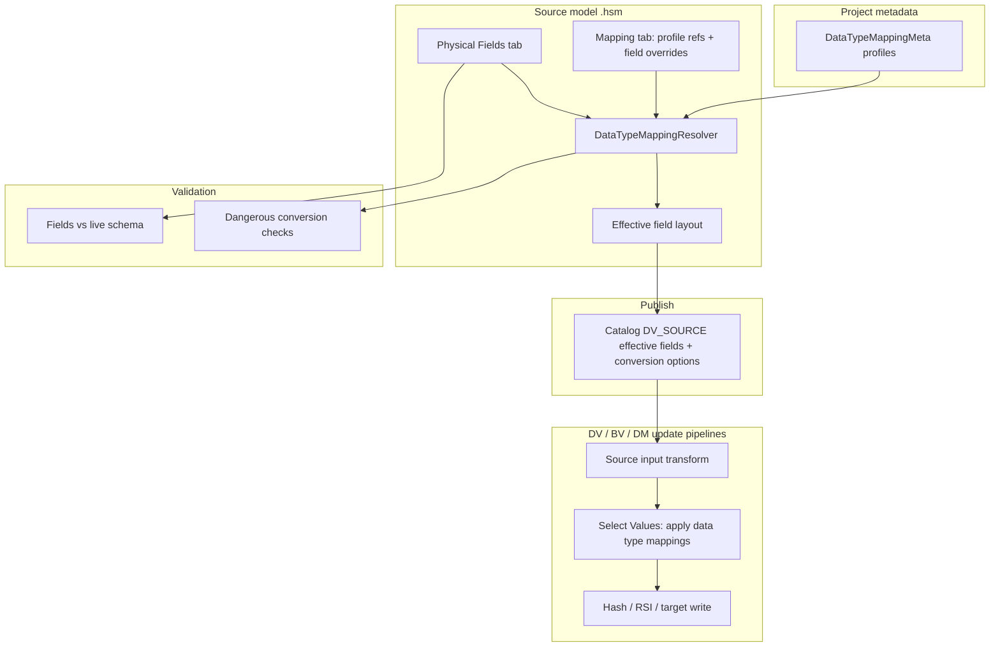

# Plan: Data Type Mappings (Issue #113)

**Issue:** [#113 — Data type mappings](https://github.com/ProjectDataHopper/hopper-edw/issues/113)  
**Branch:** `issue-113`  
**Goal:** Make source→pre-model type improvement **explicit, reusable, and validated** so Kafka/JSON/XML/CDC/file feeds stop collapsing into unbounded `TEXT`/`LONGTEXT` (and other generic types) in DV/BV/DM.

---

## 1. Problem analysis

### 1.1 Customer friction (ideal EDW vs reality)

Large estates mix relational DBs, Kafka, files, JSON, XML, CDC. “Ideal” DV still wants clean, deliberate physical types in the vault and downstream models. Today:

| Path | What we get | Downstream effect |
|------|-------------|-------------------|
| JDBC table import | Usually good type + length | Fine when source is honest |
| JSON / XML / Kafka / untyped CSV | Often `String` / `Integer` / `Number` with **no length** | DDL → `TEXT` / `LONGTEXT` / wide CLOBs; weak keys; noisy validation |
| Manual “Select Values” in pipelines | Full Hop value-meta | Works but **not model-driven**, not reusable, easy to forget |
| Source JSON fields | Already have format / length / symbols | Parse-time only; not a project-wide policy; tables/queries/pipelines lack parity |

Customer language: **pre-modeling sources** — improve source layouts *before* Raw Vault / BV / DM, without pretending every source system already has EDW-grade types.

### 1.2 What exists today (leverage)

| Asset | Role for #113 |
|-------|----------------|
| `SelectMetadataChange` + generated **Select Values** | Runtime type coercion + rename (already used for file coerce, DM date keys, RSI rename) |
| `SourceJsonField` format/length/precision/symbols | Closest field-level conversion surface on HSM |
| `CsvFieldOptions` on `SourceField` | CSV parse masks only |
| `SourceColumn` | Thin: name, `sourceDataType`, length, precision, hopType — **no conversion meta** |
| Catalog `DV_SOURCE` fields | hopType + length + precision; **publish is the contract modelers see** |
| Project `@HopMetadata` pattern | `DataQualityRuleSetMeta` + editor — template for a new mapping metadata type |
| `DvTextFileInputFieldSupport` / `DvFileSourcePipelineBuilder.coerceMappedFieldTypes` | Partial apply; coerce often sets **type only**, not length/mask/locale |
| Validation supports | `SourceTableValidationSupport`, JSON/query/pipeline check supports |

### 1.3 Requirements (issue + consultation notes)

1. **Project-level** reusable data type mapping metadata.
2. **Bulk / policy rules**: e.g. all Strings without length → `String(2000)`; all booleans → `Integer(1)`; scope by source kind, database, folder, etc.
3. **Field-level** mappings: target type, length, precision, conversion mask, decimal/grouping/currency, locale, timezone, lenient flags, encoding, rounding, **rename**.
4. **HSM source dialogs**: dedicated **Data type mapping** tab — attach selected project mapping(s) + per-source field fine-tunes.
5. **Separation of concerns**:
   - **Fields** = what we expect from the physical/parsed source (import, sample, live schema).
   - **Mappings** = explicit pre-model improvement.
6. **Downstream always uses after-conversion layout** (catalog publish, modelers, generated DV/BV/DM loads).
7. **Validation**: dangerous conversions → warnings/errors (String→Date/Timestamp/Integer/Number without mask/locale/symbols as appropriate).
8. **GUI parity** — no file-only feature.

### 1.4 Non-goals (v1)

- Replacing Hop **Select Values** as a general ETL tool for arbitrary business transforms (filters, calcs, aggregates stay in Source Pipeline / hand pipelines).
- Auto-inferring perfect EDW types from samples alone (optional assist later; not the contract).
- Changing Hop core `ValueMeta` / JDBC drivers.
- Forcing every existing catalog source to have a mapping (opt-in; missing mapping = current behaviour).
- Surrogate-key / hash redesign (orthogonal).

---

## 2. Product design

### 2.1 Mental model

```
Physical / parsed Fields          Data Type Mapping(s)           Effective layout
(what source produces)     +      (project policy + overrides)  =  (what EDW consumes)
        │                              │                                │
        │ validate vs live schema      │ validate conversion safety     │ catalog publish
        │                              │                                │ DV/BV/DM modelers
        │                              │                                │ load pipelines
```

**Invariant:** Once a source has mappings configured, every consumer that currently reads “source fields” must resolve the **effective** layout (name, hop type, length, precision, conversion options). Unmapped sources remain backward-compatible.

### 2.2 Two layers of conversion (do not conflate)

| Layer | When | Examples | Owner |
|-------|------|----------|--------|
| **Parse-time** | Reading text/JSON | CSV date format, JsonInput type/path | Existing: `CsvFieldOptions`, `SourceJsonField` |
| **Pre-model mapping** | After stream is available as Hop types | String→Integer, default String length, rename `CUST_ID`→`customer_id` | **New** Data Type Mapping |

Parse-time options remain for how bytes become values. Pre-model mappings improve the **declared feed contract** and force metadata on the stream via Select Values (or equivalent). When both exist, order is:

1. Source input (with parse options)  
2. **Apply data type mappings** (Select Values meta + rename)  
3. Rest of load graph (hash, RSI, merge, target write)

### 2.3 UX sketch

**Metadata → Data Type Mapping** (new project metadata type)

- Name / description  
- Optional **scope** (when this profile is suggested / auto-eligible): source kinds, database name pattern, file path pattern, catalog namespace pattern  
- Ordered **rules** table  
- Preview / “Simulate on sample field list…” (optional v1 polish)

**HSM dialogs** (Source table / query / JSON / pipeline) — new tab **Data type mapping**:

1. Multi-select (or ordered list) of project **Data Type Mapping** profiles to apply.  
2. Grid of **field overrides** (fine-tune): source field name → rename, target type, length, precision, conversion mask, symbols, locale, timezone, trim, notes.  
3. Read-only **Effective fields** preview (result of physical fields ⊕ profiles ⊕ overrides).  
4. Actions: **Apply defaults from selected profiles**, **Clear overrides**, **Copy effective → clipboard**.

**Fields tab** stays the source contract (import / get columns / sample). Validation of “source vs live” stays there. Mapping tab validates conversion safety against Fields.

Same tab pattern later on catalog `DV_SOURCE` editors (phase 2) for non-HSM sources.

---

## 3. Metadata model

### 3.1 New project metadata: `DataTypeMappingMeta`

Package: `org.hopper.edw.datavault.metadata.datatypemapping` (or `…metadata.mapping`)

```
@HopMetadata(key = "data-type-mapping", …)
DataTypeMappingMeta extends HopMetadataBase
  description
  scope: DataTypeMappingScope          // optional applicability
  rules: List<DataTypeMappingRule>     // ordered; first match wins per field
```

**`DataTypeMappingScope`** (all optional; empty = always applicable when attached):

| Property | Purpose |
|----------|---------|
| `sourceKinds` | `DATABASE`, `CSV`, `PARQUET`, `ICEBERG`, `JSON`, `PIPELINE`, `COMPOSITE`, … |
| `databaseNamePattern` | Glob/regex vs connection name |
| `schemaNamePattern` | Optional |
| `pathPattern` | File / Iceberg / Kafka topic path |
| `catalogNamespacePattern` | Catalog-oriented estates |

Scope is used for **suggestion / bulk attach / documentation**, not only for hard enforcement. When a profile is **explicitly attached** to a source, it applies even if scope would not match (user override). Scope mismatch → **warning** on check.

**`DataTypeMappingRule`** — match + target:

| Match (any combination) | Target (Hop value-meta subset) |
|-------------------------|--------------------------------|
| `matchHopType` (e.g. String) | `targetHopType` |
| `matchSourceDataTypePattern` (SQL/native type, e.g. `VARCHAR%`, `TEXT`) | `length`, `precision` |
| `matchFieldNamePattern` | `renamePattern` or fixed rename (advanced) |
| `matchLengthAbsent` / `matchLengthEquals(-1)` | `conversionMask` |
| `matchLengthBelow` / `matchLengthAbove` | `decimalSymbol`, `groupingSymbol`, `currencySymbol` |
| enabled flag | `dateFormatLocale`, `dateFormatTimeZone` |
| | `dateFormatLenient`, `lenientStringToNumber` |
| | `encoding`, `roundingType`, `trimType` |
| | `storageType` (optional) |

Example rules (customer “pre-model” defaults):

1. Hop String + length absent → String length **2000**  
2. Hop Boolean → Integer length **1**  
3. Source SQL type `TEXT`/`LONGTEXT` → String length **2000** (or project max VARCHAR) with warning if truncation risk  
4. Field name `*_ts` / `*_at` + String → Timestamp + mask `yyyy-MM-dd HH:mm:ss`  
5. Field `is_active` String → Boolean (or Integer 0/1) with mask if needed  

**First-match-wins** within a profile; profiles attached to a source apply in **list order** (later profile only fills still-unmapped attributes, or later wins entirely — recommend **attribute-level merge with later override**, documented). Field-level source overrides always win last.

### 3.2 Per-source binding (HSM entities)

Add to `SourceTable`, `SourceQuery`, `SourceJson`, `SourcePipeline` (and later `IDvSource` / catalog):

```
@HopMetadataProperty(key = "dataTypeMappingName", groupKey = "dataTypeMappingNames")
List<String> dataTypeMappingNames;   // ordered refs to DataTypeMappingMeta

@HopMetadataProperty(key = "fieldMapping", groupKey = "fieldMappings")
List<SourceFieldTypeMapping> fieldMappings;  // fine-tunes
```

**`SourceFieldTypeMapping`**:

| Property | Notes |
|----------|--------|
| `sourceFieldName` | Matches Fields tab name |
| `targetFieldName` | Rename; empty = keep name |
| `targetHopType` | 0 / NONE = leave type |
| `length`, `precision` | empty = leave / use rule |
| conversion fields | same subset as `SelectMetadataChange` |
| `disabled` | soft-delete without losing design |

Physical `SourceColumn` / declared fields **do not** grow full conversion meta (keeps Fields = source expectation). Exception: keep existing parse-time options on JSON/CSV as today.

### 3.3 Effective field resolution

New service: **`DataTypeMappingResolver`**

```
EffectiveSourceField resolve(field, List<DataTypeMappingMeta> profiles, List<SourceFieldTypeMapping> overrides)
List<EffectiveSourceField> resolveAll(sourceFields, …)
IRowMeta toRowMeta(effectiveFields)
SelectValuesMeta toSelectValuesMeta(physicalNames, effectiveFields)  // meta + rename
```

**`EffectiveSourceField`** carries: source name, effective name, hop type, length, precision, conversion options, provenance (`FROM_SOURCE` | `FROM_RULE(profile, ruleId)` | `FROM_OVERRIDE`).

Consumers **must** use resolver:

- Catalog publishers (`Source*CatalogPublisher`)  
- Model check / validation  
- HSM dialog Effective preview  
- DV/BV/DM source pipeline builders (and HSM generate pipelines)  
- Coach / AI context field lists (so proposals see post-map names/types)

### 3.4 Persistence & compatibility

- New metadata files under project metadata folder (Hop standard).  
- `.hsm` gains optional mapping refs/overrides; absent = legacy behaviour.  
- Catalog JSON: publish **effective** fields only (issue: “after-conversion layout should always be used”). Optionally store provenance in custom properties / description for audit (nice-to-have).  
- Do **not** require re-import of physical columns when only mappings change.

---

## 4. Runtime application

### 4.1 Shared pipeline injection

New support: **`DataTypeMappingPipelineSupport`**

After the primary source input transform (Table Input, CsvInput, JsonInput, MetaInject, Iceberg, …), if any effective field differs from physical:

1. Build `SelectValuesMeta` with:
   - **Select/rename** for name changes (and optional field order = effective order)  
   - **Meta changes** (`SelectMetadataChange`) for type, length, precision, mask, locale, timezone, symbols, lenient flags, encoding, rounding  
2. Insert transform e.g. `"apply data type mappings"`.  
3. Prefer **one** Select Values rather than many chained renames/coerces where possible.

Align with existing patterns in:

- `DvFileSourcePipelineBuilder.coerceMappedFieldTypes` → **replace/extend** to full effective meta (not type-only)  
- DM `date_keys_format` / `date_keys_int` Select Values  
- `SourceJsonPipelineGenerator` final Select Values → enrich with meta changes for mapped fields  

### 4.2 Where to hook

| Generator / builder | Hook |
|---------------------|------|
| HSM `SourceJsonPipelineGenerator` | After JsonInput select; or merge meta into existing Select Values |
| HSM `SourceQueryPipelineGenerator` / table preview | After Table Input / last hop before output |
| `DvDatabase*SourcePipelineBuilder` | After SQL input, before hash/RSI |
| `DvFileSourcePipelineBuilder` | Merge with existing coerce |
| `DvJsonSourcePipelineBuilder` / composite / Iceberg / Parquet | Same post-input hook |
| `DvPipelineSourceSupport` (MetaInject) | Prefer contract = effective fields on MetaInject output metadata; inject Select Values after inject if runtime types still weak |
| BV/DM source legs | Same shared support when they read catalog sources |

**Single choke-point preference:** resolve effective fields from catalog `DV_SOURCE` at load generation time. That implies **publish writes effective layout**, and pipeline builders can also re-apply conversion Select Values when conversion masks are required at runtime (type length alone is not enough for String→Date).

**Important:** Catalog fields today lack conversion mask storage. Extend catalog field model (`CatalogSourceField` / `SourceField` / input options) to carry conversion attributes needed at load time, **or** re-resolve from HSM mapping refs stored as provenance on the catalog record.  

**Confirmed approach:**

1. Publish effective **name/type/length/precision** to catalog (always).  
2. Publish conversion options into generalized `SourceFieldInputOptions` (not only `csv`) — e.g. a shared `conversion` block for all source kinds.  
3. Store HSM provenance (model path + object + mapping profile names) so re-publish refreshes conversions.  
4. Load builders apply Select Values from the catalog conversion block whenever present (no `.hsm` required at generate/runtime).

### 4.3 Modelers use effective layout

- “Get attributes / keys from source” in HDV already reads catalog — after publish, they get improved types.  
- Live schema compare on HSM Fields tab still compares **physical** columns.  
- New optional check: effective layout vs physical (informational).

---

## 5. Validation

New: **`DataTypeMappingValidationSupport`**

### 5.1 Profile-level

| Severity | Condition |
|----------|-----------|
| ERROR | Empty name; rule with no match criteria; invalid hop type name |
| ERROR | Target type unknown / unsupported |
| WARNING | Scope empty and rules very broad (e.g. all Strings) without length/mask |
| WARNING | Overlapping rules (document first-match) |

### 5.2 Conversion safety (per field after resolve)

| Severity | Condition |
|----------|-----------|
| **ERROR** | String → Date/Timestamp **without** conversion mask |
| **ERROR** | String → Integer/Number/BigNumber with non-empty non-numeric risk **and** no mask / not lenient (configurable; default WARNING for Number, ERROR for Date) |
| **WARNING** | String → Date/Timestamp without locale/timezone when project config expects them |
| **WARNING** | String → Number without decimal/grouping when mask implies fractional form |
| **WARNING** | Narrowing length (source length 4000 → target 2000) |
| **WARNING** | Boolean ↔ Integer/String without documented 0/1 or Y/N convention |
| **WARNING** | Type change on PK/grain field (may break joins / hashes) |
| **WARNING** | Rename that breaks existing relationships / query columns still pointing at old name |
| **ERROR** | Override references unknown source field |
| **ERROR** | Two fields map to same target name |
| **WARNING** | Attached profile scope does not match source kind/connection |

Validation runs from:

- Metadata editor save (profile)  
- HSM dialog Validate + model Check  
- Resource-definition / schema gates (optional: treat ERROR as blocking when mappings enabled)

### 5.3 Relationship / rename integrity

When a mapping renames a column used in `SourceRelationship` join keys or `SourceQuery` projections:

- Prefer **auto-update** join/query column names when rename is applied from UI action “Apply rename to model references”  
- At minimum: **ERROR/WARNING** listing dangling refs on check  

v1 recommendation: **warn + offer fix action** in dialog; do not silent-rewrite without confirmation.

---

## 6. GUI work breakdown

### 6.1 Metadata editor

Mirror `DataQualityRuleSetMetaEditor`:

- Name, description  
- Scope group (multi combo / text patterns)  
- Rules `TableView` with match columns + target columns (may use dual tabs: Match | Target to avoid unreadable grids)  
- Buttons: Add rule, Duplicate, Move up/down, Validate  

i18n in package `messages/messages_en_US.properties` with proper escaping for `'${…}'` if any.

Icon: reuse or add simple SVG under resources (e.g. `data-type-mapping.svg`).

### 6.2 HSM dialogs

Extend:

- `HopGuiSourceTableDialog`  
- `HopGuiSourceQueryDialog`  
- `HopGuiSourceJsonDialog`  
- `HopGuiSourcePipelineDialog`  

Shared composite: **`SourceDataTypeMappingTab`** (one implementation, four hosts) to avoid four copies.

Also: model-level optional default mapping list on `SourceModelConfiguration` (“apply these profiles to newly imported tables”) — small but high leverage for thousands of tables.

### 6.3 Bulk operations (scale to thousands of tables)

Toolbar / import options:

- **Attach mapping profile(s) to selected tables** on canvas multi-select  
- Schema import option: “Attach default data type mapping: [profile]”  
- Harvest / catalog refresh: do not wipe overrides; re-resolve effective on publish  

Without bulk attach, the feature fails the customer’s scale problem.

---

## 7. Implementation phases

### Phase A — Core model & resolution (foundation)

1. `DataTypeMappingMeta`, `DataTypeMappingRule`, `DataTypeMappingScope`, `SourceFieldTypeMapping`, `EffectiveSourceField`  
2. `DataTypeMappingResolver` (ordered merge, first-match, overrides)  
3. `DataTypeMappingValidationSupport` unit tests (dangerous conversions, renames, PK warnings)  
4. Metadata editor + registration (Jandex/`@HopMetadata`)  
5. Unit tests with `MemoryMetadataProvider`

**Exit criteria:** Can define “Strings without length → String(2000)” and resolve a synthetic field list correctly.

### Phase B — HSM binding & GUI

1. Persist mapping refs + field overrides on SourceTable/Query/Json/Pipeline  
2. Shared **Data type mapping** tab  
3. Effective fields preview  
4. Wire dialog Validate + model Check  
5. Model-level default profiles on import  
6. Canvas multi-select “Attach data type mapping…”

**Exit criteria:** Edit retail/demo `.hsm`, attach profile, see effective lengths in preview; check reports missing date masks.

### Phase C — Catalog publish & load pipelines

1. Extend field conversion options on catalog/`SourceField` input options  
2. Publishers write **effective** layout + conversion block  
3. `DataTypeMappingPipelineSupport` injects Select Values in DV (and HSM generators)  
4. Upgrade file coerce path to full meta  
5. Integration tests (Postgres at least): JSON/CSV source without length → vault column VARCHAR(2000) not CLOB; String date with mask loads  

**Exit criteria:** Generated update pipeline contains `apply data type mappings` when needed; DDL uses bounded types; issue scenario reproducible in `retail-example` or integration fixture.

### Phase D — Polish & non-HSM sources

1. Catalog record-definition UI: view effective + optional attach mapping  
2. Docs: `docs/data-type-mappings.adoc` + link from source-modeler overview  
3. AI/coach field lists use effective layout  
4. CHANGELOG  

### Suggested PR split

| PR | Scope |
|----|--------|
| PR1 | Phase A metadata + resolver + validation + editor |
| PR2 | Phase B HSM tab + model XML + bulk attach |
| PR3 | Phase C publish + pipeline injection + tests |
| PR4 | Docs + catalog UI + defaults polish |

---

## 8. Detailed design notes

### 8.1 Why project metadata (not only model config)

- Reuse across many `.hsm` files and projects’ environments  
- Same policy for CRM DB, Kafka landing, file drops  
- Aligns with customer “pre-modeling standards” as organizational assets  
- Searchable/editable in Hop Metadata perspective without opening every model  

Model-level defaults only **select** which profiles apply to new objects.

### 8.2 Interaction with JSON/XML parse types

Source JSON already sets JsonInput field type/format. Mapping layer may:

- Only set **length** on already-typed JSON fields (common)  
- Or re-type after JsonInput (Select Values) when sample typing was weak  

Validation should not require a second mask if parse-time format already present and type already non-String — resolver treats parse-time meta as physical baseline when building effective fields from `SourceJsonField`.

### 8.3 DDL / TEXT problem specifically

Root cause chain:

1. hopType=String, length empty/-1  
2. `DvDdlSupport` / dialect maps unbounded string → CLOB/TEXT/LONGTEXT  
3. Downstream sat attributes inherit that  

Fix chain with mappings:

1. Effective length 2000  
2. Catalog field length `"2000"`  
3. DDL → `VARCHAR(2000)` / `NVARCHAR(2000)`  

Still allow explicit “this is a LOB” via rule target length = `DatabaseMeta.CLOB_LENGTH` or source SQL type large-text detection (`DvSqlStringTypeSupport`).

### 8.4 Performance / pipeline cost

One extra Select Values per source leg is acceptable and consistent with existing RSI/date-key patterns. Avoid per-field Calculator transforms.

### 8.5 Security / safety

- Lenient conversions can hide bad data → default **strict** for Date/Timestamp (ERROR without mask); lenient flags explicit.  
- Consider future hook to data quality rules (“conversion failure count”) — out of scope for v1 but design conversion to throw at runtime like Select Values today.

---

## 9. Testing strategy

| Level | Cases |
|-------|--------|
| Unit | Resolver merge order; first-match; override wins; rename collisions; dangerous conversion matrix |
| Unit | SelectValues meta generation from effective fields |
| Unit | Publisher emits effective length/type/rename |
| Unit | Validation severities |
| Integration (Postgres+) | Fixture HSM/JSON feed with untyped strings → mapped lengths → sat DDL + load |
| GUI smoke | Manual: metadata editor + one source table tab (no automated SWT required for v1) |

Do **not** edit golden CSVs unless intentional behaviour change; prefer new fixture suite for mapping.

---

## 10. Documentation

- New: `docs/data-type-mappings.adoc` (concept, profile rules, HSM tab, publish/load behaviour, validation table)  
- Update: `docs/source-modeler-overview.adoc`, `docs/feature-overview.adoc`, `docs/ai-file-schemas/models/hsm.md`  
- Plan archive: `docs/plans/data-type-mappings-plan.md` (copy of this plan after approval)  
- CHANGELOG entry under Unreleased

---

## 11. Decisions (confirmed)

| Topic | Decision |
|-------|----------|
| **Catalog storage** | Catalog `DV_SOURCE` stores **effective fields + conversion block** (masks, locale, symbols, etc.). Loads read catalog only; `.hsm` is design-time. |
| **v1 surface** | End-to-end: project Data Type Mapping metadata + HSM tabs + catalog publish + DV load Select Values injection. Catalog record-definition editor polish can follow (Phase D). |
| **Multi-profile merge** | **Attribute-level**: later profile fills/overrides earlier; **field overrides win last**. |
| Rule match order | First matching **rule** within a profile establishes the base target for that field; subsequent rules in the same profile do not re-match that field unless we document exception attributes — implement as first full match then attribute overlay only from later **profiles** and overrides. |
| Auto-rename relationship columns | Warn + optional UI fix; no silent rewrite in v1 |
| Default String length | Not hard-coded in engine; ship example profile (e.g. `premodel-defaults` with String→2000) in retail-example / docs |
| Scope enforcement | Advisory when a profile is attached explicitly; scope used for bulk-suggest and mismatch warnings |

---

## 12. Architecture diagram



---

## 13. Success criteria

1. Architect can define org-standard pre-model type policies once as Hop metadata.  
2. HSM sources attach those policies and fine-tune outliers without hand-editing every load pipeline.  
3. Catalog + modelers + generated loads agree on **one** effective layout.  
4. Untyped String streams no longer default entire satellites to LOB/TEXT solely due to missing length.  
5. Dangerous String→temporal/numeric mappings fail design-time validation unless masks (and related symbols) are set.  
6. Feature is fully operable from Hop GUI (metadata editor + HSM tabs + check results).

---

## 14. Implementation order (when leaving plan mode)

1. Confirm open decisions above (especially catalog conversion storage + merge semantics).  
2. Implement Phase A in `src/main/java/org/hopper/edw/datavault/metadata/datatypemapping/`.  
3. Phase B GUI shared tab.  
4. Phase C publishers + `DataTypeMappingPipelineSupport` + tests.  
5. Docs + retail example profile.  
6. `mvn test` / package; Postgres integration for mapping fixture before claiming done.
