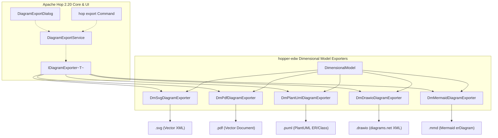

<!--
Copyright 2026 i-Bridge bv

Licensed under the Apache License, Version 2.0 (the "License");
you may not use this file except in compliance with the License.
You may obtain a copy of the License at

     http://www.apache.org/licenses/LICENSE-2.0

Unless required by applicable law or agreed to in writing, software
distributed under the License is distributed on an "AS IS" BASIS,
WITHOUT WARRANTIES OR CONDITIONS OF ANY KIND, either express or implied.
See the License for the specific language governing permissions and
limitations under the License.
-->

# Dimensional Model Diagram Export Plugins (Issue #175)

Implementation plan for `hopper-edw`. Product documentation will be added to `docs/` once implemented.

**Status (2026-09):** Implemented on Hop 2.20.0-SNAPSHOT. SVG, PDF, PlantUML, Draw.io, and Mermaid exporters ship for `.hsm` / `.hdv` / `.hbv` / `.hdm` / `.hem`. GUI uses Hop's `DiagramExportDialog` (File → Export diagram). `hop architecture-export` and `hop svg` are unchanged.

* **Hopper EDW Issue:** [#175](https://github.com/ProjectDataHopper/hopper-edw/issues/175) (*Export models to various formats in the GUI*)
* **Apache Hop Core Issue:** [apache/hop#8346](https://github.com/apache/hop/issues/8346) (*Extensible Diagram Exporter plugin architecture*)
* **Prerequisite:** Apache Hop **2.20.0-SNAPSHOT** (or 2.20.0) containing the Diagram Exporter plugin type and SPI:
  * `@DiagramExporter` annotation and `IDiagramExporter<T>` interface in `hop-core`
  * `DiagramExportFormat`, `DiagramExportOptions`, `DiagramExportResult`, and `IExportContext`
  * `DiagramExportService` in `hop-core`
  * Generic `DiagramExportDialog` and `DiagramExportDialogModel` in `hop-ui`
  * Unified `hop export` CLI command in `hop-cmd` / plugins

Do **not** start implementing the exporter plugins against Apache Hop 2.19.0. `IDiagramExporter` and `DiagramExportDialog` do not exist in 2.19.0.

---

## Goals

1. Register `hopper-edw` as a provider of diagram exporters for Kimball **Dimensional Models** (`DimensionalModel` / `.hdm` files).
2. Ship 5 standard format exporters for dimensional models:
   - **SVG**: Scalable Vector Graphics canvas rendering
   - **PDF**: Vector PDF document generation
   - **PlantUML**: Kimball Star / Snowflake ER schema (`.puml`)
   - **Draw.io**: Native diagrams.net diagram XML (`.drawio`)
   - **Mermaid**: Markdown / browser-ready `erDiagram` and `classDiagram` (`.mmd`)
3. Expose the generic export workflow in the Hop GUI via:
   - A dedicated **Export** toolbar button in `HopGuiDimensionalModelGraph`
   - A canvas right-click context menu item in `HopGuiDimensionalContext`
   - Seamless integration with Hop's `DiagramExportDialog`
4. Support headless / automated export via the unified Hop CLI command:
   ```bash
   hop export -f models/sales.hdm --format puml -o docs/diagrams/sales.puml -e dev
   ```
5. Lay a direct path to extend the same exporter plugins to Data Vault (`.hdv`), Business Vault (`.hbv`), Source Models (`.hsm`), and Execution Maps (`.hem`).

## Non-goals

- Re-inventing the export dialog shell or layout in `hopper-edw`. Hop 2.20 provides the grouped `GuiCompositeWidgets` dialog (`DiagramExportDialog`).
- Deprecating or breaking `hop architecture-export` (the multi-model SOLUTION / DATA inventory Draw.io workflow action). That action remains for complex multi-model rollups.
- Breaking backwards compatibility with `hop svg`.

---

## Architecture & Component Breakdown



---

## Exporter Specifications

### 1. `DmSvgDiagramExporter`
* **Format:** `DiagramExportFormat.SVG`
* **File Extension:** `svg`
* **Implementation:**
  Calls `DimensionalModelSvgPainter.generateDimensionalModelSvg(model, options, variables, metadataProvider)`.
* **Options:** Magnification factor, dark/light theme, include canvas notes.
* **Output:** Full-fidelity vector SVG matching the Hop GUI canvas styling.

### 2. `DmPdfDiagramExporter`
* **Format:** `DiagramExportFormat.PDF`
* **File Extension:** `pdf`
* **Implementation:**
  Generates canvas SVG via `DimensionalModelSvgPainter`, then uses `HSvgPdfExporter.mergeSvgsToPdf(List.of(svgXml))` (supplied by `hopper-presentation-core`) to transcode to vector PDF.
* **Options:** Single-page vector bounding box, margins.
* **Output:** Crisp, zoomable vector PDF file written via `HopVfs.getOutputStream()`.

### 3. `DmPlantUmlDiagramExporter`
* **Format:** `DiagramExportFormat.PLANTUML`
* **File Extension:** `puml`
* **Implementation:**
  Serializes `model.getTables()` into a Kimball Star / Snowflake schema:
  * **Facts:** `DmFact`, `DmFactlessFact`, `DmPeriodicSnapshotFact`, `DmAccumulatingSnapshotFact`, `DmAggregateFact`. Emitted as entities or classes with stereotype `<<Fact>>` (header color `#E8F4F8`, border `#2B6CB0`).
  * **Dimensions:** `DmDimension`, `DmDimensionAlias`, `DmJunkDimension`, `DmRangeDimension`. Emitted with stereotype `<<Dimension>>` (header color `#EBF8F2`, border `#276749`).
  * **Bridges:** `DmBridge`. Emitted with stereotype `<<Bridge>>` (header color `#FEFCBF`, border `#B7791F`).
  * **Fields:** Natural keys (`* key : type <<PK>>`), surrogate keys, dimension roles (`key : type <<FK>>`), measures, degenerate dimensions.
  * **Connectors:** Cardinality relationships (`fact }|--|| dimension : "role"`).
* **Options:** Syntax style (`ENTITY` vs `CLASS`), include column data types, include grain description.
* **Sample Output:**
  ```plantuml
  @startuml
  !theme plain
  skinparam linetype ortho
  skinparam class {
    BackgroundColor<<Fact>> #E8F4F8
    BorderColor<<Fact>> #2B6CB0
    BackgroundColor<<Dimension>> #EBF8F2
    BorderColor<<Dimension>> #276749
  }

  class "dim_customer" as dim_customer <<Dimension>> {
    * customer_id : integer <<PK>>
    --
    customer_name : string
    city : string
    state : string
  }

  class "fact_orders" as fact_orders <<Fact>> {
    * order_id : integer <<PK>>
    --
    customer_id : integer <<FK>>
    order_date_id : integer <<FK>>
    --
    quantity : integer
    total_amount : decimal(12,2)
  }

  fact_orders }|--|| dim_customer : "customer"
  @enduml
  ```

### 4. `DmDrawioDiagramExporter`
* **Format:** `DiagramExportFormat.DRAWIO`
* **File Extension:** `drawio`
* **Implementation:**
  Leverages `ArchitectureGraphFromModel.fromDimensional(model, variables)` and ELK layout coordinates. Generates standard Draw.io mxfile XML containing:
  * Styled entity blocks with table headers, attribute lists, and primary/foreign key markers.
  * Connector edges with labels indicating dimension roles.
* **Options:** Freeform ELK layout coordinates vs auto-swimlanes, include column details.
* **Output:** Standalone `.drawio` file editable in https://app.diagrams.net or Draw.io desktop.

### 5. `DmMermaidDiagramExporter`
* **Format:** `DiagramExportFormat.MERMAID`
* **File Extension:** `mmd`
* **Implementation:**
  Emits Mermaid `erDiagram` syntax (or optional `classDiagram`):
  * Tables rendered as entities with attribute names, types, and `PK` / `FK` markers.
  * Relationship lines with standard Mermaid crow's foot cardinality (`||--o{`).
* **Options:** Wrap in Markdown code fence (```` ```mermaid ````) vs raw `.mmd`, diagram type (`ER` vs `CLASS`).
* **Sample Output:**
  ```mermaid
  erDiagram
      DIM_CUSTOMER ||--o{ FACT_ORDERS : "customer"
      FACT_ORDERS {
          int order_id PK
          int customer_id FK
          int order_date_id FK
          int quantity
          decimal total_amount
      }
      DIM_CUSTOMER {
          int customer_id PK
          string customer_name
          string city
          string state
      }
  ```

---

## GUI & CLI Integration in `hopper-edw`

### 1. GUI Integration
* In `HopGuiDimensionalModelGraph`:
  * Add toolbar element `TOOLBAR_ITEM_EXPORT` with icon `ui/images/export.svg` (tooltip: `"Export diagram / schema..."`).
  * On click, invokes `DiagramExportDialog`:
    ```java
    @GuiToolbarElement(
        root = GUI_PLUGIN_TOOLBAR_PARENT_ID,
        id = TOOLBAR_ITEM_EXPORT,
        toolTip = "i18n::HopGuiDimensionalModelGraph.Toolbar.Export.Tooltip",
        image = "ui/images/export.svg")
    public void exportDiagram() {
      DiagramExportDialog dialog = new DiagramExportDialog(getShell(), hopGui, getVariables(), model);
      dialog.open();
    }
    ```
* In `HopGuiDimensionalContext`:
  * Add context menu action: `"Export Diagram..."` triggering the same dialog.

### 2. CLI Integration
* Once Hop 2.20's `hop export` command is present, `hopper-edw` registers file type handler support for `.hdm` so that `hop export -f models/sales.hdm --format puml` automatically loads the model using `ResourceDefinitionGroupResolver.loadDimensionalModel(...)` and runs the exporter.

---

## Testing & Verification Plan

### Automated Unit Tests
* `DmPlantUmlDiagramExporterTest`:
  * Export model containing facts, dimensions, junk dimensions, and outriggers.
  * Assert `@startuml` / `@enduml` delimiters, correct stereotypes, attribute types, PK/FK tags, and relationship connectors.
* `DmMermaidDiagramExporterTest`:
  * Assert `erDiagram` syntax, entity names, PK/FK tags, and relationships.
* `DmDrawioDiagramExporterTest`:
  * Assert valid mxfile XML, mxCell vertices, and edge geometry.
* `DmSvgDiagramExporterTest`:
  * Assert SVG XML contains table titles and valid SVG root tags.
* `DmPdfDiagramExporterTest`:
  * Assert non-empty PDF byte stream with `%PDF-` header.

### Manual End-to-End Verification
1. Open Hop GUI with the retail dimensional model (`models/retail-f-orders.hdm`).
2. Click the **Export** toolbar button.
3. Test exporting to each format:
   * **SVG**: Open in browser; verify vector sharpness.
   * **PDF**: Open in system PDF viewer; verify formatting and pagination.
   * **PlantUML**: Render in PlantUML viewer.
   * **Draw.io**: Open in diagrams.net; verify table shapes and connectors are movable.
   * **Mermaid**: Paste into GitHub issue or Markdown preview; verify star schema renders.
4. Run CLI:
   ```bash
   hop export -f models/retail-f-orders.hdm --format mermaid -o work/diagrams/retail.mmd -e retail-example-docker-pg
   ```
