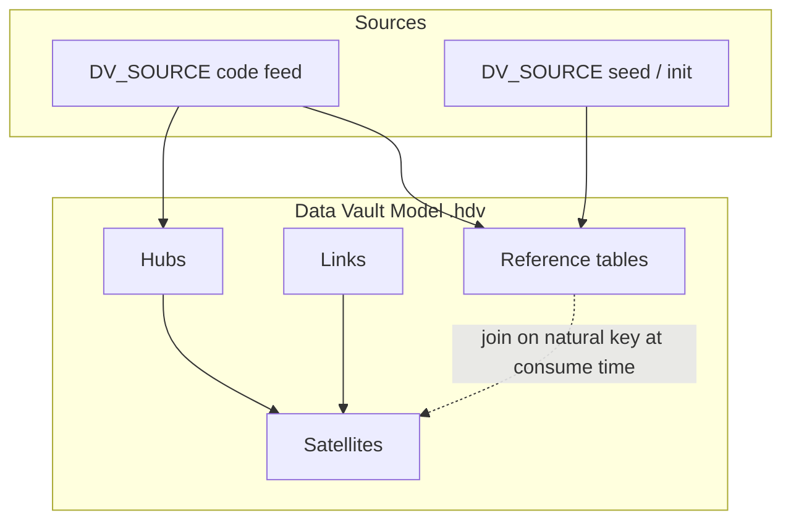

# Plan: Data Vault Reference Tables (`REFERENCE`)

**Status:** Proposed  
**Goal:** First-class support for **Reference tables** in hop-data-vault — natural-key code/catalog tables loaded into the vault database with DV audit columns, without hub hash keys or satellite hashdiff semantics. Align with VaultSpeed-style `ref_*` objects and industry “reference data in the vault” practice, while keeping pure Hub/Link/Satellite modeling intact for true business entities.

**Related:**
- Cross-model pointers are **not** this feature — see [dv-cross-model-references.adoc](../dv-cross-model-references.adoc) (`LINKED_TABLE`; formerly `TABLE_REFERENCE`).
- Reverse-engineering of VaultSpeed REF procedures (example EDW) already extracts JSON `entity_type: REF`; this plan covers **product** support and optional import into `.hdv`.

---

## 1. Problem analysis

### 1.1 What VaultSpeed (and similar automation) does

In VaultSpeed-generated warehouses, **Reference tables** are a first-class object type alongside Hub, Link, and Satellite:

| Property | Typical VaultSpeed `ref_*` |
|----------|----------------------------|
| Physical name | `ref_<source>_<entity>` (e.g. `ref_ami_land`, `ref_ami_beroepcode`) |
| Surrogate hash key (`*_hkey`) | **None** |
| Hashdiff (`dv_hash_diff`) | **None** |
| Natural key | `code`, `id`, `num_seq`, composite keys, often plus `x_src_cdc_ts` |
| Descriptive attributes | Codes, labels, flags, source audit columns |
| DV audit | `dv_load_ts`, `dv_load_cycle_id`, `dv_record_source` (names may vary) |
| Init load | **TRUNCATE + full INSERT** (often from an init/seed schema + exception stream) |
| Incremental load | **DELETE by natural key** (keys present in delta) **+ INSERT** (dedupe via `ROW_NUMBER`) |
| Parent hub/link | **None** |
| Multi-source identity integration | Not the purpose; usually single source system |

Grain is typically:

```text
(natural_key_columns [, version_or_cdc_timestamp]) → attribute columns + technical columns
```

When a CDC/version column participates in the key, the table can retain **multiple versions per code** without satellite hashdiff mechanics.

### 1.2 What Data Vault literature says

**Strict Data Vault 2.0** defines Hub, Link, and Satellite only. There is no mandatory REF primitive.

Reference-style data is usually:

1. **Hub + Satellite** when the concept is a real business entity (integrable business key, multi-source, historized attributes).
2. **Left outside the raw vault** (staging, seed DB, dimensional junk) when it is only a static lookup.
3. **Pragmatic “reference tables”** in the vault schema (vendor/automation extension) for join convenience and load-cycle governance.

VaultSpeed REF ≈ option 3: **reference data living next to the raw vault**, not a failed hub.

| Aspect | Hub | Satellite | Reference (this plan) |
|--------|-----|-----------|------------------------|
| Surrogate hash | Yes | Parent hkey | **No** |
| Business / natural key | Yes | Via parent | Natural key on the table |
| History | Insert-only | Insert-only + hashdiff | Full replace or delete-insert (optional multi-row grain) |
| Parent | — | Hub or Link | **None** |
| Multi-source identity | Core purpose | Per sat source | Optional multi-source feeds; not identity integration |
| Load | Insert new keys | Insert changes | Truncate/replace or delete-insert / merge |

### 1.3 What hop-data-vault does today

| Layer | Today | Gap |
|-------|--------|-----|
| `DvTableType` | `HUB`, `LINK`, `SATELLITE`, `TABLE_REFERENCE` | No `REFERENCE` |
| Canvas / dialogs | Hub, Link, Satellite, table references | No REF card or editor |
| DDL / update pipelines | Hub insert-new, Link insert-new, Sat hashdiff | No full-replace or delete-insert load path for natural-key tables |
| Catalog publish | `DV_HUB`, `DV_LINK`, `DV_SATELLITE` | No `DV_REFERENCE` |
| `TABLE_REFERENCE` | Cross-model pointer / hub alias | **Wrong abstraction** for code tables |

**Do not** implement REF by:

- Overloading **`TABLE_REFERENCE`** (means “pointer to another model’s table”).
- Faking **Hub + Satellite** when the physical DDL has no hkey/hashdiff (pipelines and DDL will not match existing VaultSpeed tables).

### 1.4 Goals (must-haves)

1. First-class **`REFERENCE`** table type in `.hdv` metadata and canvas.
2. **Natural keys** + **attributes** + **record sources** + **load mode**.
3. **DDL** generation for natural-key tables + standard DV audit columns (from model config).
4. **Load pipelines** for:
   - full replace (init-like),
   - delete-insert incremental (VaultSpeed-like),
   - optional merge later.
5. **Check model** validation and **Data Vault Update** orchestration (including integration modes).
6. **Catalog** publication and lineage-friendly field mappings.
7. **GUI parity**: dialog, paint, create-from-palette, i18n, search, clipboard where applicable.
8. **Documentation** (user-facing `.adoc`) and **integration tests**.

### 1.5 Non-goals (v1)

- Replacing Hub+Sat modeling guidance for true business entities.
- Auto-converting existing hubs to REF in the GUI (manual remodel only).
- Full reference-data MDM / stewardship workflows.
- Soft-delete STS pattern on REF (optional later; sats already own STS).
- Binary compatibility with VaultSpeed procedure SQL text (we match **semantics**, not generated SQL).
- Reverse-engineering importer in hop-data-vault itself (external scripts may emit `.hdv`; product accepts the format).

---

## 2. Product design

### 2.1 Mental model

A **Reference table** is a vault-side **lookup / code / catalog** table:

- Identified by **natural key(s)** (not a hash key).
- Carries **descriptive attributes**.
- Loaded with **replace or delete-insert** (not insert-only hashdiff).
- Uses the model’s **load date** and **record source** columns for operational governance.
- Does **not** require a parent hub or link.
- May appear in the same `.hdv` as hubs/links/sats, or in small dedicated models (enterprise split).



Consumers (BV, SQL, BI) join `ref_*` on natural keys. Raw vault integration remains Hub/Link/Sat.

### 2.2 When to use REF vs Hub+Sat

| Use **REFERENCE** when… | Use **Hub + Satellite** when… |
|--------------------------|--------------------------------|
| Source is a code/description or static catalog | Concept is a first-class business entity |
| Single system of record is enough | Multi-source identity integration is required |
| Delete-insert / full replace matches ops | Insert-only audit trail is required |
| Physical table has no hkey | You need hash keys and sat hashdiff CDC |
| Goal is join labels in the vault DB | Goal is enterprise-wide business key integration |

Coach / docs should state this clearly to avoid “everything is a REF” anti-patterns.

### 2.3 Canvas UX

- Palette / context menu: **New reference table**.
- Distinct icon and color (e.g. green/teal vs hub blue / link orange / sat purple — final palette with `DataVaultModelPainter`).
- Card title: name; subtitle: natural keys summary; badge load mode.
- **No** relationship drag requirements to hubs (optional future “documents” note link only).
- Double-click → `DvReferenceDialog` (tabs below).
- Integration mode badge: `(ext)` / `(custom)` same as other tables.

### 2.4 Dialog tabs (proposed)

**General**
- Name, physical table name, description
- Integration mode + custom pipeline paths
- Load mode: Full replace / Delete-insert / Merge (merge can be disabled until phase 3)
- Record source(s) multi-select (like hub) — primary for multi-source: one pipeline per source or serial multi-source workflow (reuse hub multi-source pattern)

**Natural keys**
- Ordered list: name, description, data type, length, precision, source field name, record source name (per-source field mapping like hub BKs)
- “Load from source” (PK fields from first record source when available)

**Attributes**
- Same grid pattern as satellite attributes: name, description, type, length, precision, include-in-CDC (for delete-insert: optional “compare attributes to skip no-op rewrite”; v1 may ignore and always rewrite)

**Options**
- Optional: treat selected attribute(s) as **version columns** included in grain (e.g. `x_src_cdc_ts`) — or simply allow them as natural key columns (preferred: version columns are just additional natural keys)
- Optional: empty table on full replace (default true for FULL_REPLACE)

### 2.5 Load modes

#### FULL_REPLACE
1. Ensure target exists (DDL).
2. Truncate target (or delete all rows if truncate unsupported).
3. Read source(s) → optional dedupe by natural key → write all rows with load date + record source.

#### DELETE_INSERT (VaultSpeed-like incremental)
1. Ensure target exists.
2. Read **delta** source feed (record source delivery type as today).
3. Derive natural key set from incoming rows.
4. **Delete** from target where natural keys match incoming set (composite key equality).
5. **Insert** incoming rows (after optional ROW_NUMBER dedupe by natural key, latest by source CDC if configured).
6. Do **not** require hashdiff.

#### MERGE (phase 3 optional)
- Single MERGE/upsert statement or Update+Insert path where engine supports it.
- Fallback to DELETE_INSERT on engines without merge.

### 2.6 Standard columns

Reuse `DataVaultConfiguration`:

- Load date field (e.g. `LOAD_DATE` / `dv_load_ts`)
- Record source field + length
- **No** load end date on REF by default
- **No** unknown/invalid sentinel rows for REF (v1) — codes are not hubs; optional later if customers need ghost codes

DDL column order (proposed):

1. Natural key columns (model order)
2. Attribute columns
3. Load date, record source (and other global standards if any)

Primary key: natural keys when “Generate primary keys in DDL” is enabled.

### 2.7 Integration modes

Same enum as other tables:

| Mode | Behavior |
|------|----------|
| `HOP_MANAGED` | DDL + generated load pipelines |
| `EXTERNAL_READ` | Document only; no DDL/load; still searchable/catalog |
| `CUSTOM_PIPELINES` | User `.hpl` paths instead of generated load |

### 2.8 Cross-model references

- Other models may reference a REF via **`TABLE_REFERENCE`** with `referencedTableType=REFERENCE` (extend allowed types).
- Use case: subject model documents dependency on shared `ref_country` without owning load.
- Load order: owning REF model before consumers that assume data present (ops concern; document in enterprise guide).

### 2.9 Enterprise / large-model split

Recommend (docs + reverse-engineering convention):

```text
models/
  hubs/hub_*.hdv
  links/lnk_*.hdv
  refs/ref_*.hdv      # one small model per REF when canvas size matters
```

Each REF model can be a single table + optional notes — GUI memory friendly (same motivation as hub/link splits).

---

## 3. Technical design

### 3.1 Type system

**`DvTableType`**

```java
REFERENCE("REFERENCE", /* i18n */),
```

**`IDvTable.DvTableFactory`**

```java
if (DvTableType.REFERENCE.name().equals(id)) {
  return new DvReference();
}
```

**New class `DvReference`** extends `DvTableBase`, implements `IDvTable`, `IGuiPosition`, `IBaseMeta`, `IHasName`.

Core fields:

```java
@HopMetadataProperty
private List<BusinessKey> naturalKeys = new ArrayList<>();  // reuse BusinessKey POJO

@HopMetadataProperty
private List<SatelliteAttribute> attributes = new ArrayList<>();  // reuse attribute POJO

@HopMetadataProperty(key = "recordSource", groupKey = "recordSources")
private List<String> recordSources = new ArrayList<>();

@HopMetadataProperty(storeWithCode = true)
private DvReferenceLoadMode loadMode = DvReferenceLoadMode.DELETE_INSERT;

/** Optional ordered source fields for natural keys when names differ (mirrors sat parent keys). */
// Prefer BusinessKey.sourceFieldName + recordSourceName per hub pattern — no extra list required for v1.
```

**`DvReferenceLoadMode` enum** (code + description):

- `FULL_REPLACE`
- `DELETE_INSERT`
- `MERGE` (implement after FULL_REPLACE + DELETE_INSERT are solid; UI may hide until ready)

### 3.2 XML sketch (`.hdv` fragment)

```xml
<table>
  <naturalKeys>
    <name>code</name>
    <description>Country code</description>
    <dataType>String</dataType>
    <length>3</length>
    <sourceFieldName>code</sourceFieldName>
    <recordSourceName>CRM-country</recordSourceName>
  </naturalKeys>
  <naturalKeys>
    <name>x_src_cdc_ts</name>
    <description>Source version timestamp (grain)</description>
    <dataType>Timestamp</dataType>
    <length>6</length>
    <sourceFieldName>x_src_cdc_ts</sourceFieldName>
    <recordSourceName>CRM-country</recordSourceName>
  </naturalKeys>
  <attributes>
    <name>name</name>
    <description>Country name</description>
    <dataType>String</dataType>
    <length>100</length>
    <precision/>
    <includeInChangeDataCapture>Y</includeInChangeDataCapture>
  </attributes>
  <recordSources>
    <recordSource>CRM-country</recordSource>
  </recordSources>
  <loadMode>DELETE_INSERT</loadMode>
  <tableName>ref_ami_land</tableName>
  <description>Country codes (reference data)</description>
  <tableType>REFERENCE</tableType>
  <integrationMode>HOP_MANAGED</integrationMode>
  <xloc>80</xloc>
  <yloc>80</yloc>
  <name>ref_ami_land</name>
  <virtualPath/>
</table>
```

**Serialization note:** Prefer `@HopMetadataProperty(key = "naturalKey", groupKey = "naturalKeys")` if list element naming must match Hop group conventions used elsewhere; align with existing hub `businessKeys` style for consistency (hub uses repeated `<businessKeys>` without outer group in samples — follow the same pattern as `BusinessKey` on `DvHub` for least surprise).

### 3.3 Model API extensions (`DataVaultModel`)

- `List<DvReference> getReferences()` / find helpers: `findReference(String name)`.
- Include REF in `getTables()`, name uniqueness checks, ELK layout categories.
- Check model: iterate REF checks with hubs/links/sats.
- Search analyser: index natural keys + attributes.

### 3.4 Validation (`DvReference.check`)

Errors:

- Missing name / table name empty after resolve
- Zero natural keys
- Duplicate natural key names
- Duplicate attribute names or attribute name collisions with natural keys / standard columns
- No record source when `HOP_MANAGED` (warn or error — match hub policy)
- Referenced record source missing from catalog/metadata provider
- Natural key source fields missing on source (detailed type check when enabled)

Warnings:

- FULL_REPLACE with large sources (document ops risk)
- MERGE selected but engine lacks merge (when implemented)
- Target DB differs from other models when cross-referenced

### 3.5 DDL (`DvDdlSupport` / table-specific)

New path `generateCreateTable` / alter drift for REFERENCE:

- Columns = natural keys + attributes + load date + record source
- Types from attribute/key metadata + source schema when available (`DvSqlPhysicalTypeValidationSupport` patterns)
- Optional PK on natural keys when config enables PKs
- No FK to hubs
- Truncate support detection for FULL_REPLACE (dialect-specific)

### 3.6 Pipeline generation

New builder entry on `DvReference` (mirror `DvHub.generateUpdatePipeline` structure at high level):

**Shared steps**

1. Resolve `DataVaultSource` / catalog feed per record source.
2. Source leg via existing `DvSourcePipelineBuilderFactory` (DB/CSV/Parquet/Iceberg/composite).
3. Select/rename fields to natural keys + attributes.
4. Inject load date (constant or stream) and record source value.
5. Optional: Sort + Unique / GroupBy for dedupe on natural keys.

**FULL_REPLACE**

```
Source → field map → [dedupe] → Truncate (Execute SQL or dedicated) → Table Output
```

Prefer a small pipeline that:

- Runs truncate via SQL transform or pre-step in update action before pipeline (cleaner: **ActionDataVaultUpdate** runs truncate DDL/SQL before pipeline, pipeline is insert-only).  
  **Recommended:** Update action **pre-step** for truncate/delete; pipeline only inserts. Matches “ensure special records” style orchestration.

**DELETE_INSERT**

Update action orchestration per REF + source:

1. Build key-extract pipeline or use same source twice:
   - **Option A (simple):** One pipeline: stream → copy to “keys temp” is hard in pure Hop without staging.  
   - **Option B (VaultSpeed-like, recommended):** Two phases in generated workflow:
     1. Pipeline “collect keys” → staging table or in-memory not available → use **Execute SQL** with `DELETE FROM ref WHERE EXISTS (SELECT 1 FROM delta WHERE keys match)` when source is DB on same target connection.  
     2. Insert pipeline from delta.  
   - **Option C (portable):** Pipeline writes delta to a **staging table** `stg_ref_<name>_<run>` then SQL delete-join + insert-select; cleanup staging. Heavier but engine-neutral.

**v1 recommendation:**

| Source kind | DELETE_INSERT strategy |
|-------------|------------------------|
| Database source, same RDBMS as target | Generated `DELETE … WHERE EXISTS (SELECT … FROM source_delta JOIN …)` + insert pipeline |
| File / cross-DB / Iceberg | Stage delta to target DB temp table, then delete-join + insert; or fall back to FULL_REPLACE with warning |

Implement database same-connection path first (covers VaultSpeed DFV-on-warehouse pattern); portable path second.

**Multi-source REF**

- One pipeline (or delete+insert pair) per record source, serialized like multi-source hubs (`DvMultiSourceUpdateWorkflowSupport`).

### 3.7 Data Vault Update action

Extend table selection / generation:

- Include REFERENCE tables in “tables to update”.
- Ordering: **no hard dependency** on hubs; optional user sort. Document: load REFs early if sats/BV expect codes present (not enforced).
- Metrics / duration: count REF pipelines like others.
- Skip EXTERNAL_READ; run CUSTOM_PIPELINES list.

### 3.8 Catalog (`DvCatalogPublisher`, filters)

- Map `REFERENCE` → new `RecordDefinitionType.DV_REFERENCE` (catalog module; coordinate with hop-catalog types if enum is shared).
- If catalog enum cannot be extended immediately: publish as `PHYSICAL_TABLE` with tag `dv-reference` (interim) — prefer real type.
- Data catalog list filter: add References next to Hubs/Links/Sats.
- Field-level lineage: natural keys + attributes from source fields.

### 3.9 GUI touch points (checklist)

| Area | Work |
|------|------|
| `DvTableType` + factory | New type |
| `DvReference.java` | Metadata + check + pipeline gen |
| `DvReferenceDialog.java` | Editor |
| `HopGuiVaultGraph` / palette / context menu | Create REF |
| `DataVaultModelPainter` | Icon, colors, badges |
| Clipboard / undo | Serialize REF |
| ELK layout | Cluster REFs (e.g. bottom band) |
| Search | `DataVaultModelSearchAnalyser` |
| AI coach (optional) | Suggest REF vs Hub+Sat for code tables |
| i18n `messages_en_US.properties` | All labels |
| SVG / icon assets | Reference table glyph |

### 3.10 Explicitly out of scope for wrong abstractions

```text
TABLE_REFERENCE  ≠  REFERENCE table
     │                      │
     │ pointer/alias        │ physical code table
     ▼                      ▼
cross-model nav         load + DDL target
```

---

## 4. Phased delivery

### Phase 1 — Metadata + canvas + check (no load)

**Deliverables**

- `DvTableType.REFERENCE`, `DvReference`, load mode enum
- Dialog (general, keys, attributes, sources)
- Paint + create + open/save round-trip `.hdv`
- `DataVaultModel` find/list/check uniqueness
- Unit tests: XML serialize/deserialize, check errors
- User doc draft: `docs/dv-reference.adoc` (options, when to use)

**Exit criteria:** User can create a REF on canvas, save/reopen, run Check model; Update action ignores load (or no-ops with message) until Phase 2.

### Phase 2 — DDL + FULL_REPLACE load

**Deliverables**

- CREATE/ALTER DDL for REF
- Update action: ensure table + truncate + insert pipeline(s)
- Integration test: small REF from CSV or DB → target table row counts
- Catalog publish `DV_REFERENCE` (or tagged interim)

**Exit criteria:** End-to-end full replace load in `integration-tests`.

### Phase 3 — DELETE_INSERT incremental

**Deliverables**

- Delete-by-key + insert path for same-DB sources
- Portable staging fallback (or documented limitation)
- Integration test: load v1, delta v2 (update description, delete removed code)
- Performance notes for large code tables

**Exit criteria:** VaultSpeed-like incremental behavior for DB sources.

### Phase 4 — MERGE + polish

- MERGE where supported
- Coach guidance REF vs Hub+Sat
- Architecture export / OpenLineage dataset type
- Execution map icons
- Optional: unknown code sentinel (customer-driven)

### Phase 5 — Ecosystem / reverse engineering (optional, may live outside hop-data-vault)

- Document `.hdv` REF fragment for importers
- Example: generate `refs/ref_*.hdv` from VaultSpeed procedure reverse engineering
- Natural key detection from incremental `PARTITION BY` / DELETE join columns

---

## 5. Testing strategy

### Unit tests

- `DvReferenceTest`: defaults, check validation matrix
- XML round-trip of model containing REF + hub + sat
- DDL SQL snapshots for PostgreSQL (and one other dialect if CI allows)
- Factory polymorphism: `tableType=REFERENCE` deserializes to `DvReference`

### Integration tests (new suite `tests/reference-table/`)

| Case | Assert |
|------|--------|
| Full replace init | Truncate + N rows; load date set |
| Full replace reload | Row count stable; attributes updated |
| Delete-insert update | Changed attribute; key preserved |
| Delete-insert remove | Key absent from delta → deleted from target (if using “delta is full set of changes” semantics — **define clearly**) |
| External read REF | No pipeline generated |
| Multi-source REF | Serial load; both sources contribute |

**DELETE_INSERT semantics (normative for tests):**

Incoming delta rows are the **set of natural keys to refresh**. For each key in the delta, delete existing target rows with that key, then insert the delta rows for that key. Keys not present in the delta are **left unchanged**. (Matches VaultSpeed “delete keys present in DFV, insert DFV rows”.)

### GUI smoke (manual checklist)

- Create REF, edit keys/attrs, undo, save, reopen
- Check model error when no natural key
- Update action runs without NPE when model has only REFs

---

## 6. Documentation plan

| Doc | Content |
|-----|---------|
| `docs/dv-reference.adoc` | User guide: concept, dialog, load modes, vs Hub+Sat |
| `docs/datavault-plugin.adoc` | Palette entry, check model notes |
| `docs/datavault-update-action.adoc` | REF in update orchestration |
| `docs/datavault-configuration.adoc` | Standard columns apply to REF |
| `docs/enterprise-modeling-and-team-collaboration.adoc` | Optional `refs/` split models |
| `docs/feature-overview.md` | Feature bullet |
| `CHANGELOG.md` | Release notes per phase |

---

## 7. Mapping from VaultSpeed reverse-engineering (interop)

When importing from extracted JSON (`entity_type: REF`):

| Extracted field | Hop `DvReference` |
|-----------------|-------------------|
| `table_name` | `name` / `tableName` |
| `business_keys[].name` + source mappings | `naturalKeys` (refine grain using incr PARTITION/DELETE keys when available) |
| `attributes[]` | `attributes` (exclude pure technical columns if desired: `x_*` policy) |
| `primary_source_tables` | `recordSources` labels (bind later to catalog) |
| Load pattern | `FULL_REPLACE` for init-only docs; `DELETE_INSERT` default for operational parity |
| Hash / parent | Leave empty — never invent hkeys |

**Key refinement:** prefer natural keys from incremental procedure:

- `DELETE … WHERE tgt.key = src.key [AND tgt.x_src_cdc_ts = src.x_src_cdc_ts]`
- `PARTITION BY` key list  

over “columns before first `dv_`/`x_` heuristic”.

---

## 8. Risks and mitigations

| Risk | Mitigation |
|------|------------|
| Users model business entities as REF and lose multi-source history | Docs + coach + Check warning when REF name looks like entity and has many sources |
| Truncate not supported on target | Fallback delete-all; dialect capability flags |
| DELETE_INSERT against file sources | Staging table path or force FULL_REPLACE with warning |
| Catalog enum hard to extend | Tag-based interim publish |
| Large full-replace REFs | Batch size settings; document ops windows |
| Confusion with `TABLE_REFERENCE` | Distinct type name `REFERENCE`, docs callout, different icon |
| Attribute type quality | Reuse source schema type checks from hub/sat |

---

## 9. Success metrics

- Round-trip `.hdv` with REF stable in Hop GUI.
- Integration tests green for FULL_REPLACE and DELETE_INSERT.
- A VaultSpeed-like `ref_*` table can be modeled and loaded without inventing hash keys.
- Check model catches empty natural keys and missing sources.
- Catalog shows reference targets for lineage consumers.
- Feature documented at the same depth as Hub/Link/Satellite pages.

---

## 10. Suggested implementation order (engineering checklist)

1. Enum + `DvReference` skeleton + factory + XML unit test  
2. Dialog + painter + graph create  
3. Model check + search  
4. DDL create  
5. Update action FULL_REPLACE  
6. Integration test full replace  
7. DELETE_INSERT for same-DB  
8. Integration test incremental  
9. Catalog publish + filters  
10. User docs + changelog  
11. (Optional) MERGE, staging fallback, AI coach, reverse-engineer exporter  

---

## 11. Open decisions (resolve during Phase 1)

1. **POJO reuse:** Keep `BusinessKey` for natural keys (name may confuse) vs introduce `NaturalKey` type with identical fields.  
   - **Recommendation:** reuse `BusinessKey` in v1 for speed; label UI “Natural keys”.  
2. **Default load mode:** `DELETE_INSERT` (VaultSpeed parity) vs `FULL_REPLACE` (safer default).  
   - **Recommendation:** default `FULL_REPLACE` for new objects; importers set `DELETE_INSERT` when reverse-engineering incr procedures.  
3. **Multi-version grain:** version timestamp as extra natural key (simple) vs first-class “historized reference” flag.  
   - **Recommendation:** extra natural key only in v1.  
4. **Catalog type:** new `DV_REFERENCE` vs tagged `PHYSICAL_TABLE`.  
   - **Recommendation:** new type if catalog allows; else tag.  

---

## 12. Summary

Reference tables are a **pragmatic fourth raw-vault object**: natural-key code/catalog data with DV load metadata and replace/delete-insert loads. They are **not** hubs, satellites, or cross-model table references.

hop-data-vault should add **`DvTableType.REFERENCE` / `DvReference`**, full GUI, DDL, FULL_REPLACE then DELETE_INSERT loads, catalog integration, and clear guidance on when Hub+Sat remains the correct pattern.

This enables VaultSpeed-style `ref_*` interoperability and gives Hop users a clean way to manage lookup data inside the vault without polluting the Hub/Link/Satellite model.
