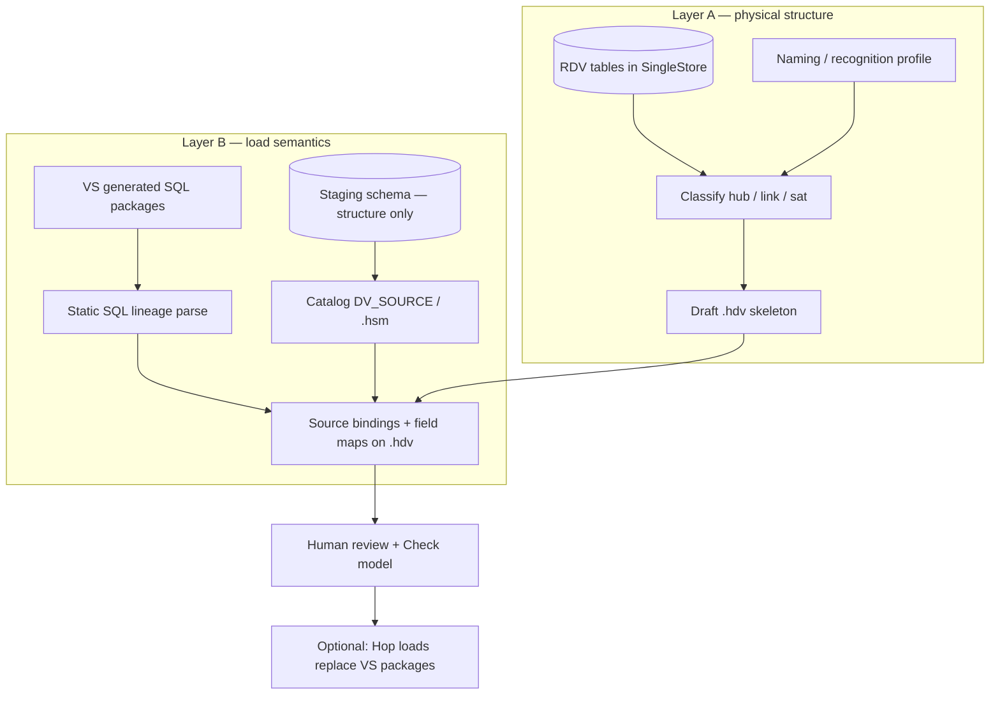

# Issue #107 — Reverse-engineer existing Data Vault models (viability + phased plan)

**Issue:** [Reverse engineering for existing DV models](https://github.com/mattcasters/hop-data-vault/issues/107)  
**Context:** VaultSpeed → hop-data-vault migration for a governmental customer; cloud-locked VS metadata; staging→RDV SQL packages available (SingleStore); BV lives in 1000+ dbt models; no agentic AI against PII/production DBs.  
**Goal of this plan:** Architect assessment of viability and a phased approach — not an implementation commit list yet.

---

## 1. Two problems that look like one

Issue #107 as filed is:

> Look at a target DV schema (naming scheme + optional PK/FK) and generate a draft `.hdv` with hubs, links, satellites and their relationships.

The customer story adds a second, harder problem:

> Recover enough *load semantics* (staging → raw vault mappings, source feeds, hash composition) to *operate* the model in Hop, not merely *draw* the ER graph.

These must be phased separately. Conflating them is how reverse-engineering projects fail.



**Bottom line up front:** Layer A is **clearly viable** and aligns with #107. Layer B is **viable without AI or PII** if the SQL packages are regular (generated code almost always is) — and is the real migration unlock. Full “bit-identical operational parity with VaultSpeed including every sat subtype and multi-source edge case” is **partial / progressive**, not a big-bang guarantee.

---

## 2. Viability assessment

### 2.1 What we can recover with high confidence (deterministic)

| Artifact | Signal | Confidence |
|----------|--------|------------|
| Table type (hub / link / sat) | Name prefixes/suffixes + column signature (1 HK + BKs vs many HKs vs parent HK + LDTS + payload) | High if naming is consistent |
| Hub business keys | Non-standard columns on hub tables | High |
| Hub / link / sat hash key column names | Config column names + type/length patterns | High |
| Satellite parent (hub vs link) | Parent hash column name match or FK, else naming (`sat_customer_*` → `hub_customer`) | Medium–high |
| Link member hubs | Multiple `*_HK` / `*_HASHKEY` columns matching hub HKs | Medium–high |
| Standard technical columns | `LOAD_DATE` / `LDTS`, `RECORD_SOURCE` / `RSRC`, `HASHDIFF`, `LOAD_END_DATE` / `LEDTS` | High with a profile |
| Draft physical names + field types | JDBC metadata (same path as catalog / DM import) | High |

This is the same *draft-for-human-review* contract already used by dimensional import:

- `DmDatabaseTableImportSupport` — table name/column heuristics → draft `.hdm` tables
- Source modeler (#105) — PK/FK harvest → `.hsm`

#107 is the missing dual for **target RDV**.

### 2.2 What needs the SQL packages (still no AI / no PII)

Physical schema alone does **not** give:

- Which staging table(s) feed which hub/link/sat
- Business-key / attribute field mappings from staging columns
- Multi-source hubs (several feeds into one hub)
- Link key role mappings when column names differ from hub BKs
- Soft business rules encoded only in load SQL (filters, driving keys, multi-active keys)

Generated staging→RDV packages are ideal input for **static analysis**:

- Offline files via Hop VFS (customer can drop packages on a laptop)
- Parse `INSERT`/`MERGE`/`SELECT` targets and sources
- Build a **source-to-target mapping graph** without touching row data
- Government constraint is satisfied: structure of code, not content of tables

Risk: package dialect (SingleStore procedures, temp tables, VS-specific wrappers). Mitigation: start from a **sample package corpus** the customer can share (redact literals if needed; structure matters more than values).

### 2.3 What is hard or out of scope for early phases

| Topic | Why hard | Recommendation |
|-------|----------|----------------|
| VaultSpeed cloud metadata API | Locked; reverse-eng may violate ToS or be unavailable offline | Do not depend on it |
| Effectivity / RTS / multi-active / NHL variants | Column patterns overlap; need profile + human confirm | Classify as “sat subtype = unknown” with warnings |
| Same hub twice on a link (aliases, #103) | Physical FKs look like two columns; roles need names | Import as two hub refs; alias naming is manual/SQL-assisted |
| Hash algorithm, separators, casing | Not in DDL; sometimes inferable from packages or docs | Profile defaults + optional later inference on **synthetic** test keys only |
| Unknown/invalid sentinels | Convention, not schema | Profile defaults; review |
| 1000+ dbt BV models | Different toolchain (YAML + SQL), not RDV reverse-eng | **Separate epic**; may later map dbt sources to `.hbv`/SQL views |
| Agentic AI over production data | Explicitly forbidden | Design for **zero LLM requirement**; AI Help remains optional on draft models offline if policy allows model files only |

### 2.4 Product / strategic viability (customer + VaultSpeed risk)

- **Viable as a migration wedge:** structure + mappings → Hop becomes the *system of record* for RDV metadata; loads can be re-generated later.
- **Does not require** VS commercial reverse-engineering support.
- **Does require** a deliberate product stance: reverse-engineering produces **draft models with confidence scores**, not silent perfect imports.
- **Aligns with hop-data-vault strengths already shipped:** catalog, source modeler, lineage, check model, SingleStore as first-class target.
- **Risk to set with the customer:** Phase 1–2 get them a *model they can own and extend*; Phase 3–4 get them *load path recovery*; cutting over production loads is a **project**, not a button.

### 2.5 Relation to Hop Naming Scheme (apache/hop#7735)

Hop’s Naming Scheme PR is about **normalizing field names** (spaces → snake_case, etc.) for TableView. Useful later for source field cleanup, **not** sufficient for DV table-type recognition.

#107 needs a richer first-class concept:

**`DvRecognitionProfile` (or `DvNamingProfile`)** — versioned metadata or model-embedded config describing:

- Table name patterns → HUB / LINK / SAT / IGNORE
- Standard column aliases (load date, record source, hash diff, end date)
- Hash key detection rules
- Optional VaultSpeed / customer presets

This is closer to a *classifier profile* than Hop’s field-name engine. Prefer plugin-local metadata (or model config tab) unless Hop generalizes scheme *types* for “database table classification” later.

---

## 3. Design principles (non-negotiable for this customer)

1. **Deterministic first** — rules and parsers with unit tests; no required LLM.
2. **Offline-capable** — JDBC optional for Layer A; SQL files only for Layer B.
3. **No PII path** — never SELECT business data for reverse-eng; only INFORMATION_SCHEMA / JDBC metadata / SQL text.
4. **Draft + review** — import never silently “fixes” ambiguous relationships; confidence + warnings.
5. **GUI parity** — Import dialog on `.hdv` toolbar (mirror DM import / source modeler import); no file-only magic.
6. **Layered completeness** — skeleton model useful even before sources; sources attach without rewriting structure.
7. **SingleStore-aware** — dialect quirks in package parse and schema read; reuse existing SingleStore target support.

---

## 4. Phased plan of approach

### Phase 0 — Discovery spike (1–2 weeks, customer-facing, low product risk)

**Purpose:** Prove signals before building a lot of product.

Deliverables:

1. **Anonymized inventory** of one subject area: table list, column names/types, PK/FK (structure only).
2. **2–5 representative VS SQL packages** (staging → hub, sat, link) for SingleStore.
3. **Hand-built recognition profile** for their naming (document patterns).
4. **Spike report:** % of tables auto-classifiable; ambiguity cases; SQL parse feasibility.

Exit criteria: written confidence that Layer A ≥ ~80% auto-classify with review, and Layer B package patterns are regular enough to parse.

*No agentic AI; no production row access. Optional: run spike as a small offline Java prototype or even spreadsheet + scripts, then promote winners into the plugin.*

---

### Phase 1 — Recognition profile + classifier (product core of #107)

**Scope:** Pure library + unit tests; no GUI required to land tests first, GUI in Phase 2.

| Component | Responsibility |
|-----------|----------------|
| `DvRecognitionProfile` | Patterns for table types, standard columns, ignore lists |
| Presets | `hop-default`, `generic-dv2`, `custom` (customer fills from Phase 0) |
| `DvTableClassifier` | Table name + columns + optional PK/FK → `{type, confidence, reasons[]}` |
| `DvRelationshipInferrer` | Sat→parent, Link→hubs candidates with confidence |
| Fixtures | Synthetic schemas + retail-like vault DDL |

Outcomes: API that turns “list of physical tables” into a typed graph with reasons (explainable — good for government audit).

Non-goals: source bindings, load generation, BV/dbt.

---

### Phase 2 — Import target tables → draft `.hdv` (issue #107 MVP)

Mirror `DmDatabaseTableImportSupport` + options dialog.

**GUI (required):**

- `.hdv` toolbar / canvas: **Import from database…**
- Select connection, schema, multi-select tables (or filter by profile patterns)
- Choose recognition profile
- Preview classification grid: table → type → confidence → include?
- Import creates draft `DvHub` / `DvLink` / `DvSatellite` with physical names, hash keys, BKs, attributes, parent refs where confidence ≥ threshold
- Warnings for low-confidence edges; no record sources yet (check model will flag — expected)

**Model config:** seed `DataVaultConfiguration` standard column names from profile where possible.

**Success metric:** Open a real customer (or sanitized) RDV schema, import, get a navigable canvas model that a modeler can correct in hours not weeks.

---

### Phase 3 — SQL package → source-to-target mapping (migration unlock)

**Input:** Directory of generated SQL/procedure packages (Hop VFS).  
**Output:** Mapping report + optional apply to model/catalog.

| Extract | Use |
|---------|-----|
| Staging object → vault table | Create/link `DV_SOURCE` catalog entries |
| Column lineage staging.col → vault.col | Hub BK sources, sat attributes, link key maps |
| Hash expression inputs | Document BK order / hash composition notes |
| Filters / WHERE | Surface as warnings (“manual review: load filter present”) |

**GUI:**

- **Import load mappings…** (from files) on model or a dedicated review dialog
- Side-by-side: vault table \| inferred sources \| confidence
- Apply selected bindings; never auto-apply low confidence without confirm

**Compliance:** Pure static analysis of SQL text; no DB credentials required for this phase.

**Risk management:** First parser targets patterns observed in Phase 0 packages; expand dialect coverage incrementally. Prefer “partial mapping + orphans list” over fragile full AST perfection.

---

### Phase 4 — Staging harvest + close the loop with #105

Already largely built:

- Source modeler `.hsm` import PK/FK
- Catalog publish of tables / composite queries
- Schema drift / validation gates

Wire reverse-eng RDV to harvested staging:

1. Import staging schema → `.hsm` / catalog (customer “metadata harvester” equivalent).
2. Join Phase 3 mappings to catalog feed names.
3. Lineage report: vault tables with full source coverage vs orphans.
4. Optionally generate composite source queries where packages join multiple staging tables (harder — Phase 4b).

Result: hop-data-vault becomes the **owned** metadata plane (source model + RDV model + lineage), independent of VS cloud.

---

### Phase 5 — Operational cutover (project, not only product)

Out of pure “reverse engineer model” but needed for customer value:

1. **Parity mode:** Keep VS packages running while Hop model is curated.
2. **Pilot subject area:** Regenerate Hop load pipelines for N hubs/sats; compare row counts / hash keys on non-PII synthetic or masked environments if policy allows.
3. **Cutover playbook** docs: profile, import, map, check model, update action, ops metrics.
4. **BV/dbt:** treat as parallel track — either leave dbt consuming RDV tables, or later map dbt models to `.hbv` SQL views / SCD2 where it pays off. Do not block RDV reverse-eng on BV.

---

## 5. Suggested technical shape (when implementation starts)

```
org.apache.hop.datavault.metadata.reverseeng/
  DvRecognitionProfile.java          // metadata or embedded config
  DvTableClassification.java         // type + confidence + reasons
  DvTableClassifier.java
  DvRelationshipInferrer.java
  DvDatabaseModelImportSupport.java  // Phase 2; parallel to DmDatabaseTableImportSupport
  sql/
    DvLoadPackageScanner.java        // Phase 3
    DvStagingToVaultMapping.java
    SqlPackageParseResult.java
```

GUI:

- `ImportDvDatabaseTablesOptionsDialog` + preview
- `ImportDvLoadMappingsDialog` (Phase 3)

Reuse:

- JDBC table/column/PK/FK discovery (`DatabasePrimaryKeyDiscoverySupport`, `DatabaseForeignKeyDiscoverySupport`)
- DM import UX patterns
- Lineage reason-code style for explainability
- Check model to drive post-import triage

---

## 6. What “done” means for #107 vs customer migration

| Milestone | Product issue #107 | Customer migration |
|-----------|--------------------|--------------------|
| Draft `.hdv` from target DB + naming profile | **MVP done** | Structure owned in Hop |
| Review UI + confidence | Expected | Audit-friendly |
| SQL package mapping | Stretch / follow-on issue OK | **Critical path** |
| Staging `.hsm` + catalog | Leverage #105 | Harvester replacement |
| Hop loads in production | Out of #107 | Separate delivery plan |
| dbt BV reverse-eng | Out of #107 | Separate epic |

Recommend: implement #107 as **Phase 1–2**, open a sibling issue **“Import staging→RDV mappings from SQL packages”** for Phase 3 so scope stays honest.

---

## 7. Risks and mitigations

| Risk | Mitigation |
|------|------------|
| Inconsistent / undocumented VS naming | Phase 0 profile; customer-specific preset |
| FK constraints missing on SingleStore RDV | Prefer column-name + profile over FK |
| Packages too dynamic / obfuscated | Spike early; fallback to manual mapping workbench (see [source-to-data-vault-mapping-plan.md](source-to-data-vault-mapping-plan.md)) |
| Scope creep into full VS clone | Explicit non-goals: cloud metadata, AI-on-PII, BV/dbt in #107 |
| False confidence on wrong sat parent | Confidence threshold + mandatory preview grid |
| Legal/ToS around reverse-eng VS packages | Customer owns packages they paid for; parse *their* deployable SQL, not VS SaaS APIs |

---

## 8. Recommendation (architect’s penny)

**The idea is sound and strategically important** — especially for VaultSpeed exit risk and government data ownership. Do **not** frame it as “fully reverse-engineer VaultSpeed.” Frame it as:

1. **Recover the RDV as a first-class Hop model** (naming + schema) — high viability, shippable.
2. **Recover load bindings from generated SQL offline** — high viability if packages are regular; highest customer ROI.
3. **Operate and extend in Hop** — project work with subject-area pilots.

Government no-AI-on-PII is not a blocker; it is a **design filter** that pushes toward explainable classifiers and static SQL analysis — which is the right architecture anyway.

**Immediate next step if you greenlight product work:** Phase 0 spike with real (structure-only) schema dump + a few SQL packages, then lock the recognition profile before building the import GUI.

---

## 9. Open decisions (for product owner)

1. Is #107 scoped to **Layer A only** (draft `.hdv`), with SQL mapping as a separate issue? **Recommended: yes.**
2. Should `DvRecognitionProfile` be Hop metadata (reusable across models) or embedded in each `.hdv` configuration? (Lean: **metadata + optional model override**.)
3. For the customer pilot, is a **read-only JDBC** connection to RDV metadata allowed in a controlled environment, or must Layer A also run from DDL files only? (Both are feasible; DDL-only is more compliance-friendly.)
4. Is BV/dbt in scope for the first commercial conversation, or explicitly “RDV first, BV later”? **Recommended: RDV first.**
