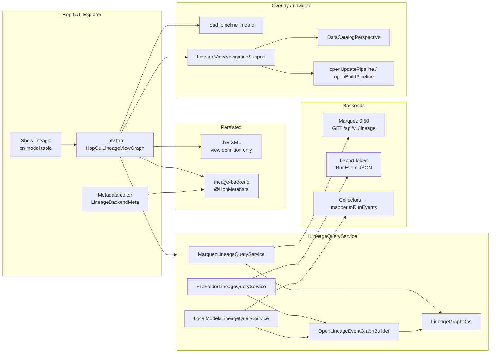
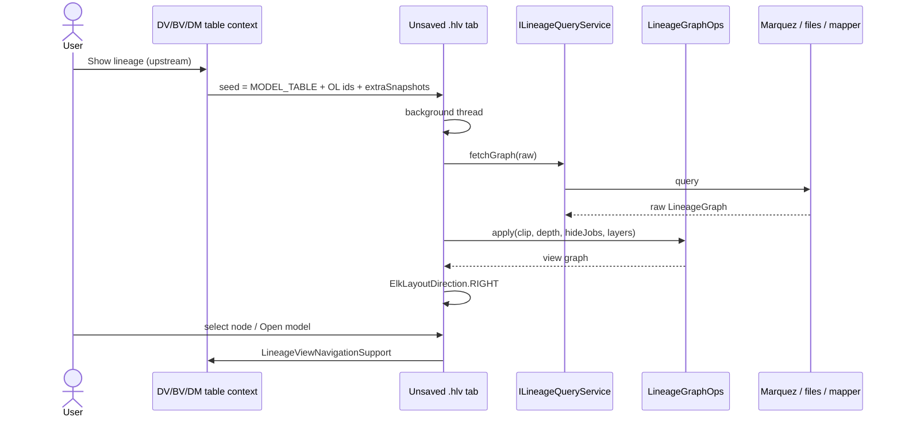
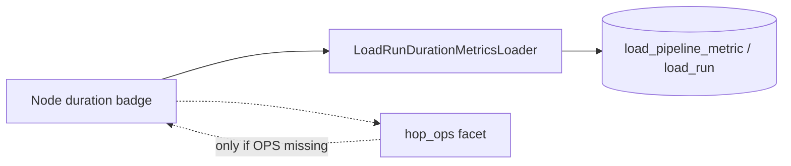

# Hop Lineage View — in-GUI data lineage over OpenLineage backends

| Field | Value |
| --- | --- |
| **Document title** | Hop Lineage View (`.hlv`) |
| **Author** | TBD |
| **Date** | 2026-08-14 |
| **Status** | Draft (rev 4 — user decisions locked 2026-08-14) |
| **Issue** | [ProjectDataHopper/hopper-edw#79](https://github.com/ProjectDataHopper/hopper-edw/issues/79) |
| **Related shipped work** | [#101 OpenLineage export](docs/plans/marquez-lineage-plan.md) (0.5.0), source-to-target lineage, execution maps (`.hem`), load-duration pane |
| **Audience** | hop-data-vault maintainers; assumes Hop 2.19.0 plugin + Explorer file-type patterns |

---

## Overview

Hop already knows *how a model maps* (collectors, Lineage tab, reverse browser, catalog siblings) and can *export* that mapping as OpenLineage `RunEvent`s to Marquez or a folder. What it does **not** do is let an engineer stay inside Hop GUI, start at the **end of the chain** (a fact, a dimension, a column), walk **upstream** through DV/BV/source, and jump to the responsible `.hdv` / `.hbv` / `.hdm`, generated pipeline, catalog record, or workflow.

This document proposes **Hop Lineage View**: a new **authorable view-definition file type** (`.hlv`) that opens in an Explorer tab (same shell as `.hem`), points at a **lineage backend** (`@HopMetadata` connection), and **queries** Marquez / a folder of exported events / local model collectors. The file stores *what to look at* (seed, depth, granularity, filters). The graph itself stays in the backend (or is derived on the fly). Live/historical “how it felt” telemetry is overlaid from the **Hop OPS database**, not from Marquez job-run history — because today’s export writes **model-derived COMPLETE events**, so Marquez’s “latest run” is the last *export*, not the last *load*.

**Recommendation:** implement alternative **D** (view-definition file + live query). Do **not** add a new `IHopPerspective`. Do **not** persist a crawled lineage snapshot like `.hem`. Do **not** pretend Collibra is a drop-in OpenLineage query API.

Local-models is **new graph-building**: collectors → `OpenLineageSnapshotMapper.toRunEvents` → the same event-BFS as the file-folder adapter. Existing `ImpactGraph` / `ReverseLineageIndex` / `ArchitectureGraphFromLineage` are the wrong shape (downstream, two-hop, or edgeless).

---

## Background & Motivation

### Two different #79s

The original issue body is a **canvas overlay** story: “this satellite took 42 minutes to load 10k rows today; average is 2 minutes.” That pain is **already partially shipped** on DV/BV/DM graphs:

- `ModelLoadDurationPane` + `LoadRunDurationMetricsLoader` (right-hand Airflow-style bars; see `docs/operations.adoc`)
- OPS tables `load_run`, `load_pipeline_metric`, `load_transform_metric`, `workflow_load_overview`
- Live-in-progress monitors under `metrics/live/` (`UpdateRunLiveMonitor`) — useful only while a load is actually running

The owner reframing (2026-08-14) is the **more important product**:

> Table and column level. Start at the end of the chain (new fact/dimension). Where does each field come from? Marquez/Collibra are nice but you lose the Hop GUI and the actual models, pipelines, workflows, tables, and columns. A generic Data Lineage surface should read Marquez or Collibra, recognize `modelName` / `modelLayer` / `tableType` / `modelFilename`, and deep-link into them.

That is **not** an overlay on a single `.hdv`. A fact’s sources live in other files. The existing Lineage tab (`LineageTabSupport`) is **one table, one model, read-only grid**. The reverse browser (`ReverseLineageBrowserDialog`) is **source → consumers**, also a grid, scoped to a resource definition group. Neither is an interactive end-of-chain graph.

### What is already true in this repo

| Capability | Where | What it is / is not |
| --- | --- | --- |
| Model-derived lineage | `org.hopper.edw.datavault.lineage.*` (`DvModelLineageCollector`, `BvModelLineageCollector`, `DmModelLineageCollector`, `LineageSnapshot`, `FieldContribution`) | Source of truth for *mappings*. Per-model snapshots, **not** a cross-model graph. |
| Lineage tab | `hopgui/lineage/LineageTabSupport.java` | Per-table reasons + field grid. |
| Reverse browser | `hopgui/lineage/ReverseLineageBrowserDialog.java` | Source field → consumers, **two hops max**. Opens model element. |
| Catalog siblings + drift | `LineageCatalogPublisher`, validate-resource-definitions | Discovery + rename gate. |
| OpenLineage **export** | `openlineage/OpenLineageSnapshotMapper`, `ActionExportDataLineage` | One COMPLETE `RunEvent` **per target table**. Job name `{layer}/{modelName}/{logicalTable}`. Facets: `hop_export` (run), `hop_location` + `dataSource` (dataset), optional `hop_ops`, optional `columnLineage`. |
| Local Marquez | `scripts/run-marquez.sh`, `scripts/docker/compose.marquez.yml` | **Marquez 0.50.0**, API `http://localhost:5001`, UI `:3001`. |
| Execution maps | `.hem`, `HopExecutionMapFileType`, `HopGuiExecutionMapGraph` | **Persisted crawled execution graph**. Opposite persistence model of a lineage *view*. |
| Catalog perspective | `DataCatalogPerspective` (`IHopPerspective`) | Singleton browser of **stored** catalog records. |
| Impact graph | `org.hopper.edw.datavault.impact` | **Downstream** blast radius from catalog sources. Not visual, not OL, not upstream. |
| Architecture export | `ArchitectureGraphFromLineage` | Draw.io inventory; **`setOmitEdges(true)`**. Not interactive. |

### Pain points this design addresses

1. **Context switch:** engineers leave Hop for Marquez and lose model/pipeline/workflow navigation.
2. **End-of-chain questions** are the common ones (new fact, “where does `order_amount` come from?”) and are poorly served by per-table tabs.
3. **Export ≠ runtime.** Marquez currently stores *what the model said at last export*. Treating Marquez job history as load telemetry would lie.
4. **No reusable “lineage question” artifact** in the project tree (unlike saved `.hem` maps or catalog connections).

---

## Goals & Non-Goals

### Goals (first ship)

1. Author, save, and open a **Hop Lineage View** (`.hlv`) in Hop GUI (Explorer tab).
2. Query **Marquez 0.50** (`GET /api/v1/lineage`) and a **folder of exported RunEvent JSON** through one SPI.
3. Start from a **seed dataset, job, or model table** and walk **upstream** (default) at **table** granularity.
4. Deep-link into `.hdv` / `.hbv` / `.hdm` (and table dialogs), catalog records, and generated pipelines using `hop_export` / `hop_location` (after facet enrichment). Pipeline openers are **per-layer** (`openUpdatePipeline` on DV/DM, `openBuildPipeline` on BV SCD2/PIT only).
5. Optional **OPS overlay** (last duration vs recent average) on dataset/job cards via existing `LoadRunDurationMetricsLoader`, keyed with `dv`/`bv`/`dm`.
6. **Show lineage** from a DV/BV/DM table context menu → unsaved `.hlv` tab.
7. Offline/dev path that does **not** require Marquez (file-folder + local collectors via mapper+BFS).
8. GUI parity: File → New wizard, metadata editor for the backend, toolbar, context menus, i18n.

### Goals (explicitly later)

- Column-level **path highlight** (not a full column hairball).
- Collibra / DataHub / OpenMetadata adapters.
- Emitting OpenLineage from real update-action runs (`START`/`COMPLETE`/`FAIL` with `load_run` ids).
- Hop Web polish (desktop must not wait).
- Persisted graph snapshots / time-travel UI.

### Non-goals

- A new left-nav `IHopPerspective`.
- Replacing the Lineage tab, reverse browser, or Marquez UI.
- Storing the lineage graph in the `.hlv` file (that is `.hem`’s model).
- Treating Marquez `latestRun` (including `durationMs` / `startedAt`) as load-run telemetry.
- Claiming Collibra is OpenLineage-query compatible.
- Inventing Hop core APIs or bumping JDK/Hop.
- Full multi-database integration matrix (this is a GUI/query feature; OPS overlay reuses existing SQL helpers).
- Editing mappings in the lineage view (models remain the source of truth).
- Walking `TableLineage.sources` as the Local-models graph (wrong join keys; use mapper+BFS).
- Using unfiltered `GET /api/v1/events/lineage` as a facet lookup.
- Falling back to `/api/v1-beta/lineage` (0.50.0 serves v1; compose pin locks it).

---

## Key Decisions

| # | Decision | Rationale |
| --- | --- | --- |
| **K1** | **Primary UX is a new file type `.hlv` (view definition), not a perspective.** | Lineage is “start from *this* seed, with *these* filters” — multiple concurrent questions. That is Explorer tabs, which `.hem` already proved. A perspective is a singleton browser (catalog). See [Alternatives](#alternatives-considered). |
| **K2** | **Persist only the view definition. Query the graph live.** | Owner intent: metadata lives in the OL backend. Avoid stale snapshots and `.hem`-sized XML. ELK layout of tens of nodes is cheap. |
| **K3** | **Lineage *server* is `@HopMetadata` (`lineage-backend`), referenced by name from `.hlv`.** | URL/auth/type must not be copied into every view (secret drift). Same pattern as `DataCatalogMeta` / `ExecutionMetricsProfileMeta`. Preferred variable: `${MARQUEZ_BASE_URL}` = `http://localhost:5001`. Client **strips** a trailing `/api/v1/lineage` or `/api/v1-beta/lineage` so pasting existing `${MARQUEZ_API}` still works. |
| **K4** | **SPI `ILineageQueryService` with three v1 adapters: Marquez, File-folder, Local-models.** | OpenLineage is a **producer** spec. Each catalog has a different query API. File-folder is the test/offline OL path. Local-models makes **Show lineage** work before any export. No silent fallback between backends (different truth). **Locked:** if exactly one `LineageBackendMeta` is enabled, use it; otherwise ask. No default checkbox on the metadata type. |
| **K5** | **Default walk is upstream from the seed; default depth 6 (not Marquez’s 20).** | Matches “end of the chain.” Depth 20 on a retail star will hairball. |
| **K6** | **Table-level graph first; column mode is a later path-highlight, never all column edges.** | Column lineage in OL/Marquez is a dataset-version facet / `GET /api/v1/column-lineage`, not first-class graph edges. Drawing every field edge is unusable. |
| **K7** | **Deep-links prefer `hop_export` + `hop_location`, then local model resolution.** | Facets are usually missing on Marquez graph nodes. Follow-up is `GET /api/v1/jobs/runs/{id}/facets?type=run` and `GET` dataset — not `/events/lineage`. |
| **K8** | **OPS DB is the source of “how it felt.” `hop_ops` is a stale fallback. Never use `latestRun.durationMs`.** | Export events are not load events. `hop_ops` is last-load-at-export-time. Reuse `LoadRunDurationMetricsLoader` with `model_type` ∈ `{dv,bv,dm}`. |
| **K9** | **Enrich `hop_export` / `hop_location` first** (small PR) so deep-links are not guesswork. | Today: `modelLayer`, `modelName`, `modelFilename`, `tableType`, `logicalName`, `exportRunId`. Add `projectKey`, `resourceGroup`, `catalogConnection`, `physicalTableName`, `targetDatabase` on `hop_export`; add `catalogKey` **and** `catalogConnection` on `hop_location`. Stamp `resourceGroup` + fallback `catalogConnection` in `OpenLineageExportService` onto each snapshot (`resourceGroup` is unused today; only DV sets `catalogConnection`). Do **not** persist generated-pipeline paths. |
| **K10** | **File extension `.hlv`.** | Fits `.hsm/.hdv/.hbv/.hdm/.hem`. `lv` = lineage *view* (definition), not lineage *map* (snapshot). XML tag `hop-lineage-view`. |
| **K11** | **Desktop GUI is the product. Hop Web is best-effort later.** | `.hem` is already experimental on web (`docs/hop-web-modelers.md`). Extend `HopGuiModelGraphBase` using the **execution-map constructor pattern** (do **not** call `createModelGraphBody()`, which always builds coach + duration pane). |
| **K12** | **First-ship “what happened when” = OPS overlay only.** Do not emit runtime OpenLineage from update actions in v1. UI: “Structure as of last export / current models. Load times from OPS.” | User decision 2026-08-14. Runtime OL remains **PR 10** (later), not first ship. |
| **K13** | **Local-models graph = collectors → `OpenLineageSnapshotMapper.toRunEvents` → shared event BFS** (`OpenLineageEventGraphBuilder`). | Collectors emit per-model snapshots with no cross-model edges. Mapper ids match export **only if** Local-models is given the same `jobNamespace` / `datasetNamespace` as the export action (retail: `${MARQUEZ_NAMESPACE_JOB}` / `${MARQUEZ_NAMESPACE_DATASET}`). Those fields live on `LocalModelsBackendSettings`. Unsaved models enter as `LineageQuery.extraSnapshots` — no SWT in the adapter. |
| **K14** | **Marquez run facets via `GET /api/v1/jobs/runs/{id}/facets?type=run`.** | Graph `Job.data.latestRun` may include `id` but not custom facets. Dedicated run-facet API is in 0.50 OpenAPI. Do not dump `/events/lineage`. |
| **K15** | **File → New is a modal wizard that runs before any tab is created. Cancel = no tab.** | Closes OQ2. Matches “must pick a backend + seed.” Empty canvas after cancel would look like a broken view. |
| **K16** | **Clip / hide-jobs / layer / depth run in shared `LineageGraphOps` after fetch.** | Depth means the same hop-distance on all backends. Marquez still receives `depth=query.depth` as an HTTP upper bound only. |

### User decisions (locked 2026-08-14)

These close remaining product forks. Do not reopen them in implementation.

| Topic | Locked choice |
| --- | --- |
| **What happened when (v1)** | **OPS overlay only** (PR 6). No runtime OpenLineage from update actions in first ship. That work stays **PR 10**. (K8, K12) |
| **Show lineage without a resource definition group** | **Single-model graph is OK.** Pass the open model as `LineageQuery.extraSnapshots`. Cross-layer walk still requires a group on Local-models. (K13) |
| **Multiple lineage backends** | **One enabled → use it; else ask** (picker / New wizard). No “default” checkbox on `LineageBackendMeta`. (K4) |

---

## Proposed Design

### Mental model

```
┌─────────────────────────────────────────────────────────────────┐
│  Hop GUI Explorer tab  (.hlv)                                   │
│  View definition: seed, backend name, depth, filters            │
│                         │ refresh (background thread)           │
│                         ▼                                       │
│  ILineageQueryService  (Marquez | File folder | Local models)   │
│                         │                                       │
│         OpenLineageEventGraphBuilder (file + local)             │
│         Marquez graph JSON mapper (Marquez)                     │
│                         │                                       │
│                         ▼                                       │
│  LineageGraphOps (clip → depth → hide-jobs → layers)            │
│                         ▼                                       │
│  Session graph (not on disk) ── ELK RIGHT ── canvas + details   │
│                         │                                       │
│          ┌──────────────┼──────────────┐                        │
│          ▼              ▼              ▼                        │
│   hop_export      hop_location      OPS DB                      │
│   → .hdv/.hbv     → catalog /     → duration badge              │
│     .hdm / table    physical          (dv/bv/dm keys)           │
│     / per-layer pipeline                                        │
└─────────────────────────────────────────────────────────────────┘
```

### Architecture



### Why a file type (stress-test of D)

Hop has two plugin GUI shells that matter here:

| Shell | Example in this plugin | Good when |
| --- | --- | --- |
| `IHopPerspective` | `DataCatalogPerspective` — singleton tree + details, toolbar slot `20035-perspective-data-catalog`, project-switch listeners, no file | Browsing **one** stored corpus |
| `IHopFileType` in Explorer | `.hsm/.hdv/.hbv/.hdm/.hem` via `ExplorerPerspectiveTabSupport` | Multiple documents, File → New/Open/Save, git, unsaved tabs |

**Lineage View is a document** (“upstream of `f_orders` on prod Marquez, depth 6, hide jobs”) not a browser of all Marquez namespaces. A perspective would reinvent Explorer tabs (multiple seeds) *or* force a single global seed (unusable).

**Unsaved tabs are mandatory** after Show lineage and after a completed File → New wizard. `HopVaultFileType.newFile()` already opens an unnamed Explorer tab (`filename == null`). `.hem` **cannot** be created empty (`HopExecutionMapFileType.newFile` throws) because a map *is* a crawl result. `.hlv` is authored, so `CAPABILITY_NEW` + `CAPABILITY_SAVE` + `CAPABILITY_SAVE_AS`. File → New must register a `GuiActionType.Create` handler (vault pattern, not `.hem`’s empty list). See [File type lifecycle](#file-type-lifecycle).

**Connection must not live only in the file.** Hence K3.

**Failure mode that does *not* reject D:** users may expect a snapshot they can email. That is alternative E. Offer **Export SVG**. Do not make the primary file a snapshot.

### What is persisted vs queried

**In `.hlv`:** the `HopLineageViewDocument` fields in [Document type and XML schema](#document-type-and-xml-schema).

**Not in the file:** nodes, edges, positions, fetched facets, OPS numbers, last-refresh timestamp.

**In the tab session:** last successful `LineageGraph` (after `LineageGraphOps`), fetch time, warnings, selected node/column, ELK positions, OPS snapshots keyed by `(modelName, opsModelType)`.

**Dirty flag:** changing view-definition fields marks dirty. A successful refresh does **not**.

**On open:** resolve variables → load backend → **background** fetch → layout → paint. Backend failure: error banner, empty canvas, no crash.

---

## Document type and XML schema

```java
@Getter
@Setter
public class HopLineageViewDocument extends HopMetadataBase
    implements IHopMetadata, IHasFilename, IUndo {

  /**
   * Runtime open path ({@link IHasFilename}), like {@code ExecutionMapDocument} / {@code
   * AbstractMeta}. Never serialized — loaders bind this from the VFS path used to open/save.
   */
  private String filename;

  @HopMetadataProperty private String description;

  /** Metadata object name of {@link LineageBackendMeta}. */
  @HopMetadataProperty private String backendName;

  @HopMetadataProperty(storeWithCode = true)
  private LineageSeedKind seedKind = LineageSeedKind.MODEL_TABLE;

  @HopMetadataProperty private String datasetNamespace;
  @HopMetadataProperty private String datasetName;
  @HopMetadataProperty private String jobNamespace;
  @HopMetadataProperty private String jobName;

  /**
   * Existing {@link LineageLayer} is a bare enum (not {@link IEnumHasCode}). Do <strong>not</strong>
   * set {@code storeWithCode} — {@code XmlMetadataUtil.serializeEnumToXMl} would ClassCastException.
   * Serializes as {@code Enum.name()} ({@code DV}/{@code BV}/{@code DM}/{@code CROSS}).
   */
  @HopMetadataProperty
  private LineageLayer modelLayer;

  @HopMetadataProperty private String modelName;
  @HopMetadataProperty private String logicalTable;
  /** Portable {@code ${PROJECT_HOME}/...} via CatalogModelRegistrySupport.portableModelPath. */
  @HopMetadataProperty private String modelFilename;

  /** Ignored by table-level v1 fetch; persisted for column-path later. */
  @HopMetadataProperty private String columnName;

  @HopMetadataProperty(storeWithCode = true)
  private LineageDirection direction = LineageDirection.UPSTREAM;

  @HopMetadataProperty private int depth = 6;

  @HopMetadataProperty(storeWithCode = true)
  private LineageGranularity granularity = LineageGranularity.TABLE;

  @HopMetadataProperty private boolean includeJobs = true;
  @HopMetadataProperty private boolean includeOpsOverlay = true;

  /**
   * Layers to keep after fetch. Empty list means all. Serialized as repeating {@code
   * <layerFilter>DV</layerFilter>} via groupKey.
   */
  @HopMetadataProperty(key = "layerFilter", groupKey = "layerFilters", storeWithCode = true)
  private List<LineageGraphLayer> layerFilters = new ArrayList<>();

  /** Resource definition group name; required for Local-models when extraSnapshots is empty. */
  @HopMetadataProperty private String resourceGroup;

  // IUndo methods are no-ops except after the user edits view-definition fields
  // (same spirit as model graphs, not like read-only ExecutionMapDocument).
}
```

**Frozen enum codes** (`IEnumHasCode.getCode()` = `name()`, `storeWithCode = true` **except** `LineageLayer`):

| Enum | Codes | Default |
| --- | --- | --- |
| `LineageSeedKind` | `DATASET`, `JOB`, `MODEL_TABLE` | `MODEL_TABLE` |
| `LineageDirection` | `UPSTREAM`, `DOWNSTREAM`, `BOTH` | `UPSTREAM` |
| `LineageGranularity` | `TABLE`, `COLUMN_PATH` | `TABLE` |
| `LineageLayer` | existing `DV`, `BV`, `DM`, `CROSS` — **name() only, no `storeWithCode`, do not add `IEnumHasCode` in this feature** | null (optional) |
| `LineageGraphLayer` | `SOURCE`, `DV`, `BV`, `DM` | (filter list) |
| `LineageBackendKind` | `MARQUEZ`, `FILE_FOLDER`, `LOCAL_MODELS` | — |
| `LineageNodeKind` | `JOB`, `DATASET` | — |

Booleans serialize as Hop `Y`/`N`.

`supportsFile(IHasFilename)` is true iff `meta instanceof HopLineageViewDocument`.

RAT: `.hlv` is **not** excluded in `pom.xml` (neither is `.hem`). `LineageViewPersistence.save` **must** write `XmlHandler.getLicenseHeader` via `ModelXmlWriteSupport.formatModelXml`.

### Complete XML example

```xml
<?xml version="1.0" encoding="UTF-8"?>
<!-- Copyright 2026 i-Bridge bv. Licensed under the Apache License, Version 2.0. -->
<hop-lineage-view>
  <name>f_orders upstream</name>
  <description>Upstream sources of the POS fact</description>
  <backendName>local-marquez</backendName>
  <seedKind>MODEL_TABLE</seedKind>
  <datasetNamespace>Vault</datasetNamespace>
  <datasetName>f_orders</datasetName>
  <jobNamespace>hop-data-vault</jobNamespace>
  <jobName>dm/retail-pos/f_orders</jobName>
  <modelLayer>DM</modelLayer>
  <modelName>retail-pos</modelName>
  <logicalTable>f_orders</logicalTable>
  <modelFilename>${PROJECT_HOME}/models/retail-pos.hdm</modelFilename>
  <columnName>order_amount</columnName>
  <direction>UPSTREAM</direction>
  <depth>6</depth>
  <granularity>TABLE</granularity>
  <includeJobs>Y</includeJobs>
  <includeOpsOverlay>Y</includeOpsOverlay>
  <resourceGroup>retail-sources</resourceGroup>
  <layerFilters>
    <layerFilter>SOURCE</layerFilter>
    <layerFilter>DV</layerFilter>
    <layerFilter>BV</layerFilter>
    <layerFilter>DM</layerFilter>
  </layerFilters>
</hop-lineage-view>
```

(`XmlMetadataUtil` may emit the repeating `layerFilter` elements without a wrapper depending on groupKey handling — tests freeze the actual shape. The **codes** above are the contract.)

---

## Lineage backend configuration

Mirror `DataCatalogMeta` (connection) + a **separate** query SPI (testable without SWT). Do **not** reuse `IDataCatalog` as the settings type.

```java
@HopMetadata(
    key = "lineage-backend",
    name = "i18n::LineageBackendMeta.name",
    description = "i18n::LineageBackendMeta.description",
    image = "lineage-view.svg",
    documentationUrl = "/metadata-types/lineage-backend.html",
    hopMetadataPropertyType = HopMetadataPropertyType.NONE)
@Getter
@Setter
public class LineageBackendMeta extends HopMetadataBase implements IHopMetadata {
  @HopMetadataProperty private String description;
  @HopMetadataProperty private boolean enabled = true;

  @HopMetadataProperty(key = "settings")
  private ILineageBackendSettings settings = new MarquezBackendSettings();
}
```

Key `lineage-backend` does **not** collide with `data-catalog`, `execution-metrics-profile`, `resource-definition-group`, `data-type-mapping`, `source-model-service`.

```java
@HopMetadataObject(objectFactory = LineageBackendSettingsFactory.class)
public interface ILineageBackendSettings {
  String PLUGIN_MARQUEZ = "MARQUEZ";
  String PLUGIN_FILE_FOLDER = "FILE_FOLDER";
  String PLUGIN_LOCAL_MODELS = "LOCAL_MODELS";

  String getPluginId();

  void setPluginId(String pluginId);

  LineageBackendKind kind();

  LineageConnectionTestResult testConnection(
      IVariables variables, IHopMetadataProvider metadataProvider, ILogChannel log)
      throws HopException;
}

@Value
@Builder
public class LineageConnectionTestResult {
  boolean ok;
  String message; // never contains API keys
  int detailCount; // namespaces, json files, or models
}
```

```java
public class LineageBackendSettingsFactory implements IHopMetadataObjectFactory {
  @Override
  public Object createObject(String id, Object parentObject) throws HopException {
    return newSettings(id);
  }

  @Override
  public String getObjectId(Object object) throws HopException {
    if (!(object instanceof ILineageBackendSettings settings)) {
      throw new HopException("Not ILineageBackendSettings: " + object.getClass().getName());
    }
    return settings.getPluginId();
  }

  public static List<String> getKnownTypeIds() {
    return List.of(
        ILineageBackendSettings.PLUGIN_MARQUEZ,
        ILineageBackendSettings.PLUGIN_FILE_FOLDER,
        ILineageBackendSettings.PLUGIN_LOCAL_MODELS);
  }

  public static ILineageBackendSettings newSettings(String id) throws HopException {
    if (ILineageBackendSettings.PLUGIN_MARQUEZ.equals(id) || id == null || id.isBlank()) {
      return new MarquezBackendSettings();
    }
    if (ILineageBackendSettings.PLUGIN_FILE_FOLDER.equals(id)) {
      return new FileFolderBackendSettings();
    }
    if (ILineageBackendSettings.PLUGIN_LOCAL_MODELS.equals(id)) {
      return new LocalModelsBackendSettings();
    }
    throw new HopException("Unknown lineage backend type id '" + id + "'");
  }
}
```

### Settings classes

Each settings class is `@GuiPlugin` (like `FileDataCatalog`) so `GuiCompositeWidgets.createCompositeWidgets` can find `@GuiWidgetElement` fields. Hop 2.19 has **no** `GuiElementType.PASSWORD`; mask the key with `@GuiWidgetElement(type = TEXT, password = true)` **and** `@HopMetadataProperty(password = true)`.

**`MarquezBackendSettings`** (`pluginId = MARQUEZ`, `@GuiPlugin(id = "GUI-MarquezLineageBackend")`)

`GUI_PLUGIN_ELEMENT_PARENT_ID = "MarquezBackendSettings-PluginSpecific-Options"`

| Field | `@HopMetadataProperty` | `@GuiWidgetElement` |
| --- | --- | --- |
| `pluginId` | yes, default `MARQUEZ` | none (not user-facing) |
| `baseUrl` | yes | `order=10`, `TEXT`, `variables=true`, parentId = that constant |
| `apiKeyHeader` | yes | `order=20`, `TEXT`, `variables=false` |
| `apiKey` | `password = true` | `order=30`, `TEXT`, **`password = true`**, `variables=false` |
| `timeoutMs` | yes, default `30000` | `order=40`, `TEXT` |
| `defaultJobNamespace` | yes | `order=50`, `TEXT`, `variables=true` |
| `defaultDatasetNamespace` | yes | `order=60`, `TEXT`, `variables=true` |
| `uiBaseUrl` | yes | `order=70`, `TEXT`, `variables=true`; hide “Open in Marquez” if empty |

`MarquezUrls.normalizeBaseUrl(String resolved)`:

1. Trim; strip trailing `/`.
2. If the path ends with `/api/v1/lineage` or `/api/v1-beta/lineage`, strip that suffix (retail `${MARQUEZ_API}` is `http://localhost:5001/api/v1/lineage`).
3. If the path ends with `/api/v1` or `/api/v1-beta`, strip that too.
4. Result is `scheme://host[:port]` (plus any unexpected prefix path). Client always appends `/api/v1/...`.

Do **not** document “reuse `${MARQUEZ_API}` unchanged.” Document `${MARQUEZ_BASE_URL}=http://localhost:5001`. Still accept `${MARQUEZ_API}` because of the strip.

**`FileFolderBackendSettings`** (`pluginId = FILE_FOLDER`, `@GuiPlugin(id = "GUI-FileFolderLineageBackend")`)

`GUI_PLUGIN_ELEMENT_PARENT_ID = "FileFolderBackendSettings-PluginSpecific-Options"`

| Field | Widgets |
| --- | --- |
| `pluginId` | persist only |
| `folder` | `@HopMetadataProperty` + `@GuiWidgetElement(order="10", type=FOLDER, variables=true, parentId=…)` — export folder from `ActionExportDataLineage`. I/O via `HopVfs` only. |

**`LocalModelsBackendSettings`** (`pluginId = LOCAL_MODELS`, `@GuiPlugin(id = "GUI-LocalModelsLineageBackend")`)

`GUI_PLUGIN_ELEMENT_PARENT_ID = "LocalModelsBackendSettings-PluginSpecific-Options"`

| Field | Widgets | Meaning |
| --- | --- | --- |
| `pluginId` | persist only | `LOCAL_MODELS` |
| `resourceDefinitionGroup` | `@HopMetadataProperty` + `@GuiWidgetElement(order="10", type=METADATA, metadata=ResourceDefinitionGroupMeta.class, parentId=…)` | Group to collect. Overridden by document/query `resourceGroup` when that is non-blank. |
| `jobNamespace` | `@HopMetadataProperty` + `@GuiWidgetElement(order="20", type=TEXT, variables=true, parentId=…)` | Passed to `OpenLineageSnapshotMapper.toRunEvents` — **same meaning as** `OpenLineageExportOptions.jobNamespace`. Retail: `${MARQUEZ_NAMESPACE_JOB}` (`retail-job`). Blank → mapper default `hop-data-vault` + projectKey. |
| `datasetNamespace` | `@HopMetadataProperty` + `@GuiWidgetElement(order="30", type=TEXT, variables=true, parentId=…)` | Same as `OpenLineageExportOptions.datasetNamespace`. Retail: `${MARQUEZ_NAMESPACE_DATASET}` (`retail-dataset`). Blank → per-connection namespaces. |

Without the two namespace fields, Local-models job ids are `job:hop-data-vault/…` while Marquez/file from retail export are `job:retail-job:…` — seeds miss. Defaults in the retail sample metadata object must use the same variables as `send-lineage-to-marquez.hwf`.

### Test connection

| Kind | What it does |
| --- | --- |
| Marquez | `GET {base}/api/v1/namespaces` (after normalize). `ok` if 2xx. `detailCount` = namespace array size. |
| File-folder | `HopVfs.getFileObject(folder).exists()`, list non-recursive `*.json` excluding `export-summary.json`. `ok` if folder exists. |
| Local-models | `ResourceDefinitionGroupResolver.loadGroup` + `resolve`. `ok` if group loads. `detailCount` = DV+BV+DM model count. |

Signature on the editor: `void testConnection()` catches `HopException`, shows `MessageBox` with `LineageConnectionTestResult.message` (no secrets).

### Editor and XP

**`LineageBackendMetaEditor`** extends `MetadataEditor<LineageBackendMeta>` (`@GuiPlugin`), same layout as `DataCatalogMetaEditor`:

- Name, description, enabled.
- Type `Combo` from `LineageBackendSettingsFactory.getKnownTypeIds()`.
- `GuiCompositeWidgets.createCompositeWidgets(settings, null, wSpecific, getGuiPluginElementParentId(settings), null)` on a type-specific composite; swap implementations on combo change (keep instances in a `Map<String, ILineageBackendSettings>` like `catalogByType`).
- `getGuiPluginElementParentId` switch on `settings.getPluginId()` → each class’s `GUI_PLUGIN_ELEMENT_PARENT_ID` (same as `DataCatalogMetaEditor` / `FileDataCatalog`).
- **Test connection** button.
- `apiKey` is masked only if the widget is `TEXT` + `password = true` as above. `@HopMetadataProperty(password = true)` alone encrypts storage and still paints a plain text box.

**XP:** `org.hopper.edw.datavault.metadata.lineage.xp.RegisterLineageBackendMetadataExtensionPoint` — copy `RegisterExecutionMetricsProfileMetadataExtensionPoint` (`HopEnvironmentAfterInit`, register `LineageBackendMeta` on `MetadataPluginType`).

**Help:** `src/main/resources/org/hopper/edw/datavault/hopgui/help/lineage-backend-dialog.md`

**Default backend for “Show lineage” (locked):** if exactly one enabled `LineageBackendMeta` exists, use it; otherwise **ask** (picker if several are enabled; New wizard / create-backend if none). No default checkbox on the metadata type. Never silently query Marquez when the user configured File. If the chosen backend is Local-models and the open model is not on a group, still open the tab with `extraSnapshots` only (single-model graph).

---

## SPI contracts

Package: `org.hopper.edw.datavault.lineageview.backend` (no SWT).

### Error / empty policy

| Situation | Result |
| --- | --- |
| Query null, or no seed identity at all (no dataset, no job, no model table) | throw `HopException` |
| Seed identity present but **no matching node** after fetch | throw `HopException` (`LineageQueryService.SEED_NOT_FOUND`) |
| Seed found, neighborhood is only that node | return `LineageGraph` with one node, empty edges — **not** an error |
| HTTP non-2xx, I/O, parse failure | throw `HopException` wrapping cause |
| File-folder: folder missing | throw `HopException` |
| File-folder: folder exists, zero events after skip-summary | throw `HopException` |
| Local-models: group missing and `extraSnapshots` empty | throw `HopException` |
| `fetchJob` / `fetchDataset` miss | `Optional.empty()` |
| `searchDatasets` / `searchJobs` with blank hint | Marquez: `q=%` (see search wrap). File/local: up to 100 indexed names |
| `fetchColumnPath` in v1 adapters | throw `HopException` (“Column lineage is not supported by ” + kind). **Not** `UnsupportedOperationException`. |
| Warnings (missing facets, clipped, cap hit) | `LineageGraph.warnings` / `LineageNode.warnings` — never fail the fetch |

### Types

```java
public enum LineageBackendKind implements IEnumHasCode {
  MARQUEZ,
  FILE_FOLDER,
  LOCAL_MODELS;

  @Override
  public String getCode() {
    return name();
  }
}

public enum LineageNodeKind implements IEnumHasCode {
  JOB,
  DATASET;

  @Override
  public String getCode() {
    return name();
  }
}

public enum LineageDirection implements IEnumHasCode {
  UPSTREAM,
  DOWNSTREAM,
  BOTH;

  @Override
  public String getCode() {
    return name();
  }
}

public enum LineageSeedKind implements IEnumHasCode {
  DATASET,
  JOB,
  MODEL_TABLE;

  @Override
  public String getCode() {
    return name();
  }
}

public enum LineageGranularity implements IEnumHasCode {
  TABLE,
  COLUMN_PATH;

  @Override
  public String getCode() {
    return name();
  }
}

/** Filter chips — SOURCE is catalog/staging feeds. */
public enum LineageGraphLayer implements IEnumHasCode {
  SOURCE,
  DV,
  BV,
  DM;

  @Override
  public String getCode() {
    return name();
  }
}

/** OpenLineage identity. Both fields required and non-blank for a valid ref. */
@Value
@Builder
public class OpenLineageRef {
  String namespace;
  String name;

  public boolean isComplete() {
    return !Utils.isEmpty(namespace) && !Utils.isEmpty(name);
  }

  /** Marquez nodeId, e.g. dataset:Vault:f_orders */
  public String toNodeId(LineageNodeKind kind) {
    String prefix = kind == LineageNodeKind.JOB ? "job" : "dataset";
    return prefix + ":" + namespace + ":" + name;
  }
}

@Value
@Builder
public class LineageQuery {
  /** Preferred seed: dataset first (end-of-chain data), then job. */
  OpenLineageRef dataset;

  OpenLineageRef job;

  LineageLayer modelLayer;
  String modelName;
  String logicalTable;
  String modelFilename;

  @Builder.Default LineageDirection direction = LineageDirection.UPSTREAM;
  @Builder.Default int depth = 6;
  @Builder.Default boolean includeJobs = true;

  /** Empty = keep all layers. */
  @Builder.Default List<LineageGraphLayer> layerFilters = List.of();

  /**
   * Unsaved (or extra) model snapshots from the GUI. Headless adapters must not look at HopGui.
   * Local-models maps these through OpenLineageSnapshotMapper and unions with group snapshots.
   * Null/empty is fine for Marquez and file-folder.
   */
  @Builder.Default List<LineageSnapshot> extraSnapshots = List.of();

  String resourceGroup;
}

@Value
@Builder
public class LineageWarning {
  String code; // SEED_ISOLATED, DEPTH_CLIPPED, EVENT_CAP, MISSING_FACET, LAYER_DROPPED
  String message;
  String nodeId; // nullable
}

@Value
@Builder
public class HopExportFacet {
  String modelLayer; // DV / BV / DM (LineageLayer.name())
  String modelName;
  String exportRunId;
  String modelFilename;
  String tableType;
  String logicalName;
  String projectKey;
  String resourceGroup;
  String catalogConnection;
  String physicalTableName;
  String targetDatabase;
}

@Value
@Builder
public class HopLocationFacet {
  String kind; // DATABASE / CSV / PARQUET / ICEBERG / STAGING
  String connectionName;
  String schemaName;
  String tableName;
  String catalogKey;
  String catalogConnection;
  String uri;
}

@Value
@Builder
public class HopOpsFacet {
  String lastSuccessAt;
  String loadRunId;
  String pipelineName;
  Long durationMs;
}

@Value
@Builder
public class LineageNode {
  /** Stable id: Marquez style job:ns:name or dataset:ns:name. Required. */
  String id;

  LineageNodeKind kind;
  String namespace;
  String name;

  /** Inferred layer for chips; UNKNOWN feeds are SOURCE if catalogKey/location present. */
  LineageGraphLayer layer;

  HopExportFacet hopExport; // nullable until follow-up
  HopLocationFacet hopLocation; // nullable
  HopOpsFacet hopOps; // nullable; from hop_ops only, never latestRun.durationMs
  @Builder.Default List<String> schemaFieldNames = List.of();

  /** ISO-8601 export/event time for structure freshness only. Not a load time. */
  String lastExportedAt;

  /** Marquez latestRun.id for follow-up. Not shown as load telemetry. */
  String latestRunId;

  @Builder.Default List<LineageWarning> warnings = List.of();
}

/**
 * Data-flow edge: data moves {@code fromNodeId → toNodeId}.
 * After hide-jobs, {@code viaJobId} remembers the collapsed job (nullable).
 */
@Value
@Builder
public class LineageEdge {
  String fromNodeId;
  String toNodeId;
  String viaJobId;
}

@Value
@Builder
public class LineageGraph {
  @Builder.Default List<LineageNode> nodes = List.of();
  @Builder.Default List<LineageEdge> edges = List.of();
  String seedNodeId;
  @Builder.Default List<LineageWarning> warnings = List.of();
}

@Value
@Builder
public class JobDetails {
  OpenLineageRef ref;
  HopExportFacet hopExport;
  HopOpsFacet hopOps;
  String latestRunId;
  String lastExportedAt;
}

@Value
@Builder
public class DatasetDetails {
  OpenLineageRef ref;
  HopLocationFacet hopLocation;
  @Builder.Default List<String> schemaFieldNames = List.of();
}

@Value
@Builder
public class ColumnLineageQuery {
  OpenLineageRef dataset;
  String fieldName;
  @Builder.Default int depth = 6;
  @Builder.Default boolean withDownstream = false;
}

@Value
@Builder
public class ColumnLineageStep {
  OpenLineageRef dataset;
  String fieldName;
}

@Value
@Builder
public class ColumnLineagePath {
  @Builder.Default List<ColumnLineageStep> steps = List.of();
}
```

### Service

```java
public interface ILineageQueryService extends AutoCloseable {
  LineageBackendKind kind();

  /**
   * Neighborhood around the seed. Implementations fetch raw structure only.
   * They must <em>not</em> clip direction, apply hide-jobs, or filter layers —
   * {@link LineageGraphOps#apply(LineageGraph, LineageQuery)} does that for every backend.
   * Marquez may pass {@code query.depth} as an HTTP upper bound.
   *
   * <p><strong>Contract:</strong> the returned graph has {@code seedNodeId} set to the matched
   * node id, or the method throws {@code SEED_NOT_FOUND}. Ops does not guess the seed.
   */
  LineageGraph fetchGraph(LineageQuery query) throws HopException;

  default ColumnLineagePath fetchColumnPath(ColumnLineageQuery query) throws HopException {
    throw new HopException("Column lineage is not supported by " + kind());
  }

  Optional<JobDetails> fetchJob(OpenLineageRef job) throws HopException;

  Optional<DatasetDetails> fetchDataset(OpenLineageRef dataset) throws HopException;

  List<OpenLineageRef> searchDatasets(String nameHint) throws HopException;

  List<OpenLineageRef> searchJobs(String nameHint) throws HopException;

  boolean supportsColumnLineage();

  /** File-folder and Local-models: true. Marquez: false (need follow-up). */
  boolean facetsInlineOnGraph();

  @Override
  default void close() {
    // HttpClient / VFS handles; Marquez may no-op
  }
}
```

Factory:

```java
public final class LineageQueryServiceFactory {
  public static ILineageQueryService open(
      LineageBackendMeta meta,
      IVariables variables,
      IHopMetadataProvider metadataProvider,
      ILogChannel log)
      throws HopException {
    // resolve settings.kind(), construct Marquez/File/Local service
  }
}
```

`LineageGraphOps.apply(graph, query)` is the **only** place that clips direction, applies depth, hide-jobs, and layer filters. Adapters unit-test raw `fetchGraph`; ops have their own tests.

---

## Graph algorithms (`LineageGraphOps`)

Edge convention is **data flow**: producer/input → consumer/output.

Marquez `inEdges` on node N: `origin → N`. `outEdges`: `N → destination`.

### Clip direction

```
seed = graph.seedNodeId (must exist)
upstream: BFS following incoming data-flow (edges where toNodeId == current → walk fromNodeId)
downstream: BFS following outgoing (fromNodeId == current → walk toNodeId)
BOTH: union of the two sets (seed included once)
Keep an edge iff both endpoints are in the kept set.
```

### Depth

Hop distance on the **clipped** graph, counting every remaining JOB and DATASET node as one hop. Drop nodes with `distance > query.depth`. Seed distance = 0. If this drops nodes, add warning `DEPTH_CLIPPED`.

### Hide-jobs (`includeJobs == false`)

```
for each JOB node J:
  ins  = edges where toNodeId == J.id and from is DATASET
  outs = edges where fromNodeId == J.id and to is DATASET
  for each (in, out):
    if in.from != out.to:
      emit LineageEdge(in.from, out.to, viaJobId = J.id)
  remove J and every edge incident to J
Dedup replacement edges by (from, to, viaJobId).
Do not emit self-loops.
Jobs with only ins or only outs disappear; their unpaired datasets stay (may become isolated).
```

### Layer filter

If `query.layerFilters` is non-empty, drop nodes whose `layer` is null or not in the list; drop incident edges; add `LAYER_DROPPED` if any were removed.

`layer` assignment (when mapping):

1. `hop_export.modelLayer` `DV`/`BV`/`DM` → `LineageGraphLayer.DV`/`BV`/`DM`.
2. Else job name prefix `dv/` / `bv/` / `dm/` (after last namespace).
3. Else `hop_location.catalogKey` or catalog-like dataset → `SOURCE`.
4. Else `SOURCE` for leftover datasets, `DV` for leftover jobs (warn `LAYER_INFERRED`).

### Apply order (mandatory)

1. Adapter `fetchGraph` (raw) — **must** set `graph.seedNodeId` to the matched node or throw `SEED_NOT_FOUND`. Ops never invents a seed.
2. If `graph.seedNodeId` is blank or not in `nodes`, throw `SEED_NOT_FOUND` (defensive; adapters should already have thrown).
3. Clip direction.
4. Depth.
5. Hide-jobs if `!includeJobs`.
6. Layer filter.

---

## Seed resolution (`LineageViewSeedSupport`)

Headless-safe. Used by File → New wizard, refresh, and Show lineage.

1. Always keep Hop identity when known: `modelLayer` + `modelName` + `logicalTable` + `modelFilename`.
2. On every refresh of a `MODEL_TABLE` seed, **recompute** OL ids from the **current** backend’s namespace fields (do not trust stored `datasetNamespace`/`jobNamespace` if the backend changed). Stored dataset/job on the document are fallbacks when Hop identity is incomplete (`DATASET`/`JOB` seeds).
   - Job name = `{layer.name().toLowerCase()}/{sanitize(modelName)}/{sanitize(logical)}`
   - Job namespace = Local-models `jobNamespace`, else Marquez `defaultJobNamespace`, else mapper default `hop-data-vault` (+ `/{projectKey}` when the mapper would).
   - Dataset namespace = Local-models `datasetNamespace` if set, else Marquez `defaultDatasetNamespace` if set, else target connection / mapper rules.
   - Dataset name = logical alias for `DIMENSION_ALIAS`, else `schema.table` or physical or logical.
3. Marquez `fetchGraph` tries `nodeId=dataset:ns:name` first; on 404 / empty, retries `job:ns:name`. Sets `seedNodeId` to the successful id.
4. File/local BFS starts from the first of dataset id, then job id, that exists in the index; that id becomes `seedNodeId`. If neither exists → `SEED_NOT_FOUND`.

Show lineage from an open table fills Hop identity via this helper, plus `extraSnapshots = List.of(collector.collect(openModel, ...))`. OL ids are filled from the chosen backend’s namespaces at launch and again on each refresh.

---

## Local-models (new graph-building)

**Not reuse** of `ImpactGraph`, `ReverseLineageIndex`, or `ArchitectureGraphFromLineage`.

Algorithm:

1. Resolve group name: `query.resourceGroup` if non-blank, else `LocalModelsBackendSettings.resourceDefinitionGroup`. If both blank and `extraSnapshots` is empty → `HopException`.
2. Load `ResourceDefinitionGroupResolver.resolve(group)` when a group name was resolved.
3. Collect `LineageSnapshot`s: DV (`DvModelLineageCollector.collect` with catalog connection), BV, DM — same loop as `OpenLineageExportService.exportFromModels`.
4. Append `query.extraSnapshots` (unsaved open model). If a snapshot’s `modelFilename` matches one from the group, **extra wins** (current editor contents).
5. Resolve namespaces: `variables.resolve(settings.jobNamespace)` / `datasetNamespace` (may be `${MARQUEZ_NAMESPACE_JOB}`). Pass those strings into `OpenLineageSnapshotMapper.toRunEvents(snapshot, jobNamespace, datasetNamespace, includeColumnLineage=false, exportRunId, locationContext)` per snapshot, then `enrichInputSchemasFromOutputs`.
6. `OpenLineageEventGraphBuilder.build(events)` — **same builder as file-folder**. Set `seedNodeId` from seed resolution (step 4 of that section).
7. Caller runs `LineageGraphOps.apply`.

Collision policy: mapper job/dataset ids already disambiguate `{layer}/{model}/{logical}`. Two models sharing a physical table name still produce distinct **jobs**; dataset nodes may merge (same namespace+name) — that is correct OL identity (one physical table). `DIMENSION_ALIAS` keeps logical dataset id; symlink is not a graph edge in v1 (details panel can show `hop_location.tableName`).

The adapter constructor takes `IVariables` + `IHopMetadataProvider` only. **No HopGui.**

---

## File-folder adapter

1. `HopVfs` list **non-recursive** children of `folder` ending in `.json`.
2. Skip `export-summary.json` (case-insensitive).
3. Cap at **5_000** files; if more, read 5_000 and add warning `EVENT_CAP`.
4. Each file must be a **single JSON object** (pretty or compact). Arrays are ignored with a warning.
5. Index by job id `job:{job.namespace}:{job.name}` and by each input/output dataset id.
6. **Last-write wins:** if the same job id appears twice, keep the event with the later `eventTime` (ISO-8601; missing `eventTime` loses to one that has it; if both missing, later file name wins).
7. `OpenLineageEventGraphBuilder.build` unions all surviving events into a LineageGraph (dataset–job–dataset edges from `inputs`/`outputs`).
8. Facets on those events are inline (`facetsInlineOnGraph() == true`).

---

## Marquez 0.50 mapping

Compose pin: `marquezproject/marquez:0.50.0`, host API `http://localhost:5001`, UI `http://localhost:3001`. **Call `/api/v1/...` only.** `/api/v1-beta/lineage` is historical; do not probe it.

### URL encoding

- Query: `nodeId` is one query parameter. Encode the **entire** value: `URLEncoder.encode(nodeId, UTF_8).replace("+", "%20")`.
  Example: `dataset:Vault:public.f_orders` → `nodeId=dataset%3AVault%3Apublic.f_orders`.
- Path: namespace and job/dataset names contain slashes (`hop-data-vault/retail`, `dm/retail-pos/f_orders`). Encode **each path segment** as a single segment (`%2F` for `/`):
  `/api/v1/namespaces/{enc(ns)}/jobs/{enc(job)}`
  `/api/v1/namespaces/{enc(ns)}/datasets/{enc(ds)}`

### Endpoints the adapter uses

| Method | Path | Use |
| --- | --- | --- |
| GET | `/api/v1/lineage?nodeId={enc}&depth={n}` | Table/job neighborhood. Pass `n = query.depth` (not 20). |
| GET | `/api/v1/namespaces` | Test connection. |
| GET | `/api/v1/search?q={encHint}&filter=dataset` or `filter=job` | `searchDatasets` / `searchJobs`. 0.50 search is SQL `LIKE` (`%` / `_` wildcards); a raw `q=orders` is an **exact** case-insensitive match. If `nameHint` contains neither `%` nor `_`, send `q=%{hint}%`. Blank hint: `q=%`. Cap 100 results. |
| GET | `/api/v1/namespaces/{encNs}/jobs/{encJob}` | Resolve `latestRun.id` if graph omitted it. |
| GET | `/api/v1/jobs/runs/{runId}/facets?type=run` | **`hop_export` / `hop_ops` follow-up** (K14). |
| GET | `/api/v1/namespaces/{encNs}/datasets/{encDs}` | `hop_location`, schema, `catalogConnection`. |
| GET | `/api/v1/column-lineage?nodeId={enc}&depth={n}&withDownstream=false` | PR 9 only. |
| GET | `/api/v1/runlineage/upstream?runId=` | Later, real load runs only. |
| POST | `/api/v1/lineage` | **Producer only** (existing export). View is read-only. |

**Do not** call `GET /api/v1/events/lineage` from the adapter (no job/dataset filter; global dump). It may appear in a debug script, not in `ILineageQueryService`.

### `GET /lineage` JSON → `LineageGraph`

Response shape (0.50 OpenAPI):

```json
{
  "graph": [
    {
      "id": "dataset:Vault:f_orders",
      "type": "DATASET",
      "data": { "namespace": "Vault", "name": "f_orders", "physicalName": "f_orders",
                "fields": [{"name": "order_amount"}], "facets": {},
                "currentVersion": "…" },
      "inEdges": [{"origin": "job:hop-data-vault:dm/retail-pos/f_orders",
                   "destination": "dataset:Vault:f_orders"}],
      "outEdges": []
    }
  ]
}
```

| JSON | DTO |
| --- | --- |
| `graph[i].id` | `LineageNode.id` |
| `type` `JOB`/`DATASET` | `LineageNodeKind` |
| `data.namespace` / `data.name` | node namespace/name; if missing, split `id` on `:`, first token kind, second ns, remainder name (job names contain `:`) — actually id format is `kind:ns:name` with **two** colons only if name has no colon. Parse: strip `job:`/`dataset:` prefix, then split on the **first** remaining `:`. |
| `inEdges[].origin` → `destination` | `LineageEdge(from=origin, to=destination, viaJobId=null)` (dedup) |
| `outEdges` | same; union with inEdges |
| `data.fields[].name` | `schemaFieldNames` |
| `data.facets.hop_export` / `hop_location` / `hop_ops` | copy if present (often absent) |
| `data.latestRun.id` | `latestRunId` only |
| `data.latestRun.endedAt` or `startedAt` | `lastExportedAt` only |
| `data.latestRun.durationMs` | **discard** — never copy to `hopOps` |
| `data.latestRun.startedAt` as load time | **forbidden** |

`facetsInlineOnGraph()` is **false**. First paint uses whatever landed on the node (usually schema names + ids). Follow-up on **select** (and optionally for the seed right after fetch, so Open model works immediately):

1. JOB: if `latestRunId` empty, `GET .../jobs/{job}` then read `latestRun.id`. Then `GET /api/v1/jobs/runs/{id}/facets?type=run`. Map `facets.hop_export` → `HopExportFacet`, `facets.hop_ops` → `HopOpsFacet`.
2. DATASET: `GET .../datasets/{ds}`. Map `facets.hop_location` + `facets.dataSource` → `HopLocationFacet`; `schema.fields` → names.

Cache follow-ups in the tab session by node id. Cancel in-flight follow-up on tab close or new selection.

### Ban (implementer checklist)

- Do **not** paint `latestRun.durationMs` on badges.
- Do **not** label `latestRun.startedAt` / `endedAt` as last load.
- Status line may say `exported {lastExportedAt}`.

---

## Deep-link navigation (`LineageViewNavigationSupport`)

Do not invent new file openers. Map facets → existing APIs.

### `hop_export.modelLayer` → `RecordOrigin.modelType`

| `modelLayer` (`LineageLayer.name()`) | `RecordOrigin.modelType` |
| --- | --- |
| `DV` | `RecordOriginNavigationSupport.MODEL_TYPE_DATA_VAULT` (`DATA_VAULT_MODEL`) |
| `BV` | `MODEL_TYPE_BUSINESS_VAULT` (`BUSINESS_VAULT_MODEL`) |
| `DM` | `MODEL_TYPE_DIMENSIONAL` (`DIMENSIONAL_MODEL`) |
| other / blank | cannot open model (disable action) |

`RecordOrigin.modelFilename` = `hop_export.modelFilename` (resolve variables).  
`RecordOrigin.modelElementName` = `hop_export.logicalName` (never physical).  
`RecordOrigin.modelName` = `hop_export.modelName`.

Then `RecordOriginNavigationSupport.navigateToOrigin(hopGui, origin, variables)` which already calls `navigateToTable(elementName)` on the opened graph.

### Catalog

PR1 puts `catalogConnection` on **both** `hop_export` and `hop_location`, and `catalogKey` on `hop_location`.

Parse `catalogKey` with **last slash** (same as `OpenLineageDatasetLocationResolver.resolveCatalogSource`):

```
namespace = catalogKey.substring(0, lastIndexOf('/'))
name      = catalogKey.substring(lastIndexOf('/') + 1)
```

`DataCatalogPerspective.selectRecordDefinition(catalogConnection, new RecordDefinitionKey(namespace, name))`.

`catalogConnection` = `hopLocation.catalogConnection` if non-blank, else `hopExport.catalogConnection`.

Disable “Open in catalog” if either connection or parsed key is missing. Source **datasets** never have `hop_export`; they rely on `hop_location` (hence PR1 must stamp connection there).

### Generated pipeline — per layer, no fictional `openUpdatePipeline` on BV

After `navigateToOrigin`, obtain the graph handler and call **only** `findTable(logicalName)` — `hop_export.logicalName` / `RecordOrigin.modelElementName`. Do **not** invent a physical-name scan.

Verified APIs: `DataVaultModel.findTable` matches `getName()` case-insensitively; `DimensionalModel.findTable` and `BusinessVaultModel.findTable` match `getName()` **case-sensitively**. None search `getTableName()` (physical).

| Layer | Find | Open | Disable when |
| --- | --- | --- | --- |
| DV | `DataVaultModel.findTable(logicalName)` | `HopGuiVaultGraph.openUpdatePipeline(IDvTable)` | table null |
| DM | `DimensionalModel.findTable(logicalName)` | `HopGuiDimensionalModelGraph.openUpdatePipeline(IDmTable)` | table null |
| BV | `BusinessVaultModel.findTable(logicalName)` | `HopGuiBusinessVaultGraph.openBuildPipeline(IBvTable)` | table null, or not `BvScd2Table` / `BvPitTable` |

Context-menu label: “Show update pipeline” for DV/DM; “Show build pipeline” for BV. There is **no** BV `openUpdatePipeline`.

### OPS model type map

`LoadRunDurationMetricsLoader` compares `load_run.model_type` with a SQL literal. Writers use `GeneratedPipelineMetadataConstants.MODEL_TYPE_*` = `"dv"` / `"bv"` / `"dm"`. Canvas panes pass those lowercase strings (`HopGuiVaultGraph.getMetricsModelType()`).

```
DV → "dv"
BV → "bv"
DM → "dm"
```

**Never** pass `"DV"` from `hop_export.modelLayer` into the loader (Postgres is case-sensitive → zero rows).

The lineage canvas spans many models. `LineageViewOpsOverlay`:

1. Group **JOB** nodes (and DATASET nodes that have `hopExport`) by `(modelName, opsType)`.
2. For each group, `LoadRunDurationMetricsLoader.load(modelName, opsType, tableNames, ...)`.
3. `tableNames` preferred order per node: `logicalName`, then `physicalTableName`. **Do not** pass `schema.table` unless that exact string is also `logicalName`/`physicalTableName` (OPS stores transform `element_name`, which model graphs supply as `table.getName()`).
4. Badge lookup: try logical, then physical, against `durationsByElement`.
5. Suppress all badges when snapshot `Status` is `NO_DATABASE`, `NO_TABLES`, `NO_RUNS`, or `ERROR` (no error dialog; status line mentions OPS unavailable).
6. Fallback `hop_ops.durationMs` only if OPS group had no row for that table; label **stale** (“as of last lineage export”).
7. **Never** read Marquez `latestRun.durationMs`.

---

## File type lifecycle

`HopLineageViewFileType` extends `HopFileTypeBase`.

**Capabilities:** `NEW`, `SAVE`, `SAVE_AS`, `CLOSE`, `EXPORT_TO_SVG`, `FILE_HISTORY`, `SEARCH`.

**`isHandledBy`:** `filename` ends with `.hlv` (case-insensitive); if `checkContent`, `XmlHandler` sub-node `hop-lineage-view` exists.

**`getContextHandlers`:** vault pattern — `GuiActionType.Create`, id `NewHopLineageView`, category `File` / order `994`, lambda calls `newFile(hopGui, variables)`. `.hem` returns `List.of()`; do **not** copy that.

**`newFile`:**

1. Open `LineageViewNewWizardDialog` with the **full view-definition field set** (not seed-only): backend combo, seed kind + seed fields, depth, direction, **include jobs**, **layer chips** (multi-select of `SOURCE`/`DV`/`BV`/`DM`; empty = all), **include OPS overlay**. Defaults: `includeJobs=true`, empty `layerFilters`, `includeOpsOverlay=true`. This **is** the closed OQ2 choice: wizard first.
2. **Cancel** → return `null` (Hop’s File → New ignores null); **no tab**.
3. **OK** → build `HopLineageViewDocument` from wizard fields (`filename == null`), then `addToExplorer(...)`.
4. After the tab is wired, start a background refresh.

**`openFile`:** `LineageViewPersistence.load` → `addToExplorer` → background refresh.

**`addToExplorer`:** `ExplorerPerspectiveTabSupport.requireTabFolder` + `registerTabItem`; `CTabItem` text = document name or `<>`; tooltip = filename or `unsaved`; `setData(graph)` **before** `setControl` (Hop Web focus trap, same comment as vault/`.hem`).

**`createSearchable`:** load document (no GUI), return `HopGuiLineageViewSearchable(location, document)` which searches name, `logicalTable`, `datasetName`, `jobName`, `backendName`. Callback opens the file via `HopLineageViewFileType.openFile`. Default `IHopFileType.createSearchable` is null — **must override**.

**`LineageViewPersistence`:**

```java
public final class LineageViewPersistence {
  public static HopLineageViewDocument load(
      String filename, IHopMetadataProvider metadataProvider, IVariables variables)
      throws HopException;

  public static void save(
      HopLineageViewDocument document, String filename, IVariables variables)
      throws HopException;
}
```

Load: `XmlHandler.loadXmlFile` → sub-node `hop-lineage-view` → `XmlMetadataUtil.deSerializeFromXml` → `document.setFilename(filename)`.  
Save: portableize `modelFilename` via `CatalogModelRegistrySupport.portableModelPath`; `ModelXmlWriteSupport.writeModelXml(HopLineageViewFileType.XML_TAG, document, filename, variables)`; `document.setFilename(filename)`.

**`HopGuiLineageViewGraph.save` / `saveAs`:** delegate to `fileType.saveFile` / `saveFileAs` exactly like `HopGuiVaultGraph` → `HopVaultFileType.saveFile` (`ModelXmlWriteSupport`, `clearChanged()`). If `filename == null`, `save()` must prompt (`saveFileAs`).

---

## GUI composition, threading, ELK

**Packages**

| Package | Role |
| --- | --- |
| `org.hopper.edw.datavault.lineageview` | Document, persistence, `LineageViewSeedSupport` |
| `org.hopper.edw.datavault.lineageview.backend` | SPI, DTOs, `LineageGraphOps`, event BFS, three adapters |
| `org.hopper.edw.datavault.metadata.lineage` | `LineageBackendMeta`, settings, factory, editor, XP |
| `org.hopper.edw.datavault.hopgui.file.lineageview` | File type, graph, painter, node context, new wizard |
| `org.hopper.edw.datavault.hopgui.lineageview` | `LineageViewGuiPlugin` — Show lineage |

**`HopGuiLineageViewGraph` extends `HopGuiModelGraphBase` using the execution-map constructor pattern** (`HopGuiExecutionMapGraph`):

- Call `super(hopGui, parent, perspective)` only. **Do not** call `createModelGraphBody()` — that method **always** constructs `ModelCoachPanel` and (on desktop) `ModelLoadDurationPane`.
- Own `FormLayout`: toolbar, optional details sash, `Canvas` with `SWT.NO_BACKGROUND`, `setupWebCanvas()`, paint listener, `registerCanvasMouseListeners()`.
- OPS badges are painted **on node cards**, not a duration sash.

**Required stubs** (copy `.hem` shapes; otherwise the subclass will not compile):

| Abstract | Lineage-view implementation |
| --- | --- |
| `createMouseInteractions()` | `LineageViewReadOnlyInteractions` — clone of `ExecutionMapReadOnlyInteractions` (pan/zoom/select node; no drag/create) |
| `getMetricsModelName()` / `Type()` / `TableNames()` | `null`, `null`, `List.of()` (duration pane is never built) |
| `getSnapshotUndo()` | `ModelGraphSnapshotUndo<HopLineageViewDocument>` for **view-definition** edits only (seed/filters), not graph nodes |
| `getModelForUndo()` / `restoreModelSnapshot` | the document |
| `clearSelectionRegion()` | `selectionRegion = null` |
| `undoRecord*` / `undoApply*` / `undoToolbarItemId` / `redoToolbarItemId` | i18n strings + toolbar ids on this graph |
| `getToolBarWidgets()` / `getZoomLevelToolbarItemId()` | the widgets created in `addToolBar()` |
| `getModelNotes()` | `List.of()` |
| `getVisibleAreaOwner` | `AreaOwner.getVisibleAreaOwner(areaOwners, x, y)` |
| `createNoteContextHandler` | `null` |
| `getNoteContextDialogMessage` / note-link tooltip / error / not-found | empty or identity strings |
| `navigateToNoteLinkTable` | no-op |

No snap/align capabilities. No coach drop.

**ELK:** `ElkLayoutAlgorithm.LAYERED` + **`ElkLayoutDirection.RIGHT`** (sources left, seed right as a consequence of layered RIGHT — not `ElkLayoutDirection.LEFT`). Existing spacing defaults.

**Right sash (desktop only):** selected node details (facets, columns, actions). No `ScrolledComposite` paint chart.

**View settings** after create: toolbar opens `LineageViewSettingsDialog` with the **same field set as the New wizard**, including include-jobs, layer chips, and OPS overlay (GUI parity — these are not file-only). Changing fields marks dirty and triggers refresh.

### SWT threading

`GuiBusySupport` is a **UI-thread** wait cursor for short work. A 2s Marquez call must **not** run on the display thread.

```
refresh():
  if fetchInFlight: cancel previous (AtomicBoolean cancelled = true)
  status = "Loading…"
  disable refresh button
  Thread.start:
    try graph = LineageGraphOps.apply(svc.fetchGraph(query), query)
    catch e: result = error
    display.asyncExec:
      if control disposed or cancelled: return
      if error: banner + empty canvas
      else: sessionGraph = graph; elk; redraw; status line
      enable refresh
tab close / widgetDisposed: cancelled = true
node select follow-up: same pattern, ignore result if selection changed
```

`HttpClient` send is aborted only by timeout (`timeoutMs`). Cancelled tabs drop the result.

### Show lineage

`@GuiPlugin` class `LineageViewGuiPlugin`. Hop instantiates it via `GuiActionLambdaBuilder`; methods take the **context** argument. Do **not** paste copies onto the three graph classes.

| Graph | Action id | parentId | Place after |
| --- | --- | --- | --- |
| DV | `vault-graph-show-lineage` | `HopGuiVaultTableContext.CONTEXT_ID` | `vault-graph-show-table-pipeline` (categoryOrder `"3"`) → use `"3.5"` or `"4"` and shift preview if needed. Prefer order `"3"` sibling: set `categoryOrder = "4"` and leave preview at `"4"` only if Hop sorts stably — **use `"35"`** between 3 and 4, or set Show lineage to `"4"` and preview to `"5"`. Spec: **categoryOrder `"4"`**, move preview target layout to `"5"`. |
| BV | `bv-graph-show-lineage` | `HopGuiBusinessVaultTableContext.CONTEXT_ID` | After **Show build pipeline** (`bv-graph-show-build-pipeline`, order `"3"`) when present. Show lineage **always visible** (not only SCD2/PIT). categoryOrder `"4"`; shift preview to `"5"`. |
| DM | `dm-graph-show-lineage` | `HopGuiDimensionalTableContext.CONTEXT_ID` | After `dm-graph-show-update-pipeline` (order `"5"`). Show lineage **`"6"`**. Move `dm-graph-preview-target-layout` from `"6"` to **`"7"`** (do not leave both at 6). |

`type = GuiActionType.Info`. Opens unsaved tab via `HopLineageViewFileType.addToExplorer` (no wizard); seed from `LineageViewSeedSupport.fromModelTable(...)`.

---

## Starting at the end of the chain



Direction clip and hide-jobs are **not** adapter-specific. See [Graph algorithms](#graph-algorithms-lineagegraphops).

---

## Where metrics come from



| Source | What it actually is | Use |
| --- | --- | --- |
| **Hop OPS** | Real load history via loader | **Primary.** Group by `(modelName, dv\|bv\|dm)`. See [OPS model type map](#ops-model-type-map). |
| **`hop_ops` facet** | Stamped at **export** | Fallback, labeled stale. |
| **Marquez `latestRun`** | Last **export** COMPLETE | Structure freshness only. **`durationMs` banned.** |
| **`metrics/live`** | In-process running update | Out of v1. |

Resolve OPS DB via `MetricsAiContextBuilder.resolveMetricsDatabaseName` + `ExecutionMetricsProfileMeta`. If `includeOpsOverlay` and no profile: hide badges, no error.

---

## Model-derived export vs “what happened when”

**Today’s producer** (`OpenLineageExportService` + `OpenLineageSnapshotMapper`):

- One COMPLETE `RunEvent` per **target table**.
- Fresh `runId` per job per export.
- `eventTime` = export instant.
- Optional `hop_ops` via `OpsLineageEnricher.findMetric` (substring on `pipeline_name` — do not trust as primary).

Marquez stores **structure** (useful) and **export history** (not loads). No time-travel graph API.

**UI copy (required):**  
`Structure: Marquez (exported 2026-08-14 10:12) · Load times: OPS (last success 09:04, 42 min, avg 2.1 min)`  
or  
`Structure: current models (local) · Load times: unavailable`

**Later — runtime OL emission** (own PR): START/COMPLETE/FAIL per table pipeline; `runId` = OPS id; job names **must stay** `{layer}/{model}/{logical}`.

---

## Offline / dev path

| Path | When | Truth |
| --- | --- | --- |
| **Local-models** | No Marquez; Show lineage | **Current** mappings (mapper+BFS). Best for modelers. |
| **File-folder** | CI, laptop | Last export. Primary automated test adapter. Last `eventTime` wins per job id. Pretty or compact single-object JSON. |
| **Marquez** | Shared server | Current graph in that server. |

Do **not** auto-fallback Marquez → local. Offer “Retry with local models.”

---

## i18n and help files

Quote `'${VARIABLE}'` and escape `=` / `:` in all properties files.

| Bundle | Path |
| --- | --- |
| File type / graph / wizard | `src/main/resources/org/hopper/edw/datavault/hopgui/file/lineageview/messages/messages_en_US.properties` |
| Show lineage plugin | `src/main/resources/org/hopper/edw/datavault/hopgui/lineageview/messages/messages_en_US.properties` |
| Backend metadata + editor | `src/main/resources/org/hopper/edw/datavault/metadata/lineage/messages/messages_en_US.properties` |
| Help: backend editor | `src/main/resources/org/hopper/edw/datavault/hopgui/help/lineage-backend-dialog.md` |
| Help: new/settings wizard | `src/main/resources/org/hopper/edw/datavault/hopgui/help/lineage-view-settings-dialog.md` |
| Icon | `src/main/resources/lineage-view.svg` |

---

## Hop Web

First ship: **desktop**. Extend `HopGuiModelGraphBase` so SVG paint can work later. Do not add RAP-specific duration charts. Do not construct `ModelLoadDurationPane`.

---

## hop_export / hop_location provenance (PR 1)

**Today** (`OpenLineageSnapshotMapper.toRunEvent` ~237–251):  
`modelLayer`, `modelName`, `exportRunId?`, `modelFilename?`, `tableType?`, `logicalName?`

**Already on snapshots but not always stamped:**

| Field | Who sets it today |
| --- | --- |
| `LineageSnapshot.projectKey` | All three collectors (`DvCatalogNamespaces.resolveProjectKey`) |
| `LineageSnapshot.catalogConnection` | **DV only** (`collect(..., catalogConnection)`). BV/DM export passes location context catalog but does not set snapshot.resource/catalog. |
| `LineageSnapshot.resourceGroup` | **Nobody** (field exists, unused) |
| `TableLineage.physicalTableName` | Collectors |
| `TableLineage.targetDatabaseMetaName` | Collectors |
| `DatasetLocation.catalogKey` | **Does not exist.** Source `TableSourceRef.catalogKey` / `FieldContribution.sourceCatalogKey` do. |

**PR 1 must:**

1. In `OpenLineageExportService.exportFromModels`, after each `collect(...)`, `snapshot.setResourceGroup(groupName)` and if `snapshot.catalogConnection` is blank, set the `defaultCatalog` already computed there.
2. Mapper writes those snapshot fields plus `table.physicalTableName` / `table.targetDatabaseMetaName` onto `hop_export`.
3. `DatasetLocation` + `hop_location`: add `catalogKey` **and** `catalogConnection`. Resolver copies `TableSourceRef.catalogKey` and the location-context catalog connection onto source datasets.

Without `catalogConnection` on `hop_location`, “Open in catalog” on a feed node cannot call `selectRecordDefinition`.

---

## Data Model Changes

**No warehouse DDL.**

**New metadata folder:** `lineage-backend/`.

**New file type** `.hlv` with ASF header via `ModelXmlWriteSupport`.

**Migration:** none. Missing new facet fields degrade deep-links.

**Git:** `.hlv` is small and committable. API keys stay in metadata (`password = true`).

---

## Alternatives Considered

### A) Dedicated `IHopPerspective`

Singleton browser vs many lineage questions. High cost. **Reject** as primary. Optional later: catalog action that opens a `.hlv` tab.

### B) Enrich existing `.hem`

Execution topology ≠ data flow. `.hem` cannot File → New. **Reject.** Later glue: dataset node → open `.hlv`.

### C) Overlay-only on DV/BV/DM canvases

Duration pane **already exists**. Cannot cross files. **Reject** as the lineage product.

### D) View-definition file + live query *(recommended)*

**Accept.** Stress-tests (secrets, snapshots, tabs, “is this a perspective?”) are mitigable.

### E) Snapshot file like `.hem`

Stale + huge. **Reject** as primary. SVG export is enough.

---

## Security & Privacy Considerations

| Threat | Severity | Mitigation |
| --- | --- | --- |
| API keys in `.hlv` or logs | High | `password = true` on metadata only. Never log headers. |
| SSRF via `${MARQUEZ_API}` / `${MARQUEZ_BASE_URL}` | Medium | User-controlled URL (same as export). JSON only. Timeouts. Strip-suffix avoids accidental double path, not SSRF. |
| TLS skip | Medium | No insecure-SSL flags in v1. |
| Opening `modelFilename` outside project | Medium | Variables + existing `RecordOriginNavigationSupport` file check. |
| File-folder huge trees | Low | Non-recursive `*.json`, 5_000 cap. |

---

## Observability

- `ILogChannel`: backend kind, seed id, node/edge counts, fetch ms, follow-up counts, OPS status. Basic / Error.
- Status line (structure source vs load times).
- Warnings list on the graph DTO.

**Latency targets:** Marquez depth 6 ~50 nodes &lt; 2 s LAN; follow-up &lt; 500 ms; file-folder retail &lt; 300 ms; local collectors &lt; 1 s; ELK &lt; 80 nodes &lt; 100 ms.

Follow-up fetch **selected** node (plus seed once). Not every node on first paint.

---

## Rollout Plan

Incremental PRs only (see [PR Plan](#pr-plan)).

**Stage 1:** PR1, 2a–2c, 3–8.  
**Stage 2:** column path.  
**Stage 3:** Collibra, runtime OL, Hop Web.

Rollback: stop opening `.hlv`. No schema migration.

---

## Feasibility assessment

### Easy (exists; reuse)

- Explorer tab wiring: `HopExecutionMapFileType` + `ExplorerPerspectiveTabSupport`.
- Authorable New **handler** pattern: `HopVaultFileType.getContextHandlers` (not `.hem`).
- XML persist: `ModelXmlWriteSupport` / `XmlMetadataUtil`.
- Canvas/zoom/SVG: `HopGuiModelGraphBase`, `ElkLayout` + `ElkLayoutDirection.RIGHT`.
- Mapper + file writer + HTTP POST client.
- Openers: `RecordOriginNavigationSupport`, `selectRecordDefinition`, `openUpdatePipeline` (DV/DM), `openBuildPipeline` (BV SCD2/PIT).
- OPS math: `LoadRunDurationMetricsLoader` (if keyed `dv`/`bv`/`dm`).
- Metadata XP: `RegisterExecutionMetricsProfileMetadataExtensionPoint`.
- Duration overlay of original #79: **already on model canvases**.

### Medium (doable; specified here)

- Marquez JSON → DTO + run-facet follow-up + encoding.
- Shared event BFS + `LineageGraphOps`.
- Local-models via mapper (new, but not a new join theory).
- Seed resolution under namespace override / aliases.
- SWT background fetch (do not use `GuiBusySupport` for HTTP).
- Show lineage via one `@GuiPlugin` with three context method signatures.

### Hard

- Column UX (later).
- Collibra query mapping.
- Runtime OL from update actions.

### Traps

| Trap | Mitigation |
| --- | --- |
| `latestRun.durationMs` as load time | Banned in parser |
| `"DV"` into OPS SQL | Map to `dv` |
| `${MARQUEZ_API}` double path | `normalizeBaseUrl` |
| Graph nodes have no `hop_export` | `GET .../runs/{id}/facets?type=run` |
| `/events/lineage` as lookup | Do not call |
| Local-models = walk `TableSourceRef` | Mapper + shared BFS |
| BV `openUpdatePipeline` | Does not exist |
| `GuiBusySupport` for HTTP | Background thread |
| `createSearchable` default null | Override |
| `.hem` empty `getContextHandlers` | Copy vault New action |

---

## Risks

| Risk | Severity | Mitigation |
| --- | --- | --- |
| Custom facets missing on GET lineage | **High** | Run-facet follow-up; file/local inline; PR1; 0.50 fixtures |
| Users believe the view is live load lineage | **High** | Status line; ban `latestRun` telemetry |
| Seed miss after namespace override | **Medium** | Store Hop + OL ids; job-name fallback |
| Hairball | **Medium** | Depth 6, upstream, hide-jobs, chips |
| Extra metadata type ignored | **Medium** | Local-models default; New wizard |
| Secret in git via metadata JSON | **Medium** | Password field |

---

## Testing strategy

**Unit (required, no Docker, no DB matrix):**

- `LineageGraphOps` clip / depth / hide-jobs / layers (hand-built graphs).
- Marquez parser from **checked-in** 0.50 `GET /lineage` fixture; assert `latestRun.durationMs` does not become `hopOps`.
- Run-facet JSON fixture → `HopExportFacet`.
- `MarquezUrls.normalizeBaseUrl` for `${MARQUEZ_API}` and host-only forms.
- File-folder: pretty + compact; last `eventTime` wins; skip summary.
- Local-models: retail models through mapper → same job ids as `OpenLineageSnapshotMapperTest`.
- `extraSnapshots` override same `modelFilename`.
- `.hlv` XML round-trip including `layerFilters`, `columnName`, `resourceGroup`.
- `LineageViewNavigationSupport` layer → `RecordOrigin.modelType`; catalog last-slash; OPS `DV→dv`.
- No SWT in `src/test` for backend packages.

**Optional Docker smoke:** `run-marquez.sh` → export → `GET /api/v1/lineage` → follow-up facets. Not in default `mvn test`. Not `run-tests-all-databases.sh`.

---

## Open Questions

1. **Marquez UI deep-link URL** for 0.50 web (`:3001`) — confirm once against compose; hide “Open in Marquez” until verified. **Not blocking** first ship.
2. ~~File → New wizard vs blank+dialog?~~ **Closed (K15):** wizard **before** tab; Cancel = no tab.
3. **Multiple backends** — **Decided (user 2026-08-14):** one enabled `LineageBackendMeta` → use it; else ask. No default checkbox. See User decisions / K4.
4. **Dimension aliases** — seed uses logical dataset id (mapper). Physical dim via `hop_location.tableName` in details, not a required extra edge in v1. Implementation detail, not a product fork.
5. **Show lineage without a resource group** — **Decided (user 2026-08-14):** single-model graph via `extraSnapshots` is OK. Cross-layer still needs a group.
6. **Collibra priority** — later, only with a documented query API. **Not blocking** first ship (PR 11).
7. **Runtime OL / “what happened when”** — **Decided (user 2026-08-14):** first ship is **OPS overlay only**. Do not emit OpenLineage from update actions in v1. Runtime OL remains PR 10.

---

## Answers to the required design questions

1. **Perspective vs file vs metadata vs hybrid?** File-type view definition (D) + metadata connection + unsaved tabs. Not a perspective.
2. **Persisted vs live?** View definition persisted; graph queried. Session cache only.
3. **Server config?** `@HopMetadata` `lineage-backend`; `.hlv` stores the name. `${MARQUEZ_BASE_URL}`; strip `${MARQUEZ_API}` suffix.
4. **End of chain?** Seed = selected table; upstream; dataset nodeId then job; Local-models = mapper+BFS + `extraSnapshots` with export-matching namespaces. `fetchGraph` sets `seedNodeId`.
5. **Table vs column hairball?** Table v1; column = later path highlight.
6. **Facets → Hop objects?** Mapping table in this doc; follow-up `GET .../runs/{id}/facets?type=run`; BV `openBuildPipeline` only.
7. **Metrics?** OPS primary with `dv`/`bv`/`dm`; `hop_ops` stale; `latestRun.durationMs` banned.
8. **Export vs runtime?** Honest gap. First ship: structure from export/models + **OPS overlay only**. Runtime OL is PR 10 (user 2026-08-14).
9. **Offline?** File-folder (last eventTime wins) + Local-models. No silent fallback.
10. **Extension?** `.hlv`.
11. **Hop Web?** Do not block desktop; no `ModelLoadDurationPane` on this graph.
12. **Tests?** Fixtures + optional Marquez docker. No full DB matrix.

---

## References

- Issue: https://github.com/ProjectDataHopper/hopper-edw/issues/79
- `docs/openlineage-export.adoc`, `docs/plans/marquez-lineage-plan.md`, `docs/source-to-target-lineage.adoc`, `docs/execution-maps.adoc`, `docs/operations.adoc`, `docs/hop-web-modelers.md`
- Export: `src/main/java/org/hopper/edw/datavault/openlineage/*`
- Collectors: `src/main/java/org/hopper/edw/datavault/lineage/*`
- `.hem`: `HopExecutionMapFileType`, `HopGuiExecutionMapGraph`, `ExecutionMapDocument`
- Vault New/save: `HopVaultFileType.getContextHandlers` / `saveFile`, `HopGuiVaultGraph.save`
- Catalog: `DataCatalogMeta`, `DataCatalogMetaObjectFactory`, `DataCatalogPerspective.selectRecordDefinition`
- Navigation: `RecordOriginNavigationSupport`, `ModelGeneratedArtifactOpenSupport`
- BV pipeline: `HopGuiBusinessVaultGraph.openBuildPipeline` (SCD2/PIT only)
- OPS: `LoadRunDurationMetricsLoader`, `GeneratedPipelineMetadataConstants.MODEL_TYPE_*`
- Marquez 0.50.0: `GET/POST /api/v1/lineage`, `GET /api/v1/column-lineage`, `GET /api/v1/jobs/runs/{id}/facets`, `GET /api/v1/search`
- Retail `${MARQUEZ_API}` = `http://localhost:5001/api/v1/lineage`
- Hop file SPI: `IHopFileType`, `HopFileTypeBase`

---

## PR Plan

Each PR is independently reviewable. PR 2 is **three** merges. PR 6 can land in parallel with PR 5.

### PR 1 — Enrich OpenLineage hop_export / hop_location for Hop deep-links

- **Files/components:** `OpenLineageExportService` (stamp `resourceGroup` + fallback `catalogConnection` on every snapshot), `OpenLineageSnapshotMapper`, `DatasetLocation`, `OpenLineageDatasetLocationResolver`, `OpenLineageDatasetFacetSupport`, tests, `docs/openlineage-export.adoc`
- **Depends on:** none
- **Description:** Write `projectKey`, `resourceGroup`, `catalogConnection`, `physicalTableName`, `targetDatabase` on `hop_export`. Write `catalogKey` **and** `catalogConnection` on `hop_location`. Additive JSON only.

### PR 2a — SPI DTOs, `LineageGraphOps`, Marquez parser + HTTP (headless)

- **Files/components:** enums + records above, `ILineageQueryService`, `LineageGraphOps`, `MarquezLineageQueryService`, `MarquezUrls`, checked-in 0.50 lineage + run-facet fixtures, unit tests (no SWT)
- **Depends on:** none (parses facets if present; better after PR 1)
- **Description:** Implementable contracts. Map `GET /api/v1/lineage`. Follow-up `GET /api/v1/jobs/runs/{id}/facets?type=run` and dataset GET. `GET /api/v1/search`. Encode nodeId and slashy path segments. Ban `latestRun.durationMs`. No beta fallback. No file/local yet.

### PR 2b — File-folder adapter

- **Files/components:** `FileFolderLineageQueryService`, `OpenLineageEventGraphBuilder`, fixture folder of mapper JSON, tests
- **Depends on:** PR 2a
- **Description:** Non-recursive `*.json`, skip summary, 5_000 cap, last `eventTime` wins, pretty or compact single object. Builder reused by 2c.

### PR 2c — Local-models adapter (mapper → shared BFS)

- **Files/components:** `LocalModelsLineageQueryService`, tests on retail models + `extraSnapshots`
- **Depends on:** PR 2b (builder)
- **Description:** Collectors → `toRunEvents(jobNamespace, datasetNamespace)` from settings (retail: `${MARQUEZ_NAMESPACE_JOB}` / `${MARQUEZ_NAMESPACE_DATASET}`) → `OpenLineageEventGraphBuilder`. Query `resourceGroup` wins over settings if non-blank. `extraSnapshots` override by `modelFilename`. `fetchGraph` sets `seedNodeId`. No SWT / no HopGui.

### PR 3 — `@HopMetadata` Lineage Backend + editor

- **Files/components:** `LineageBackendMeta`, `ILineageBackendSettings`, three settings classes, `LineageBackendSettingsFactory`, `LineageBackendMetaEditor`, `RegisterLineageBackendMetadataExtensionPoint`, i18n `metadata/lineage/messages`, help `lineage-backend-dialog.md`, serializer + test-connection tests
- **Depends on:** PR 2a (test connection uses Marquez/file/local services when those PRs exist; editor can land on 2a + stubs, but prefer after 2c)
- **Description:** Type combo, `@GuiWidgetElement` per settings class + `getGuiPluginElementParentId` switch, `TEXT`+`password=true` for API key (no `GuiElementType.PASSWORD`), Test connection, XP registration. `normalizeBaseUrl` on save/test. Local-models settings include `jobNamespace` / `datasetNamespace`.

### PR 4 — `.hlv` file type + empty canvas + File → New wizard

- **Files/components:** `HopLineageViewDocument`, `LineageViewPersistence`, `HopLineageViewFileType` (`newFile`/`openFile`/`getContextHandlers`/`createSearchable`/`isHandledBy`), `HopGuiLineageViewGraph` (zoom + empty/error canvas + status line + background refresh if seed+backend set), `LineageViewNewWizardDialog`, `LineageViewSeedSupport`, `lineage-view.svg`, file-type i18n, help `lineage-view-settings-dialog.md`, XML round-trip tests
- **Depends on:** PR 2a–2c, PR 3
- **Description:** **Shrunk.** No node context menus, no OPS badges, no Show lineage. Wizard **before** tab; Cancel = no tab. Wizard **and** settings dialog include include-jobs, layer chips, OPS overlay. Execution-map constructor (no `createModelGraphBody`). `LineageLayer` field **without** `storeWithCode`. Save/saveAs like vault. `createSearchable` implemented. Refresh recomputes `MODEL_TABLE` OL ids from the current backend namespaces.

### PR 5 — Deep-link navigation from lineage nodes

- **Files/components:** `LineageViewNavigationSupport`, `HopGuiLineageViewNodeContext` + `@GuiContextAction`, mapping unit tests
- **Depends on:** PR 4; **PR 1 strongly recommended**
- **Description:** Open model+table via `RecordOrigin` map. Catalog via last-slash `catalogKey` + connection on hop_location. Pipelines: `openUpdatePipeline` (DV/DM), `openBuildPipeline` (BV SCD2/PIT only). Filter actions when data is missing. Follow-up facet fetch on select.

### PR 6 — OPS metrics overlay on lineage nodes

- **Files/components:** `LineageViewOpsOverlay`, painter badge + tooltip, i18n
- **Depends on:** PR 4 only (parallel with PR 5)
- **Description:** Group by `(modelName, dv|bv|dm)`. Table keys: logical then physical, never schema-qualified unless that is the element name. Suppress on `NO_DATABASE` / `NO_RUNS`. `hop_ops` stale fallback. No `latestRun.durationMs`.

### PR 7 — “Show lineage” from model tables

- **Files/components:** `LineageViewGuiPlugin` (`@GuiPlugin`) with methods `(HopGuiVaultTableContext)`, `(HopGuiBusinessVaultTableContext)`, `(HopGuiDimensionalTableContext)`; launch helper; i18n
- **Depends on:** PR 4, PR 5
- **Description:** Unsaved tab, seed from `LineageViewSeedSupport`, `extraSnapshots` for the open model. Action ids/orders per [Show lineage](#show-lineage). Seed rules live in the shared helper already required by PR 4.

### PR 8 — Docs + optional Marquez smoke + retail sample view

- **Files/components:** `docs/hop-lineage-view.adoc`, links from lineage/export/feature-overview/README/`CLAUDE.md` (`.hlv` row), optional smoke script, optional `retail-example/models/f_orders-upstream.hlv`
- **Depends on:** PR 7 (ideally PR 6)
- **Description:** Export ≠ load honesty, `${MARQUEZ_BASE_URL}` vs `${MARQUEZ_API}`, testing notes.

### PR 9 — Column-level path highlight *(after first ship)*

- **Depends on:** PR 7
- **Description:** `GET /api/v1/column-lineage` + file facets + local contributions. Path highlight only.

### PR 10 — Runtime OpenLineage emission from update actions *(later)*

- **Depends on:** PR 8 in production
- **Description:** START/COMPLETE/FAIL per table load. Separate design review.

### PR 11 — Collibra / DataHub / OpenMetadata adapter *(later)*

- **Depends on:** PR 2a SPI stability
- **Description:** Only with a real query API. Ingestion-only OL is not enough.

### PR 12 — Hop Web polish *(later)*

- **Depends on:** PR 4
- **Description:** Experimental, same bar as `.hem`. Must not regress desktop.
- **Status:** Implemented — SVG banners, RAP click snapshot / unmoved mouse-up, details sash on web, settings scroll, docs. See `docs/hop-web-modelers.md` and `CHANGELOG.md`.
