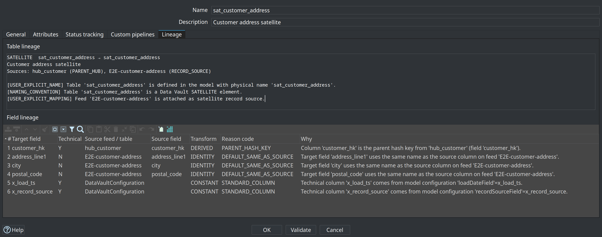
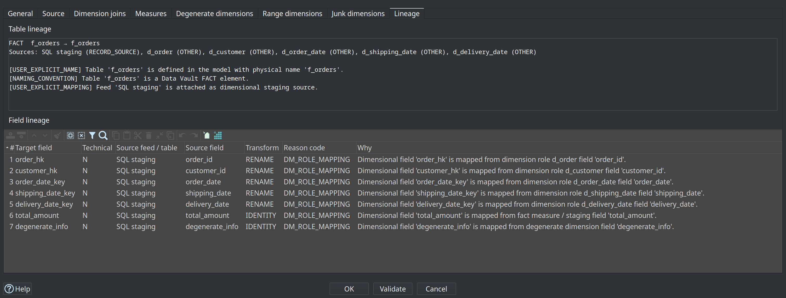

= Source-to-target lineage
:toc: macro
:toclevels: 3

toc::[]

The hop-datavault plugin captures **source-to-target lineage** for every Data Vault (DV), Business Vault (BV), and dimensional (DM) target table and field. Lineage answers three questions that production gates and opaque model generators often leave open:

. *Which* catalog feed or parent table contributes to a target?
. *How* is each target column derived (identity, rename, hash, standard technical column)?
. *Why* is that mapping or name present (structured reason codes with human-readable text)?

Models (`.hdv` / `.hbv` / `.hdm`) remain the **source of truth** for loads and DDL. Lineage is a **deterministic, derived projection** of those models (plus catalog source resolution). It is not a second place to edit mappings.

== Why this exists

Model-driven vault tools can silently rename hubs, satellites, links, or columns between versions. A workflow option such as **Fail if DDL is needed** correctly blocks structure changes, but without lineage the log only says that DDL is required — not *why*.

hop-data-vault avoids that opacity by:

* Deriving table- and field-level lineage from model metadata
* Explaining every required DDL statement with those edges
* Publishing lineage siblings into the Data Catalog for discovery
* Diffing current models against the last published lineage baseline (rename / mapping regression gate)
* Offering a reverse browser from source field to all DV/BV/DM consumers

== Concepts

=== Lineage snapshot

A *lineage snapshot* is the full set of tables and fields for one model at a point in time. Collectors build it from:

|===
| Layer | Collector input
| DV | `.hdv` hubs, links, satellites, standard columns, multi-source BKs
| BV | `.hbv` SCD2 field maps, derivatives, PIT technical columns
| DM | `.hdm` dimensions, facts, roles, measures, staging sources
|===

=== Table lineage

For each target object the snapshot records:

* Logical and physical names, table type, model file
* Upstream **sources** (catalog `DV_SOURCE` feeds, parent hub/link, SCD2 satellite inputs, staging SQL, and so on)
* One or more **reasons** for the table’s existence and naming

=== Field lineage

For each target column:

* Data type metadata when known, and whether the column is **technical** (hash key, load timestamp, record source, …)
* One or more **contributions** from upstream feeds or parent tables
* Per-contribution **transform** (`IDENTITY`, `RENAME`, `HASH_INPUT`, `DERIVED`, `CONSTANT`, …)
* Per-contribution **reason codes** and messages

=== Reason codes (selection)

|===
| Code | Meaning
| `USER_EXPLICIT_NAME` | Table or physical name set in the modeler
| `USER_EXPLICIT_MAPPING` | Explicit source field mapping (for example hub business key)
| `DEFAULT_SAME_AS_SOURCE` | Target column uses the same name as the source (typical satellite attributes)
| `NAMING_CONVENTION` | Type-driven or organizational naming
| `STANDARD_COLUMN` | Config-driven technical column (`x_load_ts`, `x_record_source`, …)
| `HASH_FROM_BUSINESS_KEYS` | Hash key derived from business keys
| `PARENT_HASH_KEY` | Parent hub/link hash on a satellite or link
| `MULTI_SOURCE_HUB` | Same BK column fed by multiple record sources
| `LINK_HUB_KEY_MAPPING` | Link maps source columns to participating hub keys
| `BV_SCD2_FIELD_MAP` | Explicit Business Vault SCD2 field mapping
| `DM_ROLE_MAPPING` | Dimensional role, measure, or staging mapping 
|===

Confidence levels (`EXPLICIT`, `DERIVED`, `CONVENTION`, `INFERRED`) indicate how strongly the reason is grounded in stored metadata.

== Lineage tab in table dialogs

Open any hub, link, satellite, BV SCD2 table, or dimensional table dialog and select the **Lineage** tab (read-only).

The tab has two areas:

**Table lineage**:: Type, logical → physical name, description, attached sources, and reason list.

**Field lineage**:: Grid of target field, technical flag, source feed/table, source field, transform, reason code, and full *Why* message.

=== Data Vault example

Satellite `sat_customer_address` shows parent hub `hub_customer`, feed `E2E-customer-address`, parent hash `customer_hk`, attribute passthroughs, and standard columns from model configuration:

=== Dimensional example

Fact `f_orders` shows staging SQL as the record source, dimension-role foreign keys, measures, and degenerates:

=== Dialogs without a tab folder

Some editors (for example BV PIT tables or range dimensions) expose a **Lineage…** button that opens the same content in a modal viewer.

== Explainable DDL

Whenever a DV, BV, or DM **Update** action generates DDL (apply structure, write SQL file, or **Fail if DDL is needed**), the action logs a **lineage explanation**: which tables/columns would change and which model mappings force that structure.

In the modeler toolbars, **Generate DDL** shows the same explanation in a scrollable dialog before opening the SQL editor (when changes exist).

Example shape (abbreviated):

----
DDL structural change(s) required: 1. Lineage explanation:
1) ADD COLUMN sat_customer_demo.segment
   Why: model 'retail-360' defines SATELLITE 'sat_customer_demo'
   Sources: E2E-customer-demo (RECORD_SOURCE), hub_customer (PARENT_HUB)
   Column lineage:
   · segment ← E2E-customer-demo.segment [DEFAULT_SAME_AS_SOURCE] …
----

Production guard **Fail if DDL is needed** still aborts the load; the explanation is what makes the gate operable.

== Catalog publish (sibling records)

When a model publishes target layouts to the Data Catalog (update actions with catalog publish enabled), the plugin also publishes **lineage siblings**:

[source]
----
hop/{project}/lineage/{dv|bv|dm}/{model-name}/
  _snapshot          # index + table list
  hub_customer       # per-table lineage payload
  sat_customer_demo
  …
----

|===
| Aspect | Detail
| Record type | `UNKNOWN`
| Tags | `LINEAGE`, optionally `LINEAGE_SNAPSHOT`, layer (`DV`/`BV`/`DM`), table type, model name
| Custom properties | `fieldsJson`, `tableReasonsJson`, `tableSourcesJson`, `physicalTableName`, `tableType`, `lineageLayer`, …
| Edit surface | **None** — fully derived; republish replaces lineage
|===
So
Models stay authoritative. Catalog lineage is for discovery, ops, and the drift gate.

See also link:data-catalog.adoc[Data Catalog] for general catalog layout and version tags (source contracts).

== Lineage drift gate

The **Validate resource definitions** workflow action (and interactive **Validate sources** on a resource definition group) compares **current model lineage** to the **last published catalog lineage** for each DV/BV/DM model in the group.

|===
| Drift type | Typical severity
| Physical / logical table rename without `USER_EXPLICIT_NAME` | *Blocking*
| Field rename (same source contribution, different target name) | Warning
| Mapping change (same target, different source) | Warning
| Table or field removed | Warning
| Table or field added | Info
| No catalog baseline yet | Info (first publish / missing siblings)
|===

Markdown and HTML validation reports include a **Lineage Drift** section. Blocking lineage renames can elevate overall simulation status to critical, consistent with schema drift gates.

.Recommended ops loop
. Publish models (writes table layouts *and* lineage siblings).
. Change names or mappings only deliberately in the modeler (explicit names stay `USER_EXPLICIT_NAME`).
. Run **Validate resource definitions** before loads; review *Lineage Drift* if the gate fails.
. Fix the model or accept intentional renames with explicit naming, then republish.

== Reverse lineage browser

From metadata type **Resource definition group**, use **Browse lineage…** (alongside **Validate sources** and catalog version buttons).

The browser:

. Indexes all models in the group (DV + BV + DM).
. Lets you filter by **source feed / table** and **source field** (substring match).
. Lists consumers with hop count, layer, model, table, target field, transform, reason codes, and path.
. Supports multi-hop paths, for example:
+
----
E2E-customer-demo.segment → sat_customer_demo.segment → customer_360_bv.cust_segment
----
. **Open model element** (or double-click) navigates to the consumer table in its model file.

Use this when you need the inverse of the Lineage tab: *given a staging column, what vault and mart objects depend on it?*

== Relationship to other features

|===
| Feature | Relationship
| link:execution-maps.adoc[Execution maps] (`.hem`) | Workflow / pipeline / dataset *execution* graph; not field-level mapping reasons
| Marquez / OpenLineage (planned) | External table-level job lineage; can reuse model-derived edges later — link:plans/marquez-lineage-plan.md[plan]
| link:resource-definition-validation.adoc[Resource definition validation] | Source schema contracts + impact; lineage drift is an additional section of the same gate
| Mapping authoring UI (coach, suggest mappings) | Creates or refines model mappings; lineage *explains* the result
|===

== Related documents

* link:data-catalog.adoc[Data Catalog]
* link:resource-definition-validation.adoc[Resource definition validation]
* link:datavault-update-action.adoc[Data Vault Update action]
* link:business-vault-update-action.adoc[Business Vault Update action]
* link:dimensional-update-action.adoc[Dimensional Update action]
* link:feature-overview.md[Feature overview]
* link:execution-maps.adoc[Execution maps]
