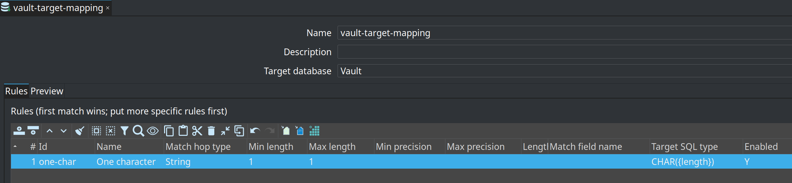
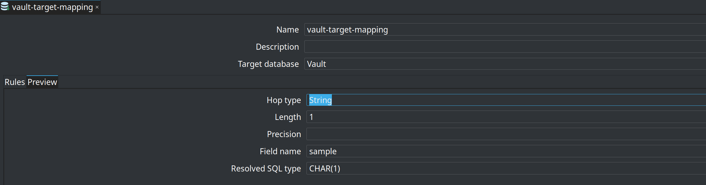

= Target type mappings (Hop type to DDL)
:toc: macro
:toclevels: 3

toc::[]

== Why

link:data-type-mappings.adoc[Data type mappings] control how source metadata arrives as Hop types (String, Integer, Timestamp, length, precision). They do **not** control the **native SQL type** Hop emits for CREATE/ALTER.

Hop dialect defaults are reasonable (Postgres `VARCHAR(n)`, `TIMESTAMP`, `SMALLINT` for short integers) but estates often want project policy: `CHAR(1)` flags, `NVARCHAR({length})`, `timestamp(6) with time zone`.

A **Target type mapping** is a reusable metadata element with ordered rules. Matching rules run **before** Hop `getFieldDefinition`. Unmatched columns keep today’s database-specific types.

On **Snowflake**, the plugin then rewrites Hop’s dialect defaults that are wrong for Data Vault: `TYPE_BINARY` → `BINARY(n)` instead of `VARIANT`, timestamps → `TIMESTAMP_NTZ`, dates → `DATE`. A target type mapping still wins when a rule matches.

Issue https://github.com/mattcasters/hop-data-vault/issues/127[#127].

== Concepts

[cols="1,3", options="header"]
|===
|Concept |Role

|**Target type mapping** (metadata)
|Named project profile: optional **target database** plus ordered **rules**.

|**Match**
|Hop type, inclusive min/max length and precision, length absent, optional field-name pattern.

|**Target SQL type**
|Native type template. Hop variables (`'${VARCHAR_TYPE}'`) then `'{length}'` / `'{precision}'`.

|**First match wins**
|Put `CHAR(1)` before `NVARCHAR({length})`.

|**Auto-match**
|When no mapping is selected and **exactly one** saved mapping names the actual target connection, that mapping is used.
|===

This is **not** a Data type mapping. Data type mappings improve source → Hop. Target type mappings improve Hop → DDL.

== Project metadata editor

In Hop **Metadata** perspective, create a **Target type mapping** (key `target-type-mapping`).

* **Name** / **Description**
* **Target database** — Hop connection this profile is intended for (auto-match + preview)
* **Rules** — ordered match → SQL type grid
* **Preview** — sample Hop type / length / precision / field name → resolved SQL (or dialect default)

Retail ships **vault-target-mapping** (`retail-example/metadata/target-type-mapping/`, target database `Vault`):

* String, min-length=1, max-length=1 → `CHAR({length})`

`run-retail-update-models.hwf` selects that mapping on **Update resource definition group**. Other useful rules (not in the sample):

* String, max-length=2000 → `NVARCHAR({length})` (or `VARCHAR({length})` on Postgres)
* Integer, max-length=2 → `BYTE`
* Integer, max-length=3 → `SMALLINT`
* Timestamp → `timestamp(6) with time zone`

== Where you select it

[cols="1,3", options="header"]
|===
|Surface |Behaviour

|**Record Definition DDL**
|Optional **Target type mapping** on the Target tab. Empty → auto-match on the resolved target connection.

|**Update resource definition group**
|Operations tab. The name is copied to each child DV / BV / DM update.

|**Data Vault / Business Vault / Dimensional Update**
|DDL tab. Same optional override.

|Modeler SQL, schema gate, remediation
|No extra field. Unique auto-match on the model target connection, or the `DATAVAULT_TARGET_TYPE_MAPPING` variable set by an update action.
|===

An explicit name that does not exist **fails DDL** (no silent fallback). Two mappings for the same target database skip auto-match; select one explicitly.

A mapping on the integration-test `Vault` connection changes generated DDL; do not add one there unless you update the relevant goldens. The retail sample mapping only remaps one-character Strings to `CHAR({length})`.

== Placeholders and variables

. `IVariables` resolves the template (`'${VARCHAR_TYPE}'`).
. `'{length}'` and `'{precision}'` (case-insensitive) are replaced from the Hop field.

If the template still contains `'{length}'` and the field has no length, the rule does not match.

== SQL Server UTF-8

Vault/EDW SQL Server DDL still expands unmatched ANSI `VARCHAR`/`CHAR` (length ×3 + UTF-8 `COLLATE`). A column that **matched a rule** is emitted verbatim (`NVARCHAR({length})` is not expanded).

== Recommended workflow

. Create one **Target type mapping** per warehouse dialect / connection.
. Set **Target database** to the vault connection so modeler SQL and Update agree without selecting the mapping on every action.
. List specific rules first.
. Optionally select the mapping on **Update resource definition group** or **Record Definition DDL** when several mappings exist.

== Related

* link:data-type-mappings.adoc[Data type mappings] (source → Hop)
* link:update-resource-definition-group-action.adoc[Update resource definition group]
* link:record-definition-ddl.adoc[Record Definition DDL]
* link:feature-overview.adoc[Feature overview]
